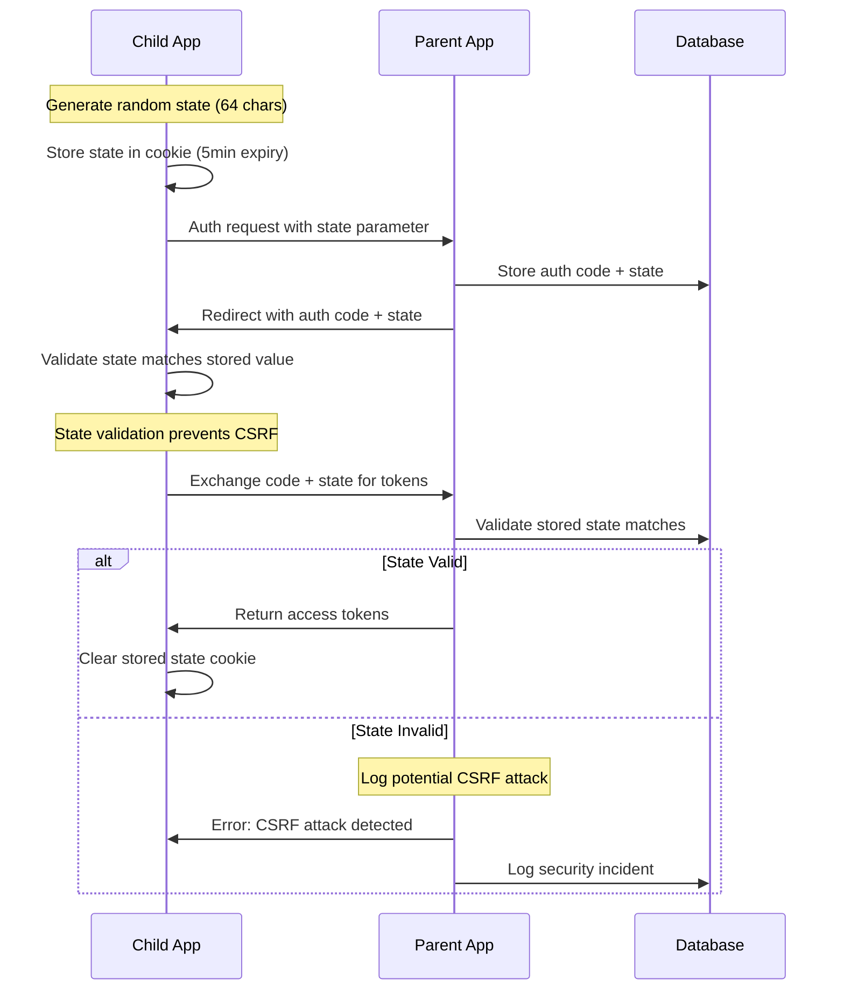

# MyJKKN Child App Implementation Guide

## Overview

This comprehensive guide provides everything needed to build a Next.js child application that integrates with the MyJKKN parent authentication system using OAuth 2.0 flow.

## Database Schema

### Core Tables for Child App Authentication

The system uses the following Supabase tables:

#### 1. `applications` Table

Stores child app registration data:

```sql
- id: uuid (primary key)
- app_id: text (unique identifier)
- name: text (display name)
- description: text
- url: text (app homepage)
- api_key_hash: text (hashed API key)
- allowed_redirect_uris: text[] (array of allowed URIs)
- uses_parent_auth: boolean (true for child apps)
- is_active: boolean
- allowed_scopes: text[] (read, write, profile)
- allowed_roles: text[] (student, faculty, admin)
- created_at: timestamp
- updated_at: timestamp
- last_auth_activity: timestamp
```

#### 2. `child_app_auth_codes` Table

Stores OAuth authorization codes with CSRF protection:

```sql
- id: uuid (primary key)
- code: text (authorization code)
- app_id: text (references applications.app_id)
- user_id: uuid (references auth.users.id)
- redirect_uri: text
- scope: text
- state: text (🔒 CSRF protection parameter)
- expires_at: timestamp
- used_at: timestamp (nullable)
- created_at: timestamp
```

#### 3. `child_app_sessions` Table

Stores active user sessions:

```sql
- id: uuid (primary key)
- user_id: uuid (references auth.users.id)
- child_app_id: text (references applications.app_id)
- access_token_hash: text
- refresh_token_hash: text
- expires_at: timestamp
- refresh_expires_at: timestamp
- is_active: boolean
- created_at: timestamp
- last_used_at: timestamp
- ip_address: text
- user_agent: text
- token_version: integer
- revoked_at: timestamp
- revoke_reason: text
```

#### 4. `child_app_user_sessions` Table

JSON-based consolidated session storage:

```sql
- id: uuid (primary key)
- user_id: uuid (references auth.users.id)
- app_id: text (references applications.app_id)
- session_data: json (active sessions array)
- permissions: json (user permissions)
- metadata: json (login count, preferences)
- last_activity_at: timestamp
- created_at: timestamp
- updated_at: timestamp
```

#### 5. `child_app_access_logs` Table

Audit logs for authentication events:

```sql
- id: uuid (primary key)
- child_app_id: text
- user_id: uuid (nullable)
- session_id: uuid (nullable)
- action: text (login, logout, validate, etc.)
- status: text (success, failed)
- error_message: text (nullable)
- ip_address: text
- user_agent: text
- metadata: json
- created_at: timestamp
```

#### 6. `profiles` Table

User profile information:

```sql
- id: uuid (primary key, references auth.users.id)
- email: text
- full_name: text
- phone_number: text
- role: text (student, faculty, admin, super_admin)
- institution_id: uuid
- is_super_admin: boolean
- is_active: boolean
- permissions: json
- profile_completed: boolean
- avatar_url: text
- last_login: timestamp
- created_at: timestamp
- updated_at: timestamp
```

## Implementation Structure

### Project Setup

```bash
# Create Next.js project
npx create-next-app@latest my-child-app --typescript --tailwind --eslint --app

# Install required dependencies
npm install js-cookie @types/js-cookie axios react-hook-form @hookform/resolvers/zod zod lucide-react
```

### Environment Configuration

Create `.env.local`:

```bash
# MyJKKN Parent App Configuration
NEXT_PUBLIC_PARENT_APP_URL=https://my.jkkn.ac.in
NEXT_PUBLIC_APP_ID=your_app_id_here
NEXT_PUBLIC_API_KEY=your_api_key_here

# Development redirect URI
NEXT_PUBLIC_REDIRECT_URI=http://localhost:3000/auth/callback

# Production redirect URI (uncomment for production):
# NEXT_PUBLIC_REDIRECT_URI=https://your-app.com/auth/callback

# JWT Secret for token verification
NEXT_PUBLIC_JWT_SECRET=your_jwt_secret_here

# Optional: Enable debug logging
NEXT_PUBLIC_AUTH_DEBUG=true
```

## 🔒 Enhanced Security Features

### CSRF Protection with State Parameter

**The parent app now includes comprehensive CSRF protection:**

1. **State Parameter Storage**: The `state` parameter is stored in the database alongside authorization codes
2. **Validation During Token Exchange**: State parameters are validated when exchanging codes for tokens
3. **Security Logging**: Potential CSRF attacks are logged for monitoring
4. **Single-Use Codes**: Authorization codes can only be used once

### Security Flow:



### Implementation Details:

- **Database Schema**: Added `state` column to `child_app_auth_codes` table
- **Parent Auth Endpoints**:
  - `/api/auth/child-app/authorize` stores state parameter
  - `/api/auth/child-app/token` validates state parameter
- **Security Logging**: Suspicious activity is logged with IP and user agent
- **Error Handling**: Clear error messages for state mismatches

## Core Implementation Files

### 1. Parent Auth Service

Create `lib/auth/parent-auth-service.ts`:

```typescript
import axios, { AxiosInstance } from 'axios';
import Cookies from 'js-cookie';

export interface ParentAppUser {
  id: string;
  email: string;
  full_name: string;
  phone_number?: string;
  role: string;
  institution_id?: string;
  is_super_admin?: boolean;
  permissions: Record<string, boolean>;
  profile_completed?: boolean;
  avatar_url?: string;
  last_login?: string;
}

export interface AuthSession {
  id: string;
  expires_at: string;
  created_at: string;
  last_used_at?: string;
}

export interface TokenResponse {
  access_token: string;
  refresh_token: string;
  token_type: string;
  expires_in: number;
  user: ParentAppUser;
}

export interface ValidationResponse {
  valid: boolean;
  user?: ParentAppUser;
  session?: AuthSession;
  error?: string;
}

class ParentAuthService {
  private api: AxiosInstance;
  private refreshPromise: Promise<boolean> | null = null;

  constructor() {
    this.api = axios.create({
      baseURL: process.env.NEXT_PUBLIC_PARENT_APP_URL,
      timeout: 10000,
      headers: {
        'Content-Type': 'application/json',
        'X-API-Key': process.env.NEXT_PUBLIC_API_KEY || '',
      },
    });

    // Add request interceptor to include auth header
    this.api.interceptors.request.use((config) => {
      const token = this.getAccessToken();
      if (token) {
        config.headers.Authorization = `Bearer ${token}`;
      }
      return config;
    });

    // Add response interceptor for token refresh
    this.api.interceptors.response.use(
      (response) => response,
      async (error) => {
        if (error.response?.status === 401 && !error.config._retry) {
          error.config._retry = true;

          const refreshed = await this.refreshToken();
          if (refreshed) {
            const token = this.getAccessToken();
            error.config.headers.Authorization = `Bearer ${token}`;
            return this.api.request(error.config);
          }
        }
        return Promise.reject(error);
      }
    );
  }

  /**
   * Initiate OAuth login flow
   */
  login(redirectUrl?: string): void {
    const state = this.generateState();
    sessionStorage.setItem('oauth_state', state);

    if (redirectUrl) {
      sessionStorage.setItem('post_login_redirect', redirectUrl);
    }

    const authUrl = new URL('/auth/authorize', process.env.NEXT_PUBLIC_PARENT_APP_URL!);
    authUrl.searchParams.append('response_type', 'code');
    authUrl.searchParams.append('client_id', process.env.NEXT_PUBLIC_APP_ID!);
    authUrl.searchParams.append('app_id', process.env.NEXT_PUBLIC_APP_ID!);
    authUrl.searchParams.append('redirect_uri', process.env.NEXT_PUBLIC_REDIRECT_URI!);
    authUrl.searchParams.append('scope', 'read write profile');
    authUrl.searchParams.append('state', state);

    window.location.href = authUrl.toString();
  }

  /**
   * Handle OAuth callback
   */
  async handleCallback(token: string, refreshToken?: string): Promise<ParentAppUser | null> {
    try {
      if (refreshToken) {
        this.setRefreshToken(refreshToken);
      }

      // Validate the token with parent app
      const validation = await this.validateToken(token);

      if (validation.valid && validation.user) {
        this.setAccessToken(token);
        this.setUser(validation.user);

        if (validation.session) {
          this.setSession(validation.session);
        }

        // Clear OAuth state
        sessionStorage.removeItem('oauth_state');

        return validation.user;
      }

      throw new Error(validation.error || 'Token validation failed');
    } catch (error) {
      console.error('Auth callback error:', error);
      this.clearSession();
      throw error;
    }
  }

  /**
   * Validate access token
   */
  async validateToken(token: string): Promise<ValidationResponse> {
    try {
      const response = await this.api.post('/api/auth/child-app/validate', {
        token,
        child_app_id: process.env.NEXT_PUBLIC_APP_ID,
      });

      return response.data;
    } catch (error: any) {
      return {
        valid: false,
        error: error.response?.data?.error || 'Validation failed'
      };
    }
  }

  /**
   * Refresh access token
   */
  async refreshToken(): Promise<boolean> {
    if (this.refreshPromise) {
      return this.refreshPromise;
    }

    this.refreshPromise = this._doRefreshToken();
    const result = await this.refreshPromise;
    this.refreshPromise = null;
    return result;
  }

  private async _doRefreshToken(): Promise<boolean> {
    try {
      const refreshToken = this.getRefreshToken();
      if (!refreshToken) {
        throw new Error('No refresh token available');
      }

      const response = await this.api.post('/api/auth/child-app/token', {
        grant_type: 'refresh_token',
        refresh_token: refreshToken,
        app_id: process.env.NEXT_PUBLIC_APP_ID,
      });

      const data: TokenResponse = response.data;

      this.setAccessToken(data.access_token);
      this.setUser(data.user);

      // Update refresh token if provided
      if (data.refresh_token) {
        this.setRefreshToken(data.refresh_token);
      }

      return true;
    } catch (error) {
      console.error('Token refresh error:', error);
      this.clearSession();
      return false;
    }
  }

  /**
   * Logout from parent app
   */
  logout(redirectToParent: boolean = true): void {
    // Notify parent app of logout
    if (redirectToParent) {
      const logoutUrl = new URL('/api/auth/child-app/logout', process.env.NEXT_PUBLIC_PARENT_APP_URL!);

      // Clear local session first
      this.clearSession();

      // Redirect to parent logout
      window.location.href = logoutUrl.toString() + `?app_id=${process.env.NEXT_PUBLIC_APP_ID}&redirect_uri=${encodeURIComponent(window.location.origin)}`;
    } else {
      this.clearSession();
    }
  }

  /**
   * Check if user is authenticated
   */
  isAuthenticated(): boolean {
    const token = this.getAccessToken();
    const user = this.getUser();
    return !!(token && user);
  }

  /**
   * Validate current session
   */
  async validateSession(): Promise<boolean> {
    const token = this.getAccessToken();
    if (!token) {
      return false;
    }

    try {
      const validation = await this.validateToken(token);

      if (validation.valid && validation.user) {
        // Update user data in case it changed
        this.setUser(validation.user);

        if (validation.session) {
          this.setSession(validation.session);
        }

        return true;
      }

      return false;
    } catch (error) {
      console.error('Session validation error:', error);
      return false;
    }
  }

  /**
   * Check if user has specific permission
   */
  hasPermission(permission: string): boolean {
    const user = this.getUser();
    return user?.permissions?.[permission] === true;
  }

  /**
   * Check if user has specific role
   */
  hasRole(role: string): boolean {
    const user = this.getUser();
    return user?.role === role;
  }

  /**
   * Check if user has any of the specified roles
   */
  hasAnyRole(roles: string[]): boolean {
    const user = this.getUser();
    return user ? roles.includes(user.role) : false;
  }

  // Token management methods
  getAccessToken(): string | null {
    return Cookies.get('access_token') || null;
  }

  private setAccessToken(token: string): void {
    const isProduction = window.location.protocol === 'https:';
    Cookies.set('access_token', token, {
      expires: 1, // 1 day
      secure: isProduction,
      sameSite: isProduction ? 'strict' : 'lax',
      path: '/'
    });
  }

  private getRefreshToken(): string | null {
    return Cookies.get('refresh_token') || null;
  }

  private setRefreshToken(token: string): void {
    const isProduction = window.location.protocol === 'https:';
    Cookies.set('refresh_token', token, {
      expires: 30, // 30 days
      secure: isProduction,
      sameSite: isProduction ? 'strict' : 'lax',
      path: '/'
    });
  }

  getUser(): ParentAppUser | null {
    try {
      const userData = localStorage.getItem('user_data');
      return userData ? JSON.parse(userData) : null;
    } catch (error) {
      console.error('Error getting user data:', error);
      return null;
    }
  }

  private setUser(user: ParentAppUser): void {
    try {
      localStorage.setItem('user_data', JSON.stringify(user));
      localStorage.setItem('auth_timestamp', Date.now().toString());
    } catch (error) {
      console.error('Error saving user data:', error);
    }
  }

  getSession(): AuthSession | null {
    try {
      const sessionData = localStorage.getItem('session_data');
      return sessionData ? JSON.parse(sessionData) : null;
    } catch (error) {
      console.error('Error getting session data:', error);
      return null;
    }
  }

  private setSession(session: AuthSession): void {
    try {
      localStorage.setItem('session_data', JSON.stringify(session));
    } catch (error) {
      console.error('Error saving session data:', error);
    }
  }

  private clearSession(): void {
    Cookies.remove('access_token');
    Cookies.remove('refresh_token');
    localStorage.removeItem('user_data');
    localStorage.removeItem('session_data');
    localStorage.removeItem('auth_timestamp');
    sessionStorage.clear();
  }

  getApiClient(): AxiosInstance {
    return this.api;
  }

  private generateState(): string {
    return Math.random().toString(36).substring(2, 15) + Math.random().toString(36).substring(2, 15);
  }
}

export default new ParentAuthService();
```

### 2. Auth Context Provider

Create `lib/auth/auth-context.tsx`:

```typescript
'use client';

import React, { createContext, useContext, useState, useEffect, ReactNode } from 'react';
import parentAuthService, { ParentAppUser, AuthSession } from './parent-auth-service';

interface AuthContextType {
  user: ParentAppUser | null;
  session: AuthSession | null;
  isLoading: boolean;
  isAuthenticated: boolean;
  error: string | null;
  login: (redirectUrl?: string) => void;
  logout: (redirectToParent?: boolean) => void;
  refreshSession: () => Promise<boolean>;
  validateSession: () => Promise<boolean>;
  hasPermission: (permission: string) => boolean;
  hasRole: (role: string) => boolean;
  hasAnyRole: (roles: string[]) => boolean;
  handleAuthCallback: (token: string, refreshToken?: string) => Promise<boolean>;
}

const AuthContext = createContext<AuthContextType | undefined>(undefined);

interface AuthProviderProps {
  children: ReactNode;
  autoValidate?: boolean;
  autoRefresh?: boolean;
  refreshInterval?: number;
  onAuthChange?: (user: ParentAppUser | null) => void;
  onSessionExpired?: () => void;
}

export function AuthProvider({
  children,
  autoValidate = true,
  autoRefresh = true,
  refreshInterval = 10 * 60 * 1000, // 10 minutes
  onAuthChange,
  onSessionExpired
}: AuthProviderProps) {
  const [user, setUser] = useState<ParentAppUser | null>(null);
  const [session, setSession] = useState<AuthSession | null>(null);
  const [isLoading, setIsLoading] = useState(true);
  const [error, setError] = useState<string | null>(null);

  // Initialize auth on mount
  useEffect(() => {
    const initAuth = async () => {
      try {
        setIsLoading(true);
        setError(null);

        // Get stored user and session
        const storedUser = parentAuthService.getUser();
        const storedSession = parentAuthService.getSession();

        if (storedUser && storedSession) {
          setUser(storedUser);
          setSession(storedSession);

          // Validate session if auto-validate is enabled
          if (autoValidate) {
            const isValid = await parentAuthService.validateSession();
            if (!isValid) {
              setUser(null);
              setSession(null);
            } else {
              // Update with fresh data
              const freshUser = parentAuthService.getUser();
              const freshSession = parentAuthService.getSession();
              setUser(freshUser);
              setSession(freshSession);
            }
          }
        }
      } catch (err) {
        console.error('Auth initialization error:', err);
        setError('Failed to initialize authentication');
        setUser(null);
        setSession(null);
      } finally {
        setIsLoading(false);
      }
    };

    initAuth();
  }, [autoValidate]);

  // Auto-refresh token
  useEffect(() => {
    if (!autoRefresh || !user || !session) return;

    const refreshTimer = setInterval(async () => {
      try {
        const refreshed = await parentAuthService.refreshToken();
        if (refreshed) {
          const freshUser = parentAuthService.getUser();
          const freshSession = parentAuthService.getSession();
          setUser(freshUser);
          setSession(freshSession);
        } else {
          // Refresh failed, session expired
          setUser(null);
          setSession(null);
          if (onSessionExpired) {
            onSessionExpired();
          }
        }
      } catch (err) {
        console.error('Auto-refresh error:', err);
      }
    }, refreshInterval);

    return () => clearInterval(refreshTimer);
  }, [autoRefresh, user, session, refreshInterval, onSessionExpired]);

  // Notify auth changes
  useEffect(() => {
    if (onAuthChange) {
      onAuthChange(user);
    }
  }, [user, onAuthChange]);

  // Check auth callback params on mount
  useEffect(() => {
    const checkAuthCallback = async () => {
      const params = new URLSearchParams(window.location.search);
      const token = params.get('token');
      const refreshToken = params.get('refresh_token');

      if (token) {
        try {
          setIsLoading(true);
          const authUser = await parentAuthService.handleCallback(token, refreshToken || undefined);

          if (authUser) {
            setUser(authUser);
            const newSession = parentAuthService.getSession();
            setSession(newSession);

            // Clean URL
            const url = new URL(window.location.href);
            url.searchParams.delete('token');
            url.searchParams.delete('refresh_token');
            window.history.replaceState({}, '', url.toString());

            // Handle post-login redirect
            const redirectUrl = sessionStorage.getItem('post_login_redirect');
            if (redirectUrl) {
              sessionStorage.removeItem('post_login_redirect');
              window.location.href = redirectUrl;
              return;
            }
          }
        } catch (err) {
          console.error('Auth callback error:', err);
          setError('Authentication failed');
        } finally {
          setIsLoading(false);
        }
      }
    };

    checkAuthCallback();
  }, []);

  const login = (redirectUrl?: string) => {
    parentAuthService.login(redirectUrl);
  };

  const logout = (redirectToParent: boolean = true) => {
    parentAuthService.logout(redirectToParent);
    setUser(null);
    setSession(null);
    setError(null);
  };

  const refreshSession = async (): Promise<boolean> => {
    try {
      const success = await parentAuthService.refreshToken();
      if (success) {
        const freshUser = parentAuthService.getUser();
        const freshSession = parentAuthService.getSession();
        setUser(freshUser);
        setSession(freshSession);
      } else {
        setUser(null);
        setSession(null);
      }
      return success;
    } catch (err) {
      console.error('Refresh session error:', err);
      setUser(null);
      setSession(null);
      return false;
    }
  };

  const validateSession = async (): Promise<boolean> => {
    try {
      const isValid = await parentAuthService.validateSession();
      if (isValid) {
        const freshUser = parentAuthService.getUser();
        const freshSession = parentAuthService.getSession();
        setUser(freshUser);
        setSession(freshSession);
      } else {
        setUser(null);
        setSession(null);
      }
      return isValid;
    } catch (err) {
      console.error('Validate session error:', err);
      setUser(null);
      setSession(null);
      return false;
    }
  };

  const handleAuthCallback = async (token: string, refreshToken?: string): Promise<boolean> => {
    try {
      setIsLoading(true);
      setError(null);

      const authUser = await parentAuthService.handleCallback(token, refreshToken);
      if (authUser) {
        setUser(authUser);
        const newSession = parentAuthService.getSession();
        setSession(newSession);
        return true;
      }
      return false;
    } catch (err) {
      console.error('Handle auth callback error:', err);
      setError(err instanceof Error ? err.message : 'Authentication failed');
      return false;
    } finally {
      setIsLoading(false);
    }
  };

  const hasPermission = (permission: string): boolean => {
    return parentAuthService.hasPermission(permission);
  };

  const hasRole = (role: string): boolean => {
    return parentAuthService.hasRole(role);
  };

  const hasAnyRole = (roles: string[]): boolean => {
    return parentAuthService.hasAnyRole(roles);
  };

  return (
    <AuthContext.Provider
      value={{
        user,
        session,
        isLoading,
        isAuthenticated: !!user,
        error,
        login,
        logout,
        refreshSession,
        validateSession,
        hasPermission,
        hasRole,
        hasAnyRole,
        handleAuthCallback,
      }}
    >
      {children}
    </AuthContext.Provider>
  );
}

export function useAuth() {
  const context = useContext(AuthContext);
  if (context === undefined) {
    throw new Error('useAuth must be used within an AuthProvider');
  }
  return context;
}

// Additional hooks for convenience
export function useIsAuthenticated(): boolean {
  const { isAuthenticated } = useAuth();
  return isAuthenticated;
}

export function useCurrentUser(): ParentAppUser | null {
  const { user } = useAuth();
  return user;
}

export function usePermission(permission: string): boolean {
  const { hasPermission } = useAuth();
  return hasPermission(permission);
}

export function useRole(role: string): boolean {
  const { hasRole } = useAuth();
  return hasRole(role);
}

export function useAnyRole(roles: string[]): boolean {
  const { hasAnyRole } = useAuth();
  return hasAnyRole(roles);
}

export function useAuthLoading(): boolean {
  const { isLoading } = useAuth();
  return isLoading;
}

export function useAuthError(): string | null {
  const { error } = useAuth();
  return error;
}

export function useSession() {
  const { session, validateSession, refreshSession } = useAuth();
  return { session, validateSession, refreshSession };
}
```

### 3. Protected Route Component

Create `components/protected-route.tsx`:

```typescript
'use client';

import { ReactNode, useEffect } from 'react';
import { useRouter } from 'next/navigation';
import { useAuth } from '@/lib/auth/auth-context';

interface ProtectedRouteProps {
  children: ReactNode;
  fallback?: ReactNode;
  redirectTo?: string;
  requiredPermissions?: string[];
  requiredRoles?: string[];
  requireAnyRole?: boolean;
  onUnauthorized?: () => void;
  loadingComponent?: ReactNode;
}

const DefaultLoading = () => (
  <div className="flex items-center justify-center min-h-screen">
    <div className="animate-spin rounded-full h-12 w-12 border-b-2 border-primary"></div>
  </div>
);

export function ProtectedRoute({
  children,
  fallback,
  redirectTo,
  requiredPermissions = [],
  requiredRoles = [],
  requireAnyRole = true,
  onUnauthorized,
  loadingComponent
}: ProtectedRouteProps) {
  const { user, isLoading, isAuthenticated, hasPermission, hasRole, hasAnyRole } = useAuth();
  const router = useRouter();

  useEffect(() => {
    if (isLoading) return;

    if (!isAuthenticated) {
      if (redirectTo) {
        router.push(redirectTo);
      } else if (onUnauthorized) {
        onUnauthorized();
      }
      return;
    }

    // Check authorization
    const isAuthorized = checkAuthorization();
    if (!isAuthorized) {
      if (onUnauthorized) {
        onUnauthorized();
      } else if (fallback) {
        // Will be rendered below
      } else {
        router.push('/unauthorized');
      }
    }
  }, [isLoading, isAuthenticated, user, router, redirectTo, onUnauthorized]);

  const checkAuthorization = (): boolean => {
    if (!user) return false;

    // Check permissions
    if (requiredPermissions.length > 0) {
      const hasAllPermissions = requiredPermissions.every(permission =>
        hasPermission(permission)
      );
      if (!hasAllPermissions) return false;
    }

    // Check roles
    if (requiredRoles.length > 0) {
      if (requireAnyRole) {
        const hasAnyRequiredRole = hasAnyRole(requiredRoles);
        if (!hasAnyRequiredRole) return false;
      } else {
        const hasAllRoles = requiredRoles.every(role => hasRole(role));
        if (!hasAllRoles) return false;
      }
    }

    return true;
  };

  if (isLoading) {
    return loadingComponent ? <>{loadingComponent}</> : <DefaultLoading />;
  }

  if (!isAuthenticated) {
    return fallback ? <>{fallback}</> : null;
  }

  if (!checkAuthorization()) {
    return fallback ? <>{fallback}</> : null;
  }

  return <>{children}</>;
}

// Higher-order component wrapper
export function withAuth<P extends object>(
  Component: React.ComponentType<P>,
  options?: Omit<ProtectedRouteProps, 'children'>
) {
  return function AuthenticatedComponent(props: P) {
    return (
      <ProtectedRoute {...options}>
        <Component {...props} />
      </ProtectedRoute>
    );
  };
}

// Convenience components
export function RequireAuth({
  children,
  redirectTo
}: {
  children: ReactNode;
  redirectTo?: string;
}) {
  return (
    <ProtectedRoute redirectTo={redirectTo || '/login'}>
      {children}
    </ProtectedRoute>
  );
}

export function RequirePermission({
  children,
  permission,
  fallback
}: {
  children: ReactNode;
  permission: string | string[];
  fallback?: ReactNode;
}) {
  const permissions = Array.isArray(permission) ? permission : [permission];

  return (
    <ProtectedRoute
      requiredPermissions={permissions}
      fallback={fallback}
    >
      {children}
    </ProtectedRoute>
  );
}

export function RequireRole({
  children,
  role,
  requireAll = false,
  fallback
}: {
  children: ReactNode;
  role: string | string[];
  requireAll?: boolean;
  fallback?: ReactNode;
}) {
  const roles = Array.isArray(role) ? role : [role];

  return (
    <ProtectedRoute
      requiredRoles={roles}
      requireAnyRole={!requireAll}
      fallback={fallback}
    >
      {children}
    </ProtectedRoute>
  );
}

export function GuestOnly({
  children,
  redirectTo = '/'
}: {
  children: ReactNode;
  redirectTo?: string;
}) {
  const { isAuthenticated, isLoading } = useAuth();
  const router = useRouter();

  useEffect(() => {
    if (!isLoading && isAuthenticated) {
      router.push(redirectTo);
    }
  }, [isAuthenticated, isLoading, router, redirectTo]);

  if (isLoading) {
    return <DefaultLoading />;
  }

  if (isAuthenticated) {
    return null;
  }

  return <>{children}</>;
}

export function ConditionalAuth({
  authenticated,
  unauthenticated,
  loading
}: {
  authenticated: ReactNode;
  unauthenticated: ReactNode;
  loading?: ReactNode;
}) {
  const { isAuthenticated, isLoading } = useAuth();

  if (isLoading) {
    return loading ? <>{loading}</> : <DefaultLoading />;
  }

  return isAuthenticated ? <>{authenticated}</> : <>{unauthenticated}</>;
}
```

### 4. OAuth Callback Handler

Create `app/auth/callback/page.tsx`:

```typescript
'use client';

import { useEffect, useState, Suspense } from 'react';
import { useSearchParams, useRouter } from 'next/navigation';
import { useAuth } from '@/lib/auth/auth-context';

function CallbackContent() {
  const searchParams = useSearchParams();
  const router = useRouter();
  const { handleAuthCallback } = useAuth();
  const [error, setError] = useState<string | null>(null);
  const [processing, setProcessing] = useState(true);

  useEffect(() => {
    const handleCallback = async () => {
      try {
        const code = searchParams?.get('code');
        const state = searchParams?.get('state');
        const error = searchParams?.get('error');
        const errorDescription = searchParams?.get('error_description');

        if (error) {
          setError(errorDescription || error);
          setProcessing(false);
          return;
        }

        if (!code) {
          setError('Authorization code not found');
          setProcessing(false);
          return;
        }

        // Exchange authorization code for tokens
        const response = await fetch('/api/auth/token', {
          method: 'POST',
          headers: {
            'Content-Type': 'application/json',
          },
          body: JSON.stringify({
            code,
            state,
          }),
        });

        if (!response.ok) {
          const errorData = await response.json();
          throw new Error(errorData.error || 'Token exchange failed');
        }

        const tokenData = await response.json();

        // Handle the authentication callback
        const success = await handleAuthCallback(
          tokenData.access_token,
          tokenData.refresh_token
        );

        if (success) {
          // Check for post-login redirect
          const redirectUrl = sessionStorage.getItem('post_login_redirect');
          if (redirectUrl) {
            sessionStorage.removeItem('post_login_redirect');
            router.push(redirectUrl);
          } else {
            router.push('/dashboard');
          }
        } else {
          setError('Authentication failed');
          setProcessing(false);
        }
      } catch (err) {
        console.error('Callback error:', err);
        setError(err instanceof Error ? err.message : 'Authentication failed');
        setProcessing(false);
      }
    };

    handleCallback();
  }, [searchParams, router, handleAuthCallback]);

  if (processing) {
    return (
      <div className="flex flex-col items-center justify-center min-h-screen">
        <div className="animate-spin rounded-full h-12 w-12 border-b-2 border-primary mb-4"></div>
        <p className="text-gray-600">Processing authentication...</p>
      </div>
    );
  }

  if (error) {
    return (
      <div className="flex flex-col items-center justify-center min-h-screen">
        <div className="text-center max-w-md">
          <h1 className="text-2xl font-bold text-red-600 mb-4">Authentication Error</h1>
          <p className="text-gray-600 mb-8">{error}</p>
          <button
            onClick={() => router.push('/login')}
            className="px-6 py-3 bg-primary text-white rounded-lg hover:bg-primary/90"
          >
            Try Again
          </button>
        </div>
      </div>
    );
  }

  return null;
}

export default function CallbackPage() {
  return (
    <Suspense fallback={
      <div className="flex items-center justify-center min-h-screen">
        <div className="animate-spin rounded-full h-12 w-12 border-b-2 border-primary"></div>
      </div>
    }>
      <CallbackContent />
    </Suspense>
  );
}
```

### 5. API Route for Token Exchange

Create `app/api/auth/token/route.ts`:

```typescript
import { NextRequest, NextResponse } from 'next/server';

export async function POST(request: NextRequest) {
  try {
    const { code, state } = await request.json();

    if (!code) {
      return NextResponse.json(
        { error: 'Authorization code is required' },
        { status: 400 }
      );
    }

    // Exchange code for tokens with parent app
    const tokenResponse = await fetch(
      `${process.env.NEXT_PUBLIC_PARENT_APP_URL}/api/auth/child-app/token`,
      {
        method: 'POST',
        headers: {
          'Content-Type': 'application/json',
        },
        body: JSON.stringify({
          grant_type: 'authorization_code',
          code,
          app_id: process.env.NEXT_PUBLIC_APP_ID,
          api_key: process.env.NEXT_PUBLIC_API_KEY,
          redirect_uri: process.env.NEXT_PUBLIC_REDIRECT_URI,
        }),
      }
    );

    if (!tokenResponse.ok) {
      const errorData = await tokenResponse.json();
      return NextResponse.json(
        { error: errorData.error_description || 'Token exchange failed' },
        { status: tokenResponse.status }
      );
    }

    const tokenData = await tokenResponse.json();
    return NextResponse.json(tokenData);

  } catch (error) {
    console.error('Token exchange error:', error);
    return NextResponse.json(
      { error: 'Internal server error' },
      { status: 500 }
    );
  }
}
```

### 6. Login Page

Create `app/login/page.tsx`:

```typescript
'use client';

import { useEffect } from 'react';
import { useAuth } from '@/lib/auth/auth-context';
import { useRouter } from 'next/navigation';
import { Button } from '@/components/ui/button';
import { Card, CardContent, CardDescription, CardHeader, CardTitle } from '@/components/ui/card';

export default function LoginPage() {
  const { login, isAuthenticated, isLoading } = useAuth();
  const router = useRouter();

  useEffect(() => {
    if (isAuthenticated) {
      router.push('/dashboard');
    }
  }, [isAuthenticated, router]);

  const handleLogin = () => {
    login();
  };

  if (isLoading) {
    return (
      <div className="flex items-center justify-center min-h-screen">
        <div className="animate-spin rounded-full h-12 w-12 border-b-2 border-primary"></div>
      </div>
    );
  }

  if (isAuthenticated) {
    return null;
  }

  return (
    <div className="flex items-center justify-center min-h-screen bg-gray-50">
      <Card className="w-full max-w-md">
        <CardHeader className="text-center">
          <CardTitle className="text-2xl">Welcome</CardTitle>
          <CardDescription>
            Sign in to access your account
          </CardDescription>
        </CardHeader>
        <CardContent>
          <Button
            onClick={handleLogin}
            className="w-full"
            size="lg"
          >
            Sign in with MyJKKN
          </Button>
        </CardContent>
      </Card>
    </div>
  );
}
```

### 7. Dashboard Page

Create `app/dashboard/page.tsx`:

```typescript
'use client';

import { RequireAuth } from '@/components/protected-route';
import { useAuth } from '@/lib/auth/auth-context';
import { Button } from '@/components/ui/button';
import { Card, CardContent, CardDescription, CardHeader, CardTitle } from '@/components/ui/card';
import { Badge } from '@/components/ui/badge';

export default function DashboardPage() {
  return (
    <RequireAuth>
      <DashboardContent />
    </RequireAuth>
  );
}

function DashboardContent() {
  const { user, logout } = useAuth();

  return (
    <div className="container mx-auto py-8">
      <div className="flex justify-between items-center mb-8">
        <div>
          <h1 className="text-3xl font-bold">Dashboard</h1>
          <p className="text-gray-600">Welcome to your personalized dashboard</p>
        </div>
        <Button variant="outline" onClick={() => logout()}>
          Logout
        </Button>
      </div>

      <div className="grid gap-6 md:grid-cols-2 lg:grid-cols-3">
        <Card>
          <CardHeader>
            <CardTitle>Profile Information</CardTitle>
            <CardDescription>Your account details</CardDescription>
          </CardHeader>
          <CardContent>
            <div className="space-y-2">
              <div>
                <span className="font-medium">Name:</span> {user?.full_name}
              </div>
              <div>
                <span className="font-medium">Email:</span> {user?.email}
              </div>
              <div>
                <span className="font-medium">Role:</span>{' '}
                <Badge variant="secondary">{user?.role}</Badge>
              </div>
              {user?.institution_id && (
                <div>
                  <span className="font-medium">Institution:</span> {user.institution_id}
                </div>
              )}
            </div>
          </CardContent>
        </Card>

        <Card>
          <CardHeader>
            <CardTitle>Permissions</CardTitle>
            <CardDescription>Your current permissions</CardDescription>
          </CardHeader>
          <CardContent>
            <div className="space-y-2">
              {user?.permissions ? (
                Object.entries(user.permissions).map(([permission, hasAccess]) => (
                  <div key={permission} className="flex justify-between">
                    <span className="capitalize">{permission.replace('_', ' ')}</span>
                    <Badge variant={hasAccess ? 'default' : 'secondary'}>
                      {hasAccess ? 'Yes' : 'No'}
                    </Badge>
                  </div>
                ))
              ) : (
                <p className="text-gray-500">No permissions data available</p>
              )}
            </div>
          </CardContent>
        </Card>

        <Card>
          <CardHeader>
            <CardTitle>Account Status</CardTitle>
            <CardDescription>Your account information</CardDescription>
          </CardHeader>
          <CardContent>
            <div className="space-y-2">
              <div className="flex justify-between">
                <span>Profile Complete</span>
                <Badge variant={user?.profile_completed ? 'default' : 'destructive'}>
                  {user?.profile_completed ? 'Yes' : 'No'}
                </Badge>
              </div>
              <div className="flex justify-between">
                <span>Super Admin</span>
                <Badge variant={user?.is_super_admin ? 'default' : 'secondary'}>
                  {user?.is_super_admin ? 'Yes' : 'No'}
                </Badge>
              </div>
              {user?.last_login && (
                <div>
                  <span className="font-medium">Last Login:</span>
                  <p className="text-sm text-gray-600">
                    {new Date(user.last_login).toLocaleDateString()}
                  </p>
                </div>
              )}
            </div>
          </CardContent>
        </Card>
      </div>
    </div>
  );
}
```

### 8. Root Layout Configuration

Update `app/layout.tsx`:

```typescript
import type { Metadata } from 'next';
import { Inter } from 'next/font/google';
import './globals.css';
import { AuthProvider } from '@/lib/auth/auth-context';

const inter = Inter({ subsets: ['latin'] });

export const metadata: Metadata = {
  title: 'My Child App',
  description: 'A child application integrated with MyJKKN authentication',
};

export default function RootLayout({
  children,
}: {
  children: React.ReactNode;
}) {
  return (
    <html lang="en">
      <body className={inter.className}>
        <AuthProvider
          autoValidate={true}
          autoRefresh={true}
          refreshInterval={10 * 60 * 1000} // 10 minutes
        >
          {children}
        </AuthProvider>
      </body>
    </html>
  );
}
```

## AI Tool Implementation Prompt

Use this prompt to implement the child app:

```
I need to build a Next.js child application that integrates with the MyJKKN parent authentication system using OAuth 2.0. Please implement the following:

### Environment Setup:
- Next.js 15 with App Router
- TypeScript configuration
- TailwindCSS for styling
- Required dependencies: js-cookie, axios, react-hook-form, zod, lucide-react

### Core Authentication System:
1. **Parent Auth Service** (`lib/auth/parent-auth-service.ts`):
   - OAuth 2.0 flow implementation
   - Token management (access/refresh)
   - API client with auto-refresh interceptors
   - User session handling
   - Permission and role checking

2. **Auth Context Provider** (`lib/auth/auth-context.tsx`):
   - React context for auth state management
   - Auto-validation and refresh capabilities
   - Callback handling for OAuth flow
   - Multiple hooks for different auth needs

3. **Protected Route Component** (`components/protected-route.tsx`):
   - Route protection with role/permission checks
   - Multiple wrapper components for different use cases
   - Proper loading and error handling

### Pages and API Routes:
1. **Login Page** (`app/login/page.tsx`):
   - OAuth initiation
   - User-friendly interface
   - Automatic redirect if already authenticated

2. **OAuth Callback** (`app/auth/callback/page.tsx`):
   - Handle OAuth callback with proper error handling
   - Token exchange and session initialization

3. **Token Exchange API** (`app/api/auth/token/route.ts`):
   - Server-side token exchange with parent app
   - Proper error handling and validation

4. **Dashboard** (`app/dashboard/page.tsx`):
   - Protected dashboard showing user info
   - Display permissions and role information
   - Logout functionality

### Configuration Requirements:
Environment variables needed:
- NEXT_PUBLIC_PARENT_APP_URL=https://my.jkkn.ac.in
- NEXT_PUBLIC_APP_ID=your_app_id_here
- NEXT_PUBLIC_API_KEY=your_api_key_here
- NEXT_PUBLIC_REDIRECT_URI=http://localhost:3000/auth/callback

### Parent App API Endpoints:
The child app will communicate with these parent app endpoints:
- GET/POST /auth/authorize - OAuth authorization
- POST /api/auth/child-app/token - Token exchange and refresh
- POST /api/auth/child-app/validate - Token validation
- POST /api/auth/child-app/logout - Logout handling

### Implementation Notes:
- Use secure cookie settings appropriate for environment
- Implement proper CSRF protection with state parameter
- Handle token refresh automatically
- Provide loading states and error handling
- Support both development and production environments
- Include proper TypeScript types throughout

Please implement all files with proper error handling, loading states, and follow Next.js 15 best practices with the App Router.
```

## Key Code Files to Share with AI

When working with an AI tool to implement this, share these specific files from the parent app:

1. **API Route Examples**:

   - `app/api/auth/child-app/token/route.ts`
   - `app/api/auth/child-app/validate/route.ts`
   - `app/api/auth/child-app/authorize/route.ts`

2. **Authentication Flow Documentation**:

   - `app/(routes)/application-hub/api-guidelines/_components/child-app-integration-docs.tsx`

3. **Type Definitions**:

   - `lib/auth/jwt-utils.ts` (for token interfaces)
   - `lib/auth/child-app/parent-auth-service.ts` (for user/session types)

4. **Service Layer Examples**:
   - `lib/services/child-app/session-manager-service.ts`
   - `lib/services/child-app/analytics-service.ts`

## Testing Checklist

### Authentication Flow:

- [ ] Login button redirects to parent app
- [ ] OAuth callback processes correctly
- [ ] User data is stored and accessible
- [ ] Protected routes work correctly
- [ ] Token refresh happens automatically
- [ ] Logout clears all session data

### Security:

- [ ] **CSRF protection with state parameter** ✨ **ENHANCED!**
  - Generate random state parameter for each auth request
  - Store state with authorization code in database
  - Validate state during token exchange
  - Log potential CSRF attacks for monitoring
- [ ] Secure cookie settings
- [ ] Token validation with parent app
- [ ] Proper error handling without information leakage
- [ ] **State parameter validation** (prevents CSRF attacks)
- [ ] Authorization code single-use enforcement
- [ ] Short expiry times for auth codes (1 minute)

### User Experience:

- [ ] Loading states during authentication
- [ ] Error messages are user-friendly
- [ ] Smooth redirects after login/logout
- [ ] Session persists across browser tabs

### Edge Cases:

- [ ] Expired tokens are handled
- [ ] Network errors don't break the app
- [ ] Invalid tokens are rejected
- [ ] Concurrent login attempts work

This guide provides everything needed to build a fully functional child app that integrates with the MyJKKN parent authentication system. The implementation follows OAuth 2.0 standards and provides a secure, user-friendly authentication experience.
