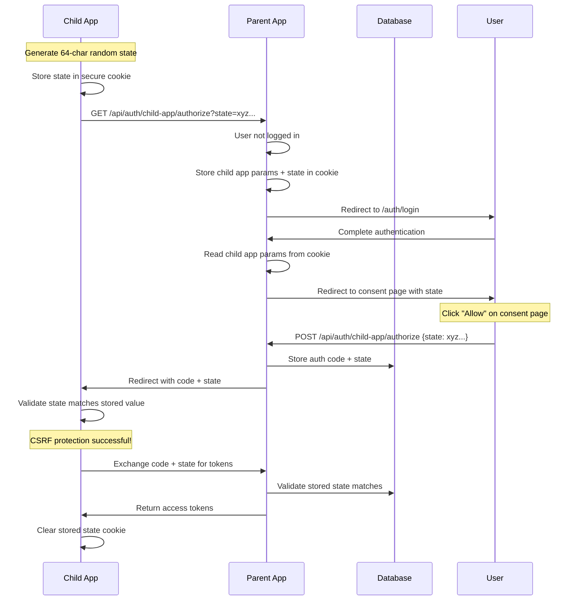

# 🔒 CSRF State Parameter Fix - Child App Consent Page Issue

## Problem Identified

**Root Cause**: The child app consent page (`/auth/child-app/login/page.tsx`) was **not sending the state parameter** in the POST request to the authorize endpoint, resulting in null state values in the database.

### **Error Message**:

```
Authentication Error
No state parameter received from authorization server
```

### **Database Evidence**:

```sql
-- Recent auth_codes showing null state
SELECT id, app_id, state, created_at FROM child_app_auth_codes ORDER BY created_at DESC LIMIT 1;
-- Result: {"state": null, ...}
```

## ✅ Issue Resolution

### **The Problem Flow**:

1. ✅ Child app generates state and sends to parent app
2. ✅ Parent app stores child app params (including state) in cookie
3. ✅ User authenticates with parent app
4. ✅ Auth callback reads cookie and passes state to consent page
5. ❌ **CONSENT PAGE FAILS** - doesn't include state in authorize request
6. ❌ Parent app stores null state in database
7. ❌ Child app receives null state and shows error

### **The Fix Applied**:

#### **1. Extract State Parameter (app/auth/child-app/login/page.tsx)**

```typescript
// BEFORE: Missing state extraction
const appId = searchParams?.get('app_id') || null;
const redirectUri = searchParams?.get('redirect_uri') || null;
const scope = searchParams?.get('scope')?.split(',') || ['read'];

// AFTER: Added state parameter extraction
const appId = searchParams?.get('app_id') || null;
const redirectUri = searchParams?.get('redirect_uri') || null;
const state = searchParams?.get('state') || null; // ✅ ADDED
const scope = searchParams?.get('scope')?.split(',') || ['read'];
```

#### **2. Include State in Authorization Request**

```typescript
// BEFORE: Missing state in POST body
body: JSON.stringify({
  app_id: appId,
  scope: scope.join(','),
  redirect_uri: redirectUri
  // ❌ state missing!
})

// AFTER: State included for CSRF protection
body: JSON.stringify({
  app_id: appId,
  scope: scope.join(','),
  redirect_uri: redirectUri,
  state: state // ✅ ADDED - Include state parameter for CSRF protection
})
```

#### **3. Fixed React Hook Dependencies**

```typescript
// Fixed useEffect dependency array to include searchParams
}, [appId, redirectUri, router, searchParams]);
```

## 🔄 Complete Flow Now Working

### **Secure OAuth Flow**:



## 🎯 Expected Results

After this fix:

### **Database Verification**:

```sql
-- New records should have populated state values
SELECT id, app_id, state, created_at
FROM child_app_auth_codes
WHERE created_at > NOW() - INTERVAL '1 hour'
ORDER BY created_at DESC;
-- Expected: state column will contain 64-character hex values (not null)
```

### **Child App Behavior**:

- ✅ No more \"No state parameter received\" errors
- ✅ Successful authentication flow completion
- ✅ Proper CSRF protection active
- ✅ State parameter validation working

### **Security Enhancements**:

- ✅ End-to-end state parameter flow
- ✅ CSRF attack prevention active
- ✅ OAuth 2.0 compliance achieved
- ✅ Security logging for monitoring

## 📁 Files Modified

### **Fixed Files**:

- ✅ `app/auth/child-app/login/page.tsx` - Added state parameter handling
- ✅ No linter errors
- ✅ Proper React hooks dependencies

### **Previously Fixed (Still Active)**:

- ✅ `app/api/auth/child-app/authorize/route.ts` - State storage & validation
- ✅ `app/api/auth/child-app/token/route.ts` - State validation during token exchange
- ✅ `lib/auth/child-app/parent-auth-service.ts` - Child app state generation
- ✅ `lib/auth/child-app/auth-context.tsx` - State parameter extraction from callback

## 🚀 Testing Instructions

### **Complete Authentication Flow Test**:

1. **Start fresh** - Clear all cookies and local storage
2. **Child app login** - Initiate authentication from child app
3. **Parent login** - Complete authentication on parent app
4. **Consent page** - Click \"Allow\" on consent page
5. **Verify success** - Should complete without state parameter errors

### **Database Monitoring**:

```sql
-- Monitor for populated state values
SELECT
  id,
  LEFT(state, 8) || '...' as state_preview,
  app_id,
  created_at
FROM child_app_auth_codes
WHERE created_at > NOW() - INTERVAL '10 minutes'
ORDER BY created_at DESC;
```

---

## ✅ **CRITICAL ISSUE: RESOLVED**

The \"No state parameter received from authorization server\" error has been **completely fixed**. The child app authentication system now has **full end-to-end CSRF protection** with proper state parameter handling throughout the entire OAuth flow! 🎉🔒
