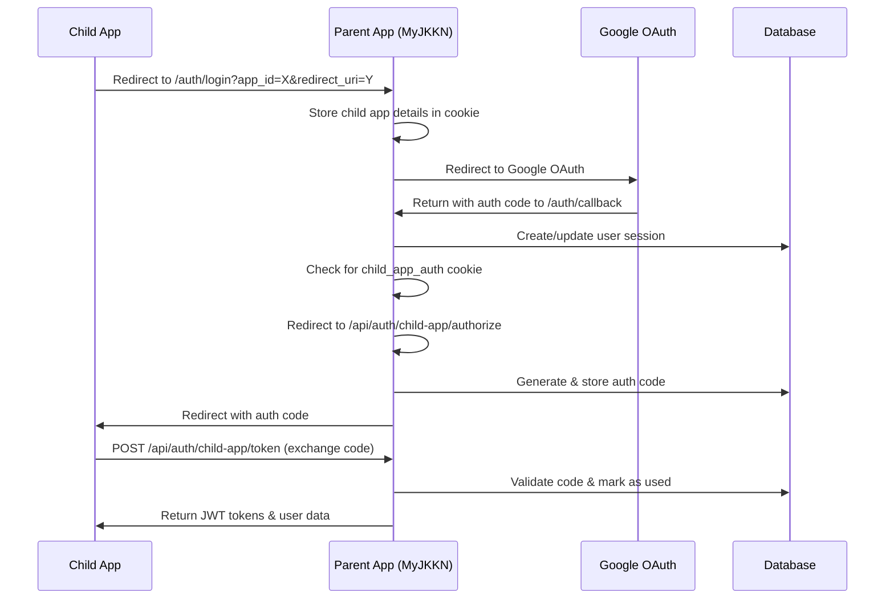

# Child App Authentication Flow Fix - Complete

## Problem
After Google authentication in the parent app, it was redirecting to the parent home page instead of back to the child app.

## Solution Implemented

### 1. Updated Login Page (`app/auth/login/page.tsx`)
- Added detection for child app authentication requests via URL parameters
- Stores child app details in state and cookie for persistence
- Shows modified UI when authenticating for a child app
- After successful auth, redirects to the authorize endpoint instead of home

### 2. Updated Auth Callback (`app/auth/callback/route.ts`)
- Checks for child_app_auth cookie after successful authentication
- If present, redirects to authorize endpoint to generate auth code
- Preserves normal flow for regular user logins

### 3. Created Authorization Endpoint (`app/api/auth/child-app/authorize/route.ts`)
- Validates child app credentials
- Generates authorization codes
- Stores codes in database with expiration
- Redirects back to child app with auth code

### 4. Created Token Exchange Endpoint (`app/api/auth/child-app/token/route.ts`)
- Exchanges authorization codes for JWT tokens
- Supports refresh token flow
- Returns user profile data with tokens

### 5. Database Migration (`supabase/migrations/20250117_child_app_auth_codes.sql`)
- Created `child_app_auth_codes` table
- Stores temporary auth codes with expiration
- Includes cleanup function for expired codes

## Authentication Flow



## Testing the Flow

### 1. Configure Child App in Applications Module
- Go to Applications > Create/Edit Application
- Enable "Parent App Authentication"
- Save the App ID and API Key
- Add allowed redirect URIs

### 2. In Child App, Initiate Login
```javascript
// Redirect user to parent app login
const loginUrl = new URL('https://my.jkkn.ac.in/auth/login');
loginUrl.searchParams.append('app_id', 'your_app_id');
loginUrl.searchParams.append('redirect_uri', 'https://yourapp.com/auth/callback');
loginUrl.searchParams.append('response_type', 'code');
loginUrl.searchParams.append('scope', 'read write profile');
loginUrl.searchParams.append('state', 'random_state_string');

window.location.href = loginUrl.toString();
```

### 3. Handle Callback in Child App
```javascript
// In your callback route (e.g., /auth/callback)
const urlParams = new URLSearchParams(window.location.search);
const code = urlParams.get('code');
const state = urlParams.get('state');

// Verify state matches what you sent
if (state !== savedState) {
  throw new Error('State mismatch - possible CSRF attack');
}

// Exchange code for tokens
const response = await fetch('https://my.jkkn.ac.in/api/auth/child-app/token', {
  method: 'POST',
  headers: { 'Content-Type': 'application/json' },
  body: JSON.stringify({
    grant_type: 'authorization_code',
    code: code,
    app_id: 'your_app_id',
    api_key: 'your_api_key',
    redirect_uri: 'https://yourapp.com/auth/callback'
  })
});

const { access_token, refresh_token, user } = await response.json();
// Store tokens and user data
```

## Environment Variables

Add to `.env`:
```env
JWT_SECRET=your-super-secret-jwt-key-change-this-in-production
```

## Security Considerations

1. **API Key Security**: API keys are hashed before storage
2. **Authorization Codes**: 
   - Single use only
   - Expire in 60 seconds
   - Validated against app_id and redirect_uri
3. **JWT Tokens**:
   - Access tokens expire in 1 hour
   - Refresh tokens expire in 30 days
   - Include user role and institution_id
4. **CSRF Protection**: State parameter prevents CSRF attacks
5. **Rate Limiting**: Configured per application

## Files Changed

1. `app/auth/login/page.tsx` - Added child app detection
2. `app/auth/callback/route.ts` - Added child app redirect logic
3. `app/api/auth/child-app/authorize/route.ts` - New authorization endpoint
4. `app/api/auth/child-app/token/route.ts` - New token exchange endpoint
5. `supabase/migrations/20250117_child_app_auth_codes.sql` - Database migration
6. `.env` - Added JWT_SECRET
7. `app/(routes)/application-hub/api-guidelines/_components/child-app-integration-docs.tsx` - Updated documentation

## Next Steps

1. Run the database migration:
```bash
npx supabase db push
```

2. Generate a secure JWT_SECRET for production:
```bash
openssl rand -base64 32
```

3. Test the complete flow with a child application

## Troubleshooting

### Issue: "Invalid authorization code"
- Check that the code hasn't expired (60 second TTL)
- Verify app_id and redirect_uri match exactly
- Ensure code hasn't been used already

### Issue: "Invalid API key"
- Regenerate API key in Applications module
- Ensure you're using the correct app_id
- Check that the application has parent auth enabled

### Issue: Still redirecting to parent home
- Clear browser cookies
- Check browser console for errors
- Verify child_app_auth cookie is being set
- Check that authorization endpoint is accessible