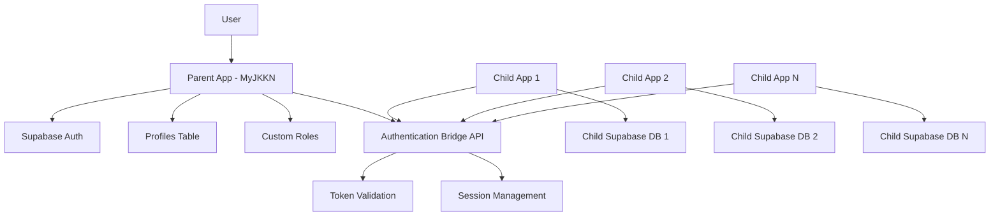

# Parent-Child Application Authentication Architecture

## Executive Summary

This document outlines the authentication architecture for MyJKKN's parent-child application ecosystem, where child applications authenticate through the parent application's centralized authentication system, eliminating the need for separate authentication in each child app.

## Architecture Overview



## Core Principles

1. **Single Sign-On (SSO)**: Users authenticate once in the parent app and gain access to all child apps
2. **Centralized User Management**: All user profiles and roles managed in parent app
3. **Decentralized Data**: Each child app maintains its own Supabase database for application-specific data
4. **Token-Based Authentication**: JWT tokens issued by parent app, validated by child apps
5. **API Key Authorization**: Child apps use API keys to communicate with parent app

## Authentication Flow

### 1. User Login Flow

```
1. User logs into Parent App (MyJKKN)
   └── Supabase Auth validates credentials
   └── User profile loaded from profiles table
   └── Custom roles assigned
   └── JWT session token created

2. User accesses Child App
   └── Child app redirects to Parent App auth endpoint
   └── Parent app validates existing session
   └── Issues child-app specific token
   └── Redirects back to child app with token

3. Child App validates token
   └── Calls Parent App validation endpoint
   └── Receives user profile and permissions
   └── Creates local session
   └── Grants access to child app
```

### 2. Token Exchange Flow

```typescript
// Parent App Issues Token
POST /api/auth/child-app/token
Headers:
  Authorization: Bearer {parent_session_token}
Body:
  {
    "child_app_id": "app_123",
    "requested_scope": ["read", "write"],
    "redirect_uri": "https://childapp.example.com/auth/callback"
  }

Response:
  {
    "access_token": "jwt_token_here",
    "token_type": "Bearer",
    "expires_in": 3600,
    "refresh_token": "refresh_token_here",
    "user": {
      "id": "user_uuid",
      "email": "user@example.com",
      "role": "student",
      "permissions": ["read", "write"],
      "institution_id": "inst_uuid"
    }
  }
```

## Implementation Components

### 1. Parent App Authentication Bridge

#### A. Authentication Endpoints

```typescript
// /app/api/auth/child-app/route.ts

import { NextRequest, NextResponse } from 'next/server';
import { createClient } from '@supabase/supabase-js';
import jwt from 'jsonwebtoken';

const JWT_SECRET = process.env.CHILD_APP_JWT_SECRET!;
const JWT_EXPIRES_IN = '24h';

// Generate child app token
export async function POST(request: NextRequest) {
  try {
    // Verify parent app session
    const authHeader = request.headers.get('authorization');
    if (!authHeader?.startsWith('Bearer ')) {
      return NextResponse.json({ error: 'Unauthorized' }, { status: 401 });
    }

    const token = authHeader.substring(7);
    const supabase = createClient(
      process.env.NEXT_PUBLIC_SUPABASE_URL!,
      process.env.NEXT_PUBLIC_SUPABASE_ANON_KEY!,
      {
        global: {
          headers: {
            Authorization: `Bearer ${token}`
          }
        }
      }
    );

    // Get user from parent app
    const { data: { user }, error } = await supabase.auth.getUser();
    if (error || !user) {
      return NextResponse.json({ error: 'Invalid session' }, { status: 401 });
    }

    // Get user profile and roles
    const { data: profile } = await supabase
      .from('profiles')
      .select('*, custom_roles(*)')
      .eq('id', user.id)
      .single();

    const body = await request.json();
    const { child_app_id, requested_scope } = body;

    // Validate child app
    const { data: childApp } = await supabase
      .from('registered_child_apps')
      .select('*')
      .eq('app_id', child_app_id)
      .single();

    if (!childApp) {
      return NextResponse.json({ error: 'Invalid child app' }, { status: 400 });
    }

    // Generate JWT for child app
    const childAppToken = jwt.sign(
      {
        user_id: user.id,
        email: user.email,
        role: profile.role,
        institution_id: profile.institution_id,
        permissions: profile.custom_roles?.permissions || {},
        scope: requested_scope,
        child_app_id,
        issued_by: 'myjkkn_parent',
        issued_at: new Date().toISOString()
      },
      JWT_SECRET,
      { expiresIn: JWT_EXPIRES_IN }
    );

    // Generate refresh token
    const refreshToken = jwt.sign(
      {
        user_id: user.id,
        child_app_id,
        type: 'refresh'
      },
      JWT_SECRET,
      { expiresIn: '7d' }
    );

    // Store token metadata
    await supabase.from('child_app_sessions').insert({
      user_id: user.id,
      child_app_id,
      access_token_hash: hashToken(childAppToken),
      refresh_token_hash: hashToken(refreshToken),
      expires_at: new Date(Date.now() + 24 * 60 * 60 * 1000).toISOString(),
      created_at: new Date().toISOString()
    });

    return NextResponse.json({
      access_token: childAppToken,
      token_type: 'Bearer',
      expires_in: 86400, // 24 hours
      refresh_token: refreshToken,
      user: {
        id: user.id,
        email: user.email,
        full_name: profile.full_name,
        role: profile.role,
        permissions: profile.custom_roles?.permissions || {},
        institution_id: profile.institution_id
      }
    });
  } catch (error) {
    console.error('Token generation error:', error);
    return NextResponse.json({ error: 'Internal server error' }, { status: 500 });
  }
}
```

#### B. Token Validation Endpoint

```typescript
// /app/api/auth/child-app/validate/route.ts

export async function POST(request: NextRequest) {
  try {
    const { token, child_app_id } = await request.json();

    // Verify JWT
    const decoded = jwt.verify(token, JWT_SECRET) as any;

    // Validate token hasn't been revoked
    const supabase = createClient(
      process.env.NEXT_PUBLIC_SUPABASE_URL!,
      process.env.SUPABASE_SERVICE_KEY! // Service key for admin access
    );

    const { data: session } = await supabase
      .from('child_app_sessions')
      .select('*')
      .eq('user_id', decoded.user_id)
      .eq('child_app_id', child_app_id)
      .eq('is_active', true)
      .single();

    if (!session) {
      return NextResponse.json({ valid: false }, { status: 401 });
    }

    // Get latest user data
    const { data: profile } = await supabase
      .from('profiles')
      .select('*, custom_roles(*)')
      .eq('id', decoded.user_id)
      .single();

    return NextResponse.json({
      valid: true,
      user: {
        id: decoded.user_id,
        email: decoded.email,
        full_name: profile.full_name,
        role: profile.role,
        permissions: profile.custom_roles?.permissions || {},
        institution_id: profile.institution_id,
        is_active: profile.is_active
      }
    });
  } catch (error) {
    return NextResponse.json({ valid: false }, { status: 401 });
  }
}
```

### 2. Child App Authentication Implementation

#### A. Authentication Service

```typescript
// child-app/lib/auth/parent-auth-service.ts

import axios from 'axios';

const PARENT_APP_URL = process.env.NEXT_PUBLIC_PARENT_APP_URL || 'https://my.jkkn.ac.in';
const CHILD_APP_ID = process.env.NEXT_PUBLIC_CHILD_APP_ID!;
const CHILD_APP_API_KEY = process.env.CHILD_APP_API_KEY!;

export interface ParentAppUser {
  id: string;
  email: string;
  full_name: string;
  role: string;
  permissions: Record<string, any>;
  institution_id: string;
}

export class ParentAuthService {
  private static TOKEN_KEY = 'parent_app_token';
  private static REFRESH_TOKEN_KEY = 'parent_app_refresh_token';
  private static USER_KEY = 'parent_app_user';

  // Redirect to parent app for authentication
  static initiateLogin(redirectUrl?: string) {
    const currentUrl = redirectUrl || window.location.href;
    const authUrl = `${PARENT_APP_URL}/auth/child-app/login?` +
      `app_id=${CHILD_APP_ID}&` +
      `redirect_uri=${encodeURIComponent(currentUrl)}`;

    window.location.href = authUrl;
  }

  // Handle callback from parent app
  static async handleCallback(token: string, refreshToken: string): Promise<ParentAppUser | null> {
    try {
      // Validate token with parent app
      const response = await axios.post(
        `${PARENT_APP_URL}/api/auth/child-app/validate`,
        {
          token,
          child_app_id: CHILD_APP_ID
        },
        {
          headers: {
            'X-API-Key': CHILD_APP_API_KEY
          }
        }
      );

      if (response.data.valid) {
        // Store tokens
        localStorage.setItem(this.TOKEN_KEY, token);
        localStorage.setItem(this.REFRESH_TOKEN_KEY, refreshToken);
        localStorage.setItem(this.USER_KEY, JSON.stringify(response.data.user));

        return response.data.user;
      }

      return null;
    } catch (error) {
      console.error('Token validation failed:', error);
      return null;
    }
  }

  // Get current user
  static getCurrentUser(): ParentAppUser | null {
    const userStr = localStorage.getItem(this.USER_KEY);
    return userStr ? JSON.parse(userStr) : null;
  }

  // Get access token
  static getAccessToken(): string | null {
    return localStorage.getItem(this.TOKEN_KEY);
  }

  // Validate current session
  static async validateSession(): Promise<boolean> {
    const token = this.getAccessToken();
    if (!token) return false;

    try {
      const response = await axios.post(
        `${PARENT_APP_URL}/api/auth/child-app/validate`,
        {
          token,
          child_app_id: CHILD_APP_ID
        },
        {
          headers: {
            'X-API-Key': CHILD_APP_API_KEY
          }
        }
      );

      if (response.data.valid) {
        localStorage.setItem(this.USER_KEY, JSON.stringify(response.data.user));
        return true;
      }

      // Token invalid, try refresh
      return await this.refreshToken();
    } catch (error) {
      return false;
    }
  }

  // Refresh token
  static async refreshToken(): Promise<boolean> {
    const refreshToken = localStorage.getItem(this.REFRESH_TOKEN_KEY);
    if (!refreshToken) return false;

    try {
      const response = await axios.post(
        `${PARENT_APP_URL}/api/auth/child-app/refresh`,
        {
          refresh_token: refreshToken,
          child_app_id: CHILD_APP_ID
        },
        {
          headers: {
            'X-API-Key': CHILD_APP_API_KEY
          }
        }
      );

      if (response.data.access_token) {
        localStorage.setItem(this.TOKEN_KEY, response.data.access_token);
        localStorage.setItem(this.REFRESH_TOKEN_KEY, response.data.refresh_token);
        localStorage.setItem(this.USER_KEY, JSON.stringify(response.data.user));
        return true;
      }

      return false;
    } catch (error) {
      this.logout();
      return false;
    }
  }

  // Logout
  static logout() {
    localStorage.removeItem(this.TOKEN_KEY);
    localStorage.removeItem(this.REFRESH_TOKEN_KEY);
    localStorage.removeItem(this.USER_KEY);

    // Redirect to parent app logout
    window.location.href = `${PARENT_APP_URL}/auth/logout?redirect_uri=${encodeURIComponent(window.location.origin)}`;
  }

  // Check permissions
  static hasPermission(permission: string): boolean {
    const user = this.getCurrentUser();
    if (!user) return false;

    return user.permissions && user.permissions[permission] === true;
  }

  // Check role
  static hasRole(role: string): boolean {
    const user = this.getCurrentUser();
    return user?.role === role;
  }
}
```

#### B. Authentication Hook for React

```typescript
// child-app/hooks/useParentAuth.ts

import { useEffect, useState, createContext, useContext } from 'react';
import { ParentAuthService, ParentAppUser } from '@/lib/auth/parent-auth-service';
import { useRouter } from 'next/navigation';

interface AuthContextType {
  user: ParentAppUser | null;
  loading: boolean;
  login: () => void;
  logout: () => void;
  hasPermission: (permission: string) => boolean;
  hasRole: (role: string) => boolean;
}

const AuthContext = createContext<AuthContextType | undefined>(undefined);

export function AuthProvider({ children }: { children: React.ReactNode }) {
  const [user, setUser] = useState<ParentAppUser | null>(null);
  const [loading, setLoading] = useState(true);
  const router = useRouter();

  useEffect(() => {
    checkAuth();
  }, []);

  const checkAuth = async () => {
    setLoading(true);

    // Check for token in URL (callback from parent app)
    const urlParams = new URLSearchParams(window.location.search);
    const token = urlParams.get('token');
    const refreshToken = urlParams.get('refresh_token');

    if (token && refreshToken) {
      const user = await ParentAuthService.handleCallback(token, refreshToken);
      if (user) {
        setUser(user);
        // Clean URL
        window.history.replaceState({}, document.title, window.location.pathname);
      }
    } else {
      // Validate existing session
      const isValid = await ParentAuthService.validateSession();
      if (isValid) {
        setUser(ParentAuthService.getCurrentUser());
      } else {
        setUser(null);
      }
    }

    setLoading(false);
  };

  const login = () => {
    ParentAuthService.initiateLogin();
  };

  const logout = () => {
    ParentAuthService.logout();
    setUser(null);
  };

  const hasPermission = (permission: string) => {
    return ParentAuthService.hasPermission(permission);
  };

  const hasRole = (role: string) => {
    return ParentAuthService.hasRole(role);
  };

  return (
    <AuthContext.Provider value={{ user, loading, login, logout, hasPermission, hasRole }}>
      {children}
    </AuthContext.Provider>
  );
}

export function useParentAuth() {
  const context = useContext(AuthContext);
  if (context === undefined) {
    throw new Error('useParentAuth must be used within an AuthProvider');
  }
  return context;
}
```

#### C. Protected Route Component

```typescript
// child-app/components/auth/protected-route.tsx

import { useParentAuth } from '@/hooks/useParentAuth';
import { useRouter } from 'next/navigation';
import { useEffect } from 'react';

interface ProtectedRouteProps {
  children: React.ReactNode;
  requiredPermission?: string;
  requiredRole?: string;
}

export function ProtectedRoute({
  children,
  requiredPermission,
  requiredRole
}: ProtectedRouteProps) {
  const { user, loading, login, hasPermission, hasRole } = useParentAuth();
  const router = useRouter();

  useEffect(() => {
    if (!loading && !user) {
      login();
    }
  }, [loading, user]);

  if (loading) {
    return <div>Loading...</div>;
  }

  if (!user) {
    return null; // Will redirect to login
  }

  if (requiredPermission && !hasPermission(requiredPermission)) {
    return <div>Access Denied: Insufficient permissions</div>;
  }

  if (requiredRole && !hasRole(requiredRole)) {
    return <div>Access Denied: Role required: {requiredRole}</div>;
  }

  return <>{children}</>;
}
```

### 3. Database Schema Updates

```sql
-- Parent App: Table for registered child applications
CREATE TABLE IF NOT EXISTS public.registered_child_apps (
    id UUID PRIMARY KEY DEFAULT uuid_generate_v4(),
    app_id VARCHAR(50) UNIQUE NOT NULL,
    app_name VARCHAR(255) NOT NULL,
    app_url VARCHAR(255) NOT NULL,
    api_key_hash VARCHAR(255) NOT NULL,
    allowed_redirect_uris TEXT[] NOT NULL,
    allowed_scopes TEXT[] DEFAULT ARRAY['read'],
    is_active BOOLEAN DEFAULT true,
    created_at TIMESTAMPTZ DEFAULT now(),
    updated_at TIMESTAMPTZ DEFAULT now()
);

-- Parent App: Table for child app sessions
CREATE TABLE IF NOT EXISTS public.child_app_sessions (
    id UUID PRIMARY KEY DEFAULT uuid_generate_v4(),
    user_id UUID NOT NULL REFERENCES profiles(id),
    child_app_id VARCHAR(50) NOT NULL,
    access_token_hash VARCHAR(255) NOT NULL,
    refresh_token_hash VARCHAR(255) NOT NULL,
    expires_at TIMESTAMPTZ NOT NULL,
    last_used_at TIMESTAMPTZ,
    is_active BOOLEAN DEFAULT true,
    created_at TIMESTAMPTZ DEFAULT now(),
    updated_at TIMESTAMPTZ DEFAULT now()
);

-- Indexes
CREATE INDEX idx_child_app_sessions_user_id ON public.child_app_sessions(user_id);
CREATE INDEX idx_child_app_sessions_child_app_id ON public.child_app_sessions(child_app_id);
CREATE INDEX idx_child_app_sessions_expires_at ON public.child_app_sessions(expires_at);
```

## Security Considerations

### 1. Token Security

- **JWT Signing**: Use strong secret keys (minimum 256 bits)
- **Token Expiration**: Set appropriate expiration times (24 hours for access, 7 days for refresh)
- **Token Rotation**: Implement refresh token rotation
- **Secure Storage**: Store tokens in httpOnly cookies or secure localStorage

### 2. API Key Management

- **Key Hashing**: Never store plain text API keys
- **Key Rotation**: Regular rotation schedule (every 90 days)
- **Rate Limiting**: Implement rate limiting per API key
- **Audit Logging**: Log all API key usage

### 3. Communication Security

- **HTTPS Only**: All communication must use HTTPS
- **CORS Configuration**: Strict CORS policies for child apps
- **Request Signing**: Optional request signing for additional security
- **IP Whitelisting**: Optional IP restrictions for production

### 4. Session Management

- **Session Validation**: Regular validation of active sessions
- **Revocation**: Ability to revoke sessions immediately
- **Device Tracking**: Optional device fingerprinting
- **Concurrent Session Limits**: Limit number of active sessions

## Implementation Checklist

### Parent App Setup

- [ ] Create authentication bridge API endpoints
- [ ] Implement token generation and validation
- [ ] Set up registered child apps table
- [ ] Configure CORS for child app domains
- [ ] Implement session management
- [ ] Add audit logging
- [ ] Create admin UI for managing child apps

### Child App Setup

- [ ] Install authentication service
- [ ] Configure parent app URL and credentials
- [ ] Implement authentication hook/provider
- [ ] Set up protected routes
- [ ] Handle token refresh
- [ ] Implement logout flow
- [ ] Add permission checking

### Testing

- [ ] Test login flow
- [ ] Test token refresh
- [ ] Test permission validation
- [ ] Test logout flow
- [ ] Test error handling
- [ ] Load testing
- [ ] Security testing

## Migration Guide

### For Existing Child Apps

1. **Remove Supabase Auth**

   ```typescript
   // Remove these imports
   // import { createClient } from '@supabase/supabase-js';
   // import { useUser } from '@supabase/auth-helpers-react';
   ```

2. **Replace with Parent Auth**

   ```typescript
   // Add new imports
   import { useParentAuth } from '@/hooks/useParentAuth';
   import { ProtectedRoute } from '@/components/auth/protected-route';
   ```

3. **Update Authentication Checks**

   ```typescript
   // Before
   const { user } = useUser();
   if (!user) redirect('/login');

   // After
   const { user } = useParentAuth();
   if (!user) login();
   ```

4. **Update API Calls**
   ```typescript
   // Include parent app token
   const token = ParentAuthService.getAccessToken();
   fetch('/api/data', {
     headers: {
       'Authorization': `Bearer ${token}`
     }
   });
   ```

## API Documentation

### Authentication Endpoints

#### 1. Generate Child App Token

```
POST /api/auth/child-app/token
Authorization: Bearer {parent_session_token}

Request:
{
  "child_app_id": "string",
  "requested_scope": ["read", "write"]
}

Response:
{
  "access_token": "string",
  "refresh_token": "string",
  "expires_in": number,
  "user": {...}
}
```

#### 2. Validate Token

```
POST /api/auth/child-app/validate
X-API-Key: {child_app_api_key}

Request:
{
  "token": "string",
  "child_app_id": "string"
}

Response:
{
  "valid": boolean,
  "user": {...}
}
```

#### 3. Refresh Token

```
POST /api/auth/child-app/refresh
X-API-Key: {child_app_api_key}

Request:
{
  "refresh_token": "string",
  "child_app_id": "string"
}

Response:
{
  "access_token": "string",
  "refresh_token": "string",
  "expires_in": number
}
```

#### 4. Revoke Token

```
POST /api/auth/child-app/revoke
Authorization: Bearer {token}

Request:
{
  "token": "string",
  "child_app_id": "string"
}

Response:
{
  "success": boolean
}
```

## Monitoring and Debugging

### Logging

```typescript
// Parent App
console.log('[Auth Bridge] Token generated for:', {
  user_id: user.id,
  child_app_id,
  timestamp: new Date().toISOString()
});

// Child App
console.log('[Parent Auth] Session validated:', {
  user_id: user.id,
  valid: true,
  timestamp: new Date().toISOString()
});
```

### Metrics to Track

- Authentication success/failure rates
- Token generation frequency
- Session duration
- API call patterns
- Error rates by endpoint

### Common Issues and Solutions

1. **Token Expired**
   - Solution: Implement automatic refresh
2. **CORS Errors**
   - Solution: Configure proper CORS headers
3. **Session Not Found**
   - Solution: Re-authenticate with parent app
4. **Permission Denied**
   - Solution: Check role and permission mapping

## Support and Maintenance

### Regular Tasks

- Weekly: Review authentication logs
- Monthly: Audit active sessions
- Quarterly: Rotate API keys
- Yearly: Security audit

### Emergency Procedures

- Revoke all tokens: Execute revoke all script
- Block child app: Deactivate in registered_child_apps
- Force re-authentication: Clear all sessions

## Conclusion

This authentication bridge provides a secure, scalable solution for managing authentication across parent and child applications while maintaining data isolation and centralized user management. The implementation ensures seamless user experience with robust security controls.
