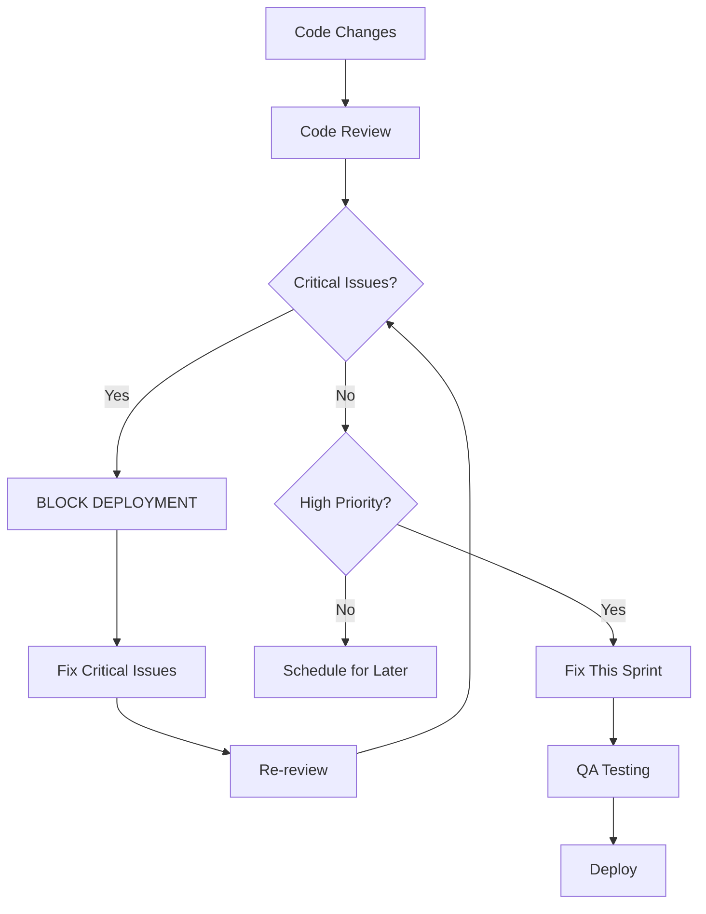

# Code Review Reports

This directory contains comprehensive code reviews for the MyJKKN TQM (Total Quality Management) modules.

## Available Reports

### Part 3: OKR ABCD, Billing COPQ, Process Excellence
**File:** `tqm-review-part3.md`
**Date:** 2026-02-01
**Modules:**
- OKR ABCD Matrix (Process vs. Result analysis)
- Billing COPQ (Cost of Poor Quality tracking)
- Process Excellence (TIMWOOD waste tracking)

**Summary:** `tqm-modules-summary.md`

**Critical Issues:** 8
**High Priority:** 12
**Total Issues:** 44

**Status:** ⚠️ REQUIRES IMMEDIATE ACTION

---

## Quick Links

- [Full Part 3 Review](./tqm-review-part3.md)
- [Executive Summary](./tqm-modules-summary.md)
- [Part 1 Review](./tqm-review-part1.md)
- [Part 2 Review](./tqm-review-part2.md)

---

## Priority Issues at a Glance

### 🔴 Critical (Fix Immediately)
1. SQL Injection in search filters
2. Race condition in process advancement
3. Missing null safety in ABCD calculations
4. Financial precision loss (floating point)
5. Cross-institution data leakage
6. Unvalidated financial inputs
7. Silent error swallowing
8. Unbounded query DoS

### 🟡 High Priority (Fix This Sprint)
1. Missing transaction support
2. Inconsistent error messages
3. No ABCD filter validation
4. Hardcoded colors (dark mode)
5. Missing loading states
6. Memory leaks in charts
7. No search debouncing
8. Missing rate limiting
9. No audit logging
10. Invalid date ranges
11. Process rating not validated
12. Duplicate keys in loops

---

## Review Workflow

---

## Testing Checklist

Before marking any review as complete:

- [ ] Security tests pass (cross-institution access)
- [ ] Load tests pass (pagination, concurrent updates)
- [ ] Financial accuracy verified (to the paisa)
- [ ] All critical issues fixed
- [ ] All high priority issues fixed
- [ ] Code review approved by senior dev
- [ ] QA sign-off received

---

## Contact

Questions about these reviews? Contact the development team.

**Last Updated:** 2026-02-01
