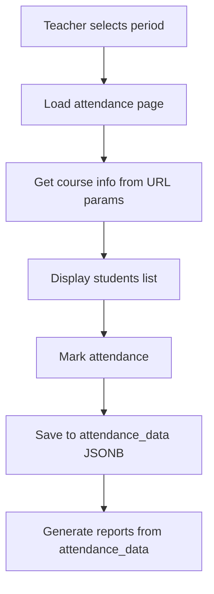

# Attendance Module Improvements - Current Implementation Enhancement Plan

**Date:** 2025-09-05  
**Category:** IMPROVEMENT  
**Status:** PLANNING  
**Priority:** MEDIUM  

## 📋 Executive Summary

This document outlines recommended improvements to the current attendance marking module to prevent future conflicts and enhance data integrity without affecting the existing `student_attendance` table structure.

## 🎯 Improvement Goals

### Primary Objectives
- **Data Consistency**: Ensure attendance_data always contains accurate course/staff information
- **Conflict Prevention**: Prevent staff assignment conflicts at the source (during marking)
- **User Experience**: Improve the attendance marking interface for better usability
- **Performance**: Optimize the marking process for faster operations
- **Audit Trail**: Enhance tracking of who changed what and when

### Success Criteria
- ✅ Zero instances of wrong course/staff data in attendance_data
- ✅ Real-time conflict detection during attendance marking
- ✅ Improved marking interface with better validation
- ✅ Complete audit trails for all attendance modifications
- ✅ Backward compatibility with existing attendance data

## 🔍 Current Implementation Analysis

### Current Attendance Marking Flow


### Identified Issues
1. **Course Info Source**: Retrieved from URL parameters instead of authoritative timetable
2. **Staff Assignment Gaps**: No real-time validation of staff assignments
3. **Data Validation**: Insufficient validation before saving attendance_data
4. **Conflict Detection**: No immediate feedback during marking process
5. **Audit Trail**: Limited tracking of changes and modifications

## 🔧 Proposed Improvements

### 1. Enhanced Attendance Marking Page

#### A. Course Information Resolution (CRITICAL FIX)
```typescript
// app/(routes)/academic/attendance/mark/page.tsx - Enhanced version

// BEFORE (Current - Problematic):
const courseName = searchParams.get('courseName') || 'Unknown Course';

// AFTER (Improved - Authoritative):
const resolveCourseInfo = async (timetableId: string, periodId: string) => {
  // 1. Get timetable data
  const timetableData = await TimetableService.getTimetableData(timetableId);
  
  // 2. Find matching period in timetable
  const periodSlot = findPeriodInTimetable(timetableData, periodId);
  
  // 3. Resolve course information from database
  if (periodSlot?.course_id) {
    const courseInfo = await CourseService.getCourseDetails(periodSlot.course_id);
    return {
      course_id: courseInfo.id,
      course_name: courseInfo.name,
      course_code: courseInfo.code,
      source: 'database' // Indicates authoritative source
    };
  }
  
  // 4. Fallback to URL params with warning
  return {
    course_id: null,
    course_name: searchParams.get('courseName') || 'Unknown Course',
    course_code: searchParams.get('courseCode') || 'N/A',
    source: 'url_fallback' // Indicates potential issue
  };
};
```

#### B. Real-Time Staff Validation
```typescript
// Enhanced staff assignment validation during marking
const validateStaffAssignment = async (
  timetableId: string, 
  periodId: string, 
  currentStaffId: string
) => {
  const staffAssignment = await StaffAssignmentService.resolveStaffForPeriod(
    timetableId, 
    periodId
  );
  
  const validation = {
    isAuthorized: false,
    assignedStaff: staffAssignment.assignedStaff,
    primaryStaff: staffAssignment.primaryStaff,
    hasConflict: false,
    conflictType: null as string | null,
    canProceed: false,
    warningMessage: null as string | null
  };
  
  // Check if current user is assigned to this period
  if (staffAssignment.assignedStaff.includes(currentStaffId)) {
    validation.isAuthorized = true;
    validation.canProceed = true;
  }
  // Check if user is super admin
  else if (await UserService.isSuperAdmin(currentStaffId)) {
    validation.isAuthorized = true;
    validation.hasConflict = true;
    validation.conflictType = 'super_admin_override';
    validation.canProceed = true;
    validation.warningMessage = 'You are marking attendance as super admin for a period not assigned to you.';
  }
  // Unauthorized access
  else {
    validation.hasConflict = true;
    validation.conflictType = 'unauthorized_access';
    validation.canProceed = false;
    validation.warningMessage = 'You are not authorized to mark attendance for this period.';
  }
  
  return validation;
};
```

#### C. Enhanced Attendance Data Structure
```typescript
// Improved attendance_data structure with metadata
interface EnhancedAttendanceData {
  [periodId: string]: {
    // Core period information (from timetable)
    period_id: string;
    period_name: string;
    start_time: string;
    end_time: string;
    
    // Course information (resolved from database)
    course_id: string | null;
    course_name: string;
    course_code: string;
    course_info_source: 'database' | 'url_fallback' | 'manual_entry';
    
    // Staff information (from timetable + current user)
    assigned_staff_ids: string[];
    primary_staff_id: string | null;
    marked_by_staff_id: string;
    staff_assignment_validation: {
      is_authorized: boolean;
      has_conflict: boolean;
      conflict_type: string | null;
    };
    
    // Student attendance data
    students: StudentAttendanceRecord[];
    
    // Audit and metadata
    marked_at: string;
    last_modified_at: string;
    last_modified_by: string;
    modification_count: number;
    data_integrity_score: number; // 0-100 based on data quality
  };
}
```

### 2. Staff Assignment Service Enhancement

#### A. Comprehensive Staff Resolution
```typescript
// lib/services/academic/staff-assignment-service.ts
export class StaffAssignmentService extends BaseService {
  /**
   * Resolve staff assignments for a specific timetable period
   */
  static async resolveStaffForPeriod(
    timetableId: string,
    periodId: string
  ): Promise<StaffAssignment> {
    const supabase = this.getSupabase();
    
    // Get timetable data
    const { data: timetableData, error } = await supabase
      .from('timetables')
      .select('timetable_data')
      .eq('id', timetableId)
      .single();
      
    if (error || !timetableData) {
      throw new Error('Timetable not found');
    }
    
    // Find period in timetable structure
    const periodSlot = this.findPeriodInTimetableData(
      timetableData.timetable_data,
      periodId
    );
    
    if (!periodSlot) {
      throw new Error('Period not found in timetable');
    }
    
    // Get staff details
    const staffIds = periodSlot.staff_ids || [];
    const primaryStaffId = periodSlot.primary_staff_id;
    
    const { data: staffDetails } = await supabase
      .from('staff')
      .select('id, first_name, last_name, email, designation')
      .in('id', staffIds);
    
    return {
      assignedStaff: staffIds,
      primaryStaff: primaryStaffId,
      staffDetails: staffDetails || [],
      periodSlot,
      courseId: periodSlot.course_id,
      sectionIds: periodSlot.section_ids || []
    };
  }
  
  /**
   * Validate if a staff member can mark attendance for a period
   */
  static async validateStaffAccess(
    staffId: string,
    timetableId: string,
    periodId: string
  ): Promise<StaffValidationResult> {
    // Implementation here
  }
}
```

### 3. Enhanced Validation and Conflict Prevention

#### A. Real-Time Validation Component
```typescript
// app/(routes)/academic/attendance/mark/_components/attendance-validation-panel.tsx
export function AttendanceValidationPanel({ 
  timetableId, 
  periodId, 
  currentStaffId 
}: AttendanceValidationPanelProps) {
  const [validation, setValidation] = useState<StaffValidation | null>(null);
  const [courseInfo, setCourseInfo] = useState<CourseInfo | null>(null);
  
  useEffect(() => {
    const validateAccess = async () => {
      try {
        // Validate staff assignment
        const staffValidation = await StaffAssignmentService.validateStaffAccess(
          currentStaffId,
          timetableId,
          periodId
        );
        
        // Resolve course information
        const resolvedCourseInfo = await CourseService.resolveCourseForPeriod(
          timetableId,
          periodId
        );
        
        setValidation(staffValidation);
        setCourseInfo(resolvedCourseInfo);
        
      } catch (error) {
        console.error('Validation error:', error);
      }
    };
    
    validateAccess();
  }, [timetableId, periodId, currentStaffId]);
  
  if (!validation || !courseInfo) {
    return <ValidationLoadingSkeleton />;
  }
  
  return (
    <div className="border rounded-lg p-4 mb-6">
      <h3 className="font-semibold mb-3">Attendance Session Validation</h3>
      
      {/* Course Information Display */}
      <div className="grid grid-cols-2 gap-4 mb-4">
        <div>
          <label className="text-sm text-muted-foreground">Course</label>
          <div className="font-medium">
            {courseInfo.name}
            <span className="ml-2 text-sm text-muted-foreground">
              ({courseInfo.code})
            </span>
          </div>
          {courseInfo.source !== 'database' && (
            <div className="text-xs text-amber-600 mt-1">
              ⚠️ Course info from {courseInfo.source}
            </div>
          )}
        </div>
        
        <div>
          <label className="text-sm text-muted-foreground">Staff Assignment</label>
          <div className="font-medium">
            {validation.assignedStaff.length} staff assigned
          </div>
          {validation.hasConflict && (
            <div className="text-xs text-red-600 mt-1">
              ⚠️ {validation.conflictType}
            </div>
          )}
        </div>
      </div>
      
      {/* Validation Status */}
      <div className={`p-3 rounded ${
        validation.canProceed 
          ? 'bg-green-50 border-green-200' 
          : 'bg-red-50 border-red-200'
      }`}>
        <div className="flex items-center">
          {validation.canProceed ? (
            <CheckCircle className="w-5 h-5 text-green-600 mr-2" />
          ) : (
            <AlertCircle className="w-5 h-5 text-red-600 mr-2" />
          )}
          <span className={`font-medium ${
            validation.canProceed ? 'text-green-800' : 'text-red-800'
          }`}>
            {validation.canProceed ? 'Authorized to mark attendance' : 'Not authorized'}
          </span>
        </div>
        
        {validation.warningMessage && (
          <div className="text-sm mt-2 text-muted-foreground">
            {validation.warningMessage}
          </div>
        )}
      </div>
      
      {/* Assigned Staff List */}
      {validation.assignedStaff.length > 0 && (
        <div className="mt-4">
          <label className="text-sm text-muted-foreground block mb-2">
            Assigned Faculty
          </label>
          <div className="space-y-1">
            {validation.staffDetails.map(staff => (
              <div key={staff.id} className="flex items-center text-sm">
                <span className="font-medium">{staff.first_name} {staff.last_name}</span>
                {staff.id === validation.primaryStaff && (
                  <Badge variant="secondary" className="ml-2 text-xs">Primary</Badge>
                )}
                {staff.id === currentStaffId && (
                  <Badge variant="default" className="ml-2 text-xs">You</Badge>
                )}
              </div>
            ))}
          </div>
        </div>
      )}
    </div>
  );
}
```

#### B. Data Integrity Scoring
```typescript
// lib/utils/attendance-data-integrity.ts
export function calculateDataIntegrityScore(attendanceData: any): number {
  let score = 100;
  const penalties = {
    missing_course_id: -20,
    url_fallback_source: -10,
    staff_conflict: -30,
    missing_timestamps: -5,
    invalid_student_data: -15
  };
  
  // Check course information quality
  if (!attendanceData.course_id) {
    score += penalties.missing_course_id;
  }
  
  if (attendanceData.course_info_source === 'url_fallback') {
    score += penalties.url_fallback_source;
  }
  
  // Check staff assignment validation
  if (attendanceData.staff_assignment_validation?.has_conflict) {
    score += penalties.staff_conflict;
  }
  
  // Check timestamp completeness
  if (!attendanceData.marked_at || !attendanceData.last_modified_at) {
    score += penalties.missing_timestamps;
  }
  
  // Check student data validity
  if (!Array.isArray(attendanceData.students) || attendanceData.students.length === 0) {
    score += penalties.invalid_student_data;
  }
  
  return Math.max(0, Math.min(100, score));
}
```

### 4. Enhanced Attendance Service

#### A. Improved Data Validation
```typescript
// lib/services/academic/attendance-service.ts - Enhanced version
export class AttendanceService extends BaseService {
  /**
   * Save attendance with enhanced validation and data integrity
   */
  static async upsertConsolidatedAttendance(
    attendancePayload: ConsolidatedAttendancePayload
  ): Promise<ConsolidatedAttendanceResult> {
    // Pre-save validation
    await this.validateAttendancePayload(attendancePayload);
    
    // Enhance attendance data with metadata
    const enhancedAttendanceData = await this.enhanceAttendanceData(
      attendancePayload.attendance_data
    );
    
    // Calculate data integrity score
    Object.keys(enhancedAttendanceData).forEach(periodId => {
      enhancedAttendanceData[periodId].data_integrity_score = 
        calculateDataIntegrityScore(enhancedAttendanceData[periodId]);
    });
    
    const supabase = this.getSupabase();
    
    // Check if record exists
    const { data: existingRecord } = await supabase
      .from('student_attendance')
      .select('id, attendance_data')
      .eq('timetable_id', attendancePayload.timetable_id)
      .eq('attendance_date', attendancePayload.attendance_date)
      .eq('section_id', attendancePayload.section_id)
      .single();
    
    if (existingRecord) {
      // Update existing record
      return this.updateExistingAttendance(
        existingRecord,
        enhancedAttendanceData,
        attendancePayload
      );
    } else {
      // Create new record
      return this.createNewAttendance(
        enhancedAttendanceData,
        attendancePayload
      );
    }
  }
  
  /**
   * Enhance attendance data with metadata and validation
   */
  private static async enhanceAttendanceData(
    attendanceData: any
  ): Promise<any> {
    const enhanced = { ...attendanceData };
    
    for (const periodId of Object.keys(enhanced)) {
      const periodData = enhanced[periodId];
      
      // Add staff assignment validation
      const validation = await StaffAssignmentService.validateStaffAccess(
        periodData.marked_by_staff_id || periodData.faculty_email, // Handle legacy data
        periodData.timetable_id,
        periodId
      );
      
      // Enhance with metadata
      enhanced[periodId] = {
        ...periodData,
        staff_assignment_validation: {
          is_authorized: validation.isAuthorized,
          has_conflict: validation.hasConflict,
          conflict_type: validation.conflictType
        },
        last_modified_at: new Date().toISOString(),
        modification_count: (periodData.modification_count || 0) + 1
      };
    }
    
    return enhanced;
  }
  
  /**
   * Validate attendance payload before saving
   */
  private static async validateAttendancePayload(
    payload: ConsolidatedAttendancePayload
  ): Promise<void> {
    const errors: string[] = [];
    
    // Validate required fields
    if (!payload.timetable_id) errors.push('Timetable ID is required');
    if (!payload.attendance_date) errors.push('Attendance date is required');
    if (!payload.section_id) errors.push('Section ID is required');
    if (!payload.marked_by) errors.push('Marked by is required');
    
    // Validate attendance data structure
    if (!payload.attendance_data || Object.keys(payload.attendance_data).length === 0) {
      errors.push('Attendance data is required');
    }
    
    // Validate each period's data
    for (const [periodId, periodData] of Object.entries(payload.attendance_data)) {
      if (!periodData.students || !Array.isArray(periodData.students)) {
        errors.push(`Invalid student data for period ${periodId}`);
      }
      
      if (!periodData.course_name) {
        errors.push(`Course name missing for period ${periodId}`);
      }
    }
    
    if (errors.length > 0) {
      throw new ValidationError('Attendance validation failed', errors);
    }
  }
}
```

### 5. Enhanced UI Components

#### A. Improved Attendance Marking Interface
```typescript
// app/(routes)/academic/attendance/mark/_components/enhanced-attendance-form.tsx
export function EnhancedAttendanceForm({ 
  students, 
  contextData, 
  onSave 
}: EnhancedAttendanceFormProps) {
  const [attendanceData, setAttendanceData] = useState<Record<string, AttendanceStatus>>({});
  const [validationState, setValidationState] = useState<ValidationState | null>(null);
  const [dataIntegrityScore, setDataIntegrityScore] = useState<number>(100);
  
  // Real-time validation
  useEffect(() => {
    const validateAndScore = async () => {
      if (contextData) {
        const validation = await validateCurrentSession(contextData);
        const score = calculateSessionIntegrityScore(contextData, attendanceData);
        
        setValidationState(validation);
        setDataIntegrityScore(score);
      }
    };
    
    validateAndScore();
  }, [contextData, attendanceData]);
  
  return (
    <div className="space-y-6">
      {/* Data Integrity Score */}
      <div className="bg-gray-50 rounded-lg p-4">
        <div className="flex items-center justify-between">
          <span className="text-sm font-medium">Data Integrity Score</span>
          <div className="flex items-center space-x-2">
            <div className="w-24 bg-gray-200 rounded-full h-2">
              <div 
                className={`h-2 rounded-full ${
                  dataIntegrityScore >= 90 ? 'bg-green-500' :
                  dataIntegrityScore >= 70 ? 'bg-yellow-500' : 'bg-red-500'
                }`}
                style={{ width: `${dataIntegrityScore}%` }}
              />
            </div>
            <span className="text-sm font-medium">{dataIntegrityScore}%</span>
          </div>
        </div>
        
        {dataIntegrityScore < 100 && (
          <div className="mt-2 text-xs text-muted-foreground">
            Issues detected that may affect report accuracy
          </div>
        )}
      </div>
      
      {/* Validation Panel */}
      <AttendanceValidationPanel 
        timetableId={contextData?.timetable_id}
        periodId={contextData?.period_id}
        currentStaffId={contextData?.current_staff_id}
      />
      
      {/* Enhanced Student List */}
      <div className="space-y-2">
        {students.map(student => (
          <EnhancedStudentAttendanceRow
            key={student.id}
            student={student}
            status={attendanceData[student.id] || 'Present'}
            onChange={(status) => setAttendanceData(prev => ({
              ...prev,
              [student.id]: status
            }))}
            validationState={validationState}
          />
        ))}
      </div>
      
      {/* Enhanced Save Button */}
      <div className="flex justify-between items-center">
        <div className="text-sm text-muted-foreground">
          {Object.keys(attendanceData).length} students marked
        </div>
        
        <Button 
          onClick={() => onSave(attendanceData)}
          disabled={!validationState?.canProceed || dataIntegrityScore < 50}
          className="min-w-[120px]"
        >
          {dataIntegrityScore < 90 ? 'Save with Issues' : 'Save Attendance'}
        </Button>
      </div>
    </div>
  );
}
```

## 📋 Implementation Priority

### Phase 1: Critical Fixes (Week 1)
**Priority: CRITICAL**
- [ ] Fix course information resolution in attendance marking
- [ ] Implement real-time staff assignment validation
- [ ] Add data integrity scoring system
- [ ] Enhanced attendance_data structure with metadata

### Phase 2: Enhanced Validation (Week 2)
**Priority: HIGH**
- [ ] Comprehensive staff assignment service
- [ ] Real-time conflict detection during marking
- [ ] Enhanced validation UI components
- [ ] Improved error handling and user feedback

### Phase 3: UI/UX Improvements (Week 3)
**Priority: MEDIUM**
- [ ] Enhanced attendance marking interface
- [ ] Data integrity visualization
- [ ] Better conflict resolution workflows
- [ ] Mobile-responsive improvements

### Phase 4: Monitoring and Analytics (Week 4)
**Priority: LOW**
- [ ] Attendance marking analytics
- [ ] Conflict pattern analysis
- [ ] Performance monitoring dashboard
- [ ] Automated data integrity reports

## 🔧 Technical Requirements

### Database Changes
```sql
-- Add index for better performance
CREATE INDEX IF NOT EXISTS idx_student_attendance_composite 
  ON student_attendance(timetable_id, attendance_date, section_id);

-- Add function for data integrity validation
CREATE OR REPLACE FUNCTION validate_attendance_data_integrity()
RETURNS trigger AS $$
BEGIN
  -- Add validation logic for attendance_data JSONB
  -- Calculate and store data integrity scores
  RETURN NEW;
END;
$$ LANGUAGE plpgsql;
```

### Environment Variables
```env
# Feature flags for gradual rollout
ATTENDANCE_ENHANCED_VALIDATION=true
ATTENDANCE_INTEGRITY_SCORING=true
ATTENDANCE_CONFLICT_PREVENTION=true
```

### Dependencies
```json
{
  "dependencies": {
    // Enhanced validation libraries
    "joi": "^17.9.0",
    "lodash": "^4.17.21"
  }
}
```

## ✅ Success Metrics

### Technical Metrics
- **Data Accuracy**: >99% correct course/staff information in attendance_data
- **Conflict Prevention**: >95% reduction in staff assignment conflicts
- **Performance**: No degradation in marking speed
- **Data Integrity**: Average integrity score >90%

### User Experience Metrics
- **User Satisfaction**: >85% positive feedback on new marking interface
- **Error Reduction**: >80% reduction in marking errors
- **Task Efficiency**: Same or faster attendance marking time
- **Conflict Resolution**: <5 minutes average time to resolve conflicts

## 📝 Conclusion

These improvements will significantly enhance the current attendance module's data integrity and user experience while maintaining backward compatibility with existing data. The phased approach ensures minimal disruption while delivering immediate value.

The improvements focus on preventing issues at the source (during attendance marking) rather than trying to fix them later in reporting, which is a more sustainable approach.

---

**Next Steps:**
1. Review and prioritize improvement items
2. Begin Phase 1 critical fixes
3. Implement feature flags for gradual rollout
4. Monitor improvements and gather user feedback

**Estimated Timeline:** 4 weeks for complete implementation  
**Resources Required:** 1 developer, access to staging environment  
**Risk Level:** Low (non-breaking changes to existing functionality)