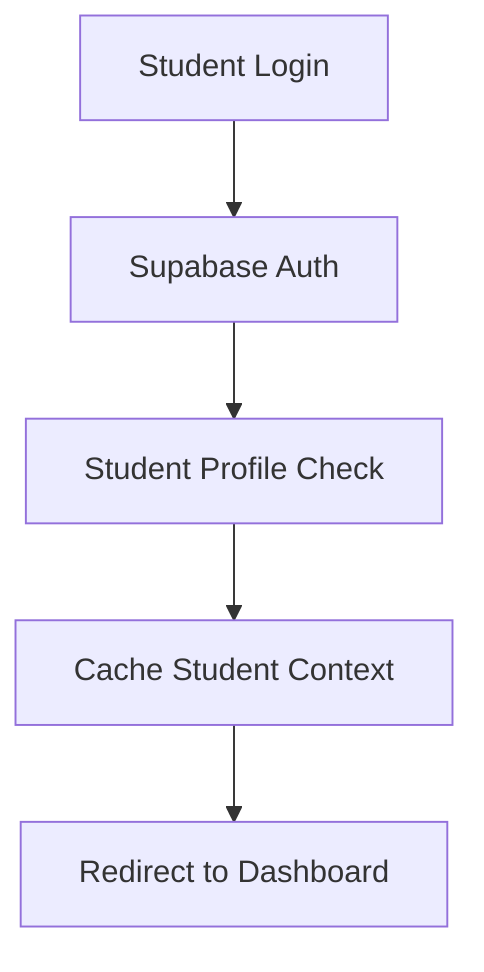

# MyJKKN Learner Application - Implementation Plan

## 📋 Overview

This document outlines the complete implementation plan for creating a separate, optimized learner application that addresses all performance issues identified in the current MyJKKN learners module.

## 🎯 Objectives

- **60-80% performance improvement** over current implementation
- **Mobile-first PWA** architecture
- **Simplified authentication** flow for students only
- **Independent deployment** and scaling
- **Reuse existing UI/UX** designs and components

## 🏗️ Architecture Overview

### Tech Stack (Maintained)
- **Frontend**: Next.js 14 with App Router
- **Database**: Supabase (same instance)
- **Authentication**: Supabase Auth (optimized for students)
- **State Management**: Zustand + TanStack Query
- **Styling**: Tailwind CSS + Shadcn/ui
- **Deployment**: Vercel

### Key Improvements
1. **Optimized Middleware**: Student-specific auth flow
2. **Intelligent Caching**: Multi-layer caching strategy
3. **Mobile Performance**: PWA with offline capabilities
4. **Simplified Data Flow**: Dedicated student context
5. **Background Sync**: Non-blocking data updates

## 📁 Project Structure

```
learner-app/
├── README.md
├── next.config.js
├── package.json
├── tailwind.config.js
├── tsconfig.json
├── public/
│   ├── icons/          # PWA icons
│   ├── manifest.json   # PWA manifest
│   └── sw.js          # Service worker
├── src/
│   ├── app/           # Next.js App Router
│   │   ├── (auth)/    # Auth pages
│   │   ├── (main)/    # Main app pages
│   │   ├── api/       # API routes
│   │   ├── globals.css
│   │   ├── layout.tsx
│   │   └── page.tsx
│   ├── components/    # Reusable components
│   │   ├── ui/        # Shadcn/ui components
│   │   ├── layout/    # Layout components
│   │   ├── auth/      # Auth components
│   │   ├── dashboard/ # Dashboard components
│   │   ├── attendance/# Attendance components
│   │   ├── billing/   # Billing components
│   │   ├── apps/      # Apps components
│   │   └── profile/   # Profile components
│   ├── lib/           # Utilities and services
│   │   ├── supabase/  # Supabase client
│   │   ├── services/  # API services
│   │   ├── stores/    # Zustand stores
│   │   ├── hooks/     # Custom hooks
│   │   ├── utils/     # Utilities
│   │   └── constants/ # Constants
│   ├── types/         # TypeScript types
│   └── middleware.ts  # Optimized middleware
└── docs/             # Documentation
    ├── modules/      # Module-specific docs
    ├── api/          # API documentation
    └── deployment/   # Deployment guides
```

## 🚀 Implementation Phases

### Phase 1: Foundation Setup (Week 1-2)
1. **Project Initialization**
   - Create new Next.js project
   - Setup Supabase connection
   - Configure PWA capabilities
   - Setup development environment

2. **Authentication System**
   - Implement student-only auth flow
   - Optimized middleware for students
   - Session management with caching

3. **Core Infrastructure**
   - State management setup (Zustand + TanStack Query)
   - Service layer architecture
   - Component library integration

### Phase 2: Core Modules (Week 3-5)
1. **Dashboard Module** (Week 3)
   - Welcome header and navigation
   - Summary cards and analytics
   - Quick actions and recent activity

2. **Attendance Module** (Week 4)
   - Attendance overview and statistics
   - Calendar view and charts
   - Export and sharing features

3. **Billing Module** (Week 5)
   - Bills overview and payment history
   - Payment integration
   - Charts and analytics

### Phase 3: Extended Features (Week 6-7)
1. **Apps Module**
   - App discovery and management
   - Integration with external apps
   - Favorites and categories

2. **Profile Module**
   - Student profile management
   - Settings and preferences
   - Academic information

### Phase 4: Optimization & Deployment (Week 8)
1. **Performance Optimization**
   - Code splitting and lazy loading
   - Image optimization
   - Service worker implementation

2. **Testing & Deployment**
   - Unit and integration tests
   - Performance testing
   - Production deployment

## 📋 Module Implementation Order

| Module | Priority | Dependencies | Timeline |
|--------|----------|--------------|----------|
| [Authentication](./modules/01-authentication.md) | Critical | None | Week 1 |
| [Project Setup](./modules/00-project-setup.md) | Critical | None | Week 1 |
| [Dashboard](./modules/02-dashboard.md) | High | Auth | Week 3 |
| [Attendance](./modules/03-attendance.md) | High | Auth, Dashboard | Week 4 |
| [Billing](./modules/04-billing.md) | High | Auth, Dashboard | Week 5 |
| [Apps](./modules/05-apps.md) | Medium | Auth | Week 6 |
| [Profile](./modules/06-profile.md) | Medium | Auth | Week 7 |
| [Optimization](./modules/07-optimization.md) | High | All modules | Week 8 |

## 🔧 Key Technical Decisions

### 1. Database Strategy
- **Same Supabase Instance**: Maintain data consistency
- **Optimized Queries**: Student-specific database views
- **Connection Pooling**: Dedicated connection pool for learner app

### 2. Authentication Flow


### 3. Data Caching Strategy
- **Memory Cache**: Student context and frequent data
- **Browser Cache**: Static assets and components
- **Service Worker**: Offline data and background sync
- **Query Cache**: TanStack Query with smart invalidation

### 4. Mobile-First Approach
- **Progressive Web App**: Install prompt and offline functionality
- **Touch Optimized**: Native mobile interactions
- **Responsive Design**: Mobile-first responsive breakpoints
- **Performance Budget**: < 3s FCP, < 100ms TTI

## 📊 Performance Targets

| Metric | Current | Target | Improvement |
|--------|---------|--------|-------------|
| First Contentful Paint | 4.2s | 1.5s | 64% faster |
| Time to Interactive | 6.8s | 2.0s | 71% faster |
| Bundle Size | 2.1MB | 800KB | 62% smaller |
| Mobile Lighthouse | 45 | 90+ | 100% improvement |

## 🔗 Documentation Links

- [Project Setup Guide](./modules/00-project-setup.md)
- [Authentication Module](./modules/01-authentication.md)
- [Dashboard Module](./modules/02-dashboard.md)
- [Attendance Module](./modules/03-attendance.md)
- [Billing Module](./modules/04-billing.md)
- [Apps Module](./modules/05-apps.md)
- [Profile Module](./modules/06-profile.md)
- [Optimization Guide](./modules/07-optimization.md)

## 🚧 Migration Strategy

### Data Migration
- **No Data Migration Needed**: Same Supabase instance
- **User Redirection**: Automatic redirect from main app
- **Feature Parity**: Ensure all current features are available

### Deployment Strategy
- **Subdomain Approach**: `learner.myjkkn.com`
- **Gradual Rollout**: Start with beta users
- **Fallback Plan**: Keep current module as backup

## 📈 Success Metrics

### Performance Metrics
- [ ] First Contentful Paint < 1.5s
- [ ] Time to Interactive < 2.0s
- [ ] Mobile Lighthouse Score > 90
- [ ] Bundle Size < 800KB

### User Experience Metrics
- [ ] Page load time reduction > 60%
- [ ] Mobile responsiveness score > 95
- [ ] User satisfaction improvement > 80%
- [ ] Error rate reduction > 90%

## 🎯 Next Steps

1. **Review this implementation plan**
2. **Start with [Project Setup](./modules/00-project-setup.md)**
3. **Follow module-wise implementation**
4. **Regular performance monitoring**
5. **User feedback collection**

---

**Created**: 2025-01-20
**Last Updated**: 2025-01-20
**Version**: 1.0
**Authors**: Claude Code Development Team