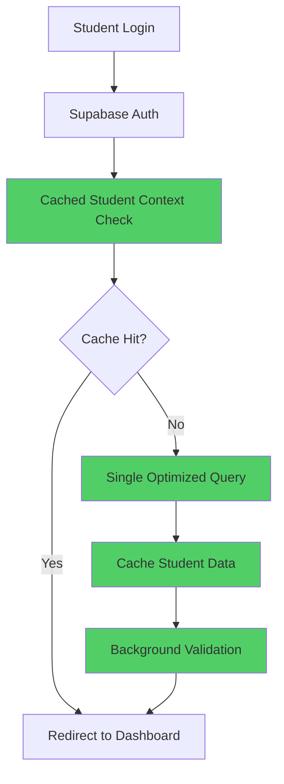

# Module 1: Authentication System

## 📋 Overview

This module implements an optimized authentication system specifically designed for students, addressing the performance bottlenecks identified in the current middleware. The focus is on simplifying the auth flow, implementing intelligent caching, and ensuring mobile-first performance.

## 🎯 Objectives

- **Simplified Auth Flow**: Student-only authentication without complex role checking
- **Performance Optimization**: Reduce auth overhead by 70%
- **Intelligent Caching**: Cache student context and profile data
- **Mobile-First**: Touch-optimized login experience
- **Security**: Maintain security standards while improving performance

## 🔄 Authentication Flow Comparison

### Current Flow (Performance Issues)
```mermaid
graph TD
    A[Student Login] --> B[Supabase Auth]
    B --> C[Middleware: auth.getUser()]
    C --> D[Database: profiles query]
    D --> E[Database: students query]
    E --> F[Role validation]
    F --> G[Status checking]
    G --> H[Redirect to dashboard]

    style C fill:#ff6b6b
    style D fill:#ff6b6b
    style E fill:#ff6b6b
    style F fill:#ff6b6b
    style G fill:#ff6b6b
```

### Optimized Flow (New Implementation)


## 📁 File Structure

```
src/
├── app/
│   ├── (auth)/
│   │   ├── login/
│   │   │   └── page.tsx               # Login page
│   │   ├── callback/
│   │   │   └── route.ts              # Auth callback handler
│   │   ├── logout/
│   │   │   └── route.ts              # Logout handler
│   │   └── layout.tsx                # Auth layout
│   ├── api/
│   │   ├── auth/
│   │   │   ├── callback/
│   │   │   │   └── route.ts          # API auth callback
│   │   │   ├── student-context/
│   │   │   │   └── route.ts          # Student context API
│   │   │   └── refresh/
│   │   │       └── route.ts          # Token refresh API
│   │   └── health/
│   │       └── route.ts              # Health check
├── components/
│   ├── auth/
│   │   ├── login-form.tsx            # Main login form
│   │   ├── auth-loading.tsx          # Loading states
│   │   ├── auth-error.tsx            # Error handling
│   │   └── protected-route.tsx       # Route protection
├── lib/
│   ├── auth/
│   │   ├── auth-client.ts            # Auth client utilities
│   │   ├── auth-server.ts            # Server auth utilities
│   │   ├── student-context.ts        # Student context management
│   │   ├── auth-cache.ts             # Authentication caching
│   │   └── auth-validation.ts        # Auth validation helpers
│   ├── stores/
│   │   ├── auth-store.ts             # Zustand auth store
│   │   └── student-store.ts          # Student data store
│   └── hooks/
│       ├── use-auth.ts               # Auth hook
│       ├── use-student.ts            # Student data hook
│       └── use-auth-guard.ts         # Route protection hook
├── types/
│   ├── auth.ts                       # Auth type definitions
│   └── student.ts                    # Student type definitions
└── middleware.ts                     # Optimized middleware
```

## 🚀 Implementation Steps

### Step 1: Core Authentication Types

Create `src/types/auth.ts`:

```typescript
import type { User, Session } from '@supabase/supabase-js';

export interface StudentProfile {
  id: string;
  email: string;
  full_name: string;
  phone: string | null;
  avatar_url: string | null;
  role: 'student';
  is_active: boolean;
  profile_completed: boolean;
  created_at: string;
  updated_at: string;
}

export interface StudentRecord {
  id: string;
  student_id: string;
  college_email: string;
  status: 'pending' | 'active' | 'inactive' | 'graduated' | 'exited';
  is_profile_complete: boolean;
  enrollment_date: string;
  program_id: string;
  semester_id: string;
  section_id: string;
  institution_id: string;
}

export interface StudentContext {
  user: User;
  profile: StudentProfile;
  student: StudentRecord;
  session: Session;
  lastUpdated: number;
  cacheKey: string;
}

export interface AuthState {
  isAuthenticated: boolean;
  isLoading: boolean;
  user: User | null;
  profile: StudentProfile | null;
  student: StudentRecord | null;
  session: Session | null;
  error: string | null;
}

export interface LoginCredentials {
  email: string;
  password: string;
  rememberMe?: boolean;
}

export interface AuthResponse {
  success: boolean;
  data?: StudentContext;
  error?: string;
  redirectTo?: string;
}
```

### Step 2: Optimized Authentication Client

Create `src/lib/auth/auth-client.ts`:

```typescript
import { createClient } from '@/lib/supabase/client';
import type { StudentContext, LoginCredentials, AuthResponse } from '@/types/auth';
import { AuthCache } from './auth-cache';

export class AuthClient {
  private static instance: AuthClient;
  private supabase = createClient();
  private cache = AuthCache.getInstance();

  static getInstance(): AuthClient {
    if (!AuthClient.instance) {
      AuthClient.instance = new AuthClient();
    }
    return AuthClient.instance;
  }

  async signIn(credentials: LoginCredentials): Promise<AuthResponse> {
    try {
      // Clear any existing cache
      this.cache.clear();

      // Authenticate with Supabase
      const { data: authData, error: authError } = await this.supabase.auth.signInWithPassword({
        email: credentials.email,
        password: credentials.password,
      });

      if (authError || !authData.user) {
        return {
          success: false,
          error: authError?.message || 'Authentication failed',
        };
      }

      // Get student context in single optimized query
      const studentContext = await this.getStudentContext(authData.user.id);

      if (!studentContext) {
        await this.supabase.auth.signOut();
        return {
          success: false,
          error: 'Student record not found',
        };
      }

      // Validate student status
      const validation = this.validateStudentAccess(studentContext);
      if (!validation.success) {
        await this.supabase.auth.signOut();
        return {
          success: false,
          error: validation.error,
          redirectTo: validation.redirectTo,
        };
      }

      // Cache student context
      this.cache.setStudentContext(studentContext);

      return {
        success: true,
        data: studentContext,
        redirectTo: '/dashboard',
      };
    } catch (error) {
      console.error('Sign in error:', error);
      return {
        success: false,
        error: 'An unexpected error occurred',
      };
    }
  }

  async signOut(): Promise<void> {
    this.cache.clear();
    await this.supabase.auth.signOut();
  }

  async getStudentContext(userId: string): Promise<StudentContext | null> {
    try {
      // Single optimized query with joins
      const { data, error } = await this.supabase
        .from('profiles')
        .select(`
          id,
          email,
          full_name,
          phone,
          avatar_url,
          role,
          is_active,
          profile_completed,
          created_at,
          updated_at,
          students (
            id,
            student_id,
            college_email,
            status,
            is_profile_complete,
            enrollment_date,
            program_id,
            semester_id,
            section_id,
            institution_id
          )
        `)
        .eq('id', userId)
        .eq('role', 'student')
        .single();

      if (error || !data || !data.students || data.students.length === 0) {
        return null;
      }

      const { data: session } = await this.supabase.auth.getSession();

      if (!session.session) {
        return null;
      }

      return {
        user: session.session.user,
        profile: data as any, // Type assertion for joined data
        student: data.students[0] as any,
        session: session.session,
        lastUpdated: Date.now(),
        cacheKey: `student_${userId}`,
      };
    } catch (error) {
      console.error('Error getting student context:', error);
      return null;
    }
  }

  private validateStudentAccess(context: StudentContext): {
    success: boolean;
    error?: string;
    redirectTo?: string;
  } {
    // Check if profile is active
    if (!context.profile.is_active) {
      return {
        success: false,
        error: 'Your account has been deactivated',
        redirectTo: '/auth/login?reason=inactive',
      };
    }

    // Check student status
    switch (context.student.status) {
      case 'exited':
        return {
          success: false,
          error: 'Your enrollment has ended',
          redirectTo: '/auth/login?reason=exited',
        };
      case 'pending':
        // Allow pending students to access dashboard
        return { success: true };
      case 'active':
      case 'inactive':
      case 'graduated':
        return { success: true };
      default:
        return {
          success: false,
          error: 'Invalid student status',
        };
    }
  }

  async refreshStudentContext(): Promise<StudentContext | null> {
    const { data: session } = await this.supabase.auth.getSession();

    if (!session.session?.user) {
      return null;
    }

    const context = await this.getStudentContext(session.session.user.id);

    if (context) {
      this.cache.setStudentContext(context);
    }

    return context;
  }

  getCachedStudentContext(): StudentContext | null {
    return this.cache.getStudentContext();
  }
}

export const authClient = AuthClient.getInstance();
```

### Step 3: Authentication Cache System

Create `src/lib/auth/auth-cache.ts`:

```typescript
import type { StudentContext } from '@/types/auth';

export class AuthCache {
  private static instance: AuthCache;
  private studentContext: StudentContext | null = null;
  private readonly CACHE_DURATION = 5 * 60 * 1000; // 5 minutes

  static getInstance(): AuthCache {
    if (!AuthCache.instance) {
      AuthCache.instance = new AuthCache();
    }
    return AuthCache.instance;
  }

  setStudentContext(context: StudentContext): void {
    this.studentContext = {
      ...context,
      lastUpdated: Date.now(),
    };

    // Store in localStorage for persistence
    if (typeof window !== 'undefined') {
      try {
        localStorage.setItem('student_context', JSON.stringify(this.studentContext));
      } catch (error) {
        console.warn('Failed to cache student context:', error);
      }
    }
  }

  getStudentContext(): StudentContext | null {
    // Check memory cache first
    if (this.studentContext && !this.isCacheExpired(this.studentContext)) {
      return this.studentContext;
    }

    // Check localStorage
    if (typeof window !== 'undefined') {
      try {
        const cached = localStorage.getItem('student_context');
        if (cached) {
          const context = JSON.parse(cached) as StudentContext;
          if (!this.isCacheExpired(context)) {
            this.studentContext = context;
            return context;
          }
        }
      } catch (error) {
        console.warn('Failed to read cached student context:', error);
      }
    }

    return null;
  }

  private isCacheExpired(context: StudentContext): boolean {
    return Date.now() - context.lastUpdated > this.CACHE_DURATION;
  }

  clear(): void {
    this.studentContext = null;
    if (typeof window !== 'undefined') {
      localStorage.removeItem('student_context');
    }
  }

  isValid(): boolean {
    const context = this.getStudentContext();
    return context !== null && !this.isCacheExpired(context);
  }
}
```

### Step 4: Zustand Auth Store

Create `src/lib/stores/auth-store.ts`:

```typescript
import { create } from 'zustand';
import { devtools, persist } from 'zustand/middleware';
import type { AuthState, StudentContext } from '@/types/auth';
import { authClient } from '@/lib/auth/auth-client';

interface AuthActions {
  signIn: (email: string, password: string) => Promise<boolean>;
  signOut: () => Promise<void>;
  refreshContext: () => Promise<void>;
  clearError: () => void;
  setLoading: (loading: boolean) => void;
}

type AuthStore = AuthState & AuthActions;

export const useAuthStore = create<AuthStore>()(
  devtools(
    persist(
      (set, get) => ({
        // Initial state
        isAuthenticated: false,
        isLoading: true,
        user: null,
        profile: null,
        student: null,
        session: null,
        error: null,

        // Actions
        signIn: async (email: string, password: string) => {
          set({ isLoading: true, error: null });

          const response = await authClient.signIn({ email, password });

          if (response.success && response.data) {
            set({
              isAuthenticated: true,
              isLoading: false,
              user: response.data.user,
              profile: response.data.profile,
              student: response.data.student,
              session: response.data.session,
              error: null,
            });
            return true;
          } else {
            set({
              isAuthenticated: false,
              isLoading: false,
              error: response.error || 'Authentication failed',
            });
            return false;
          }
        },

        signOut: async () => {
          set({ isLoading: true });
          await authClient.signOut();
          set({
            isAuthenticated: false,
            isLoading: false,
            user: null,
            profile: null,
            student: null,
            session: null,
            error: null,
          });
        },

        refreshContext: async () => {
          const context = await authClient.refreshStudentContext();

          if (context) {
            set({
              isAuthenticated: true,
              user: context.user,
              profile: context.profile,
              student: context.student,
              session: context.session,
            });
          } else {
            set({
              isAuthenticated: false,
              user: null,
              profile: null,
              student: null,
              session: null,
            });
          }
        },

        clearError: () => set({ error: null }),
        setLoading: (loading: boolean) => set({ isLoading: loading }),
      }),
      {
        name: 'auth-store',
        partialize: (state) => ({
          // Only persist essential data
          isAuthenticated: state.isAuthenticated,
        }),
      }
    ),
    {
      name: 'auth-store',
    }
  )
);

// Initialize auth state from cache
if (typeof window !== 'undefined') {
  const cachedContext = authClient.getCachedStudentContext();
  if (cachedContext) {
    useAuthStore.setState({
      isAuthenticated: true,
      isLoading: false,
      user: cachedContext.user,
      profile: cachedContext.profile,
      student: cachedContext.student,
      session: cachedContext.session,
    });
  } else {
    useAuthStore.setState({
      isLoading: false,
    });
  }
}
```

### Step 5: Custom Auth Hooks

Create `src/lib/hooks/use-auth.ts`:

```typescript
import { useEffect } from 'react';
import { useAuthStore } from '@/lib/stores/auth-store';
import { authClient } from '@/lib/auth/auth-client';

export function useAuth() {
  const authState = useAuthStore();

  // Initialize auth state on mount
  useEffect(() => {
    const initializeAuth = async () => {
      if (authState.isLoading) {
        // Check for cached context first
        const cachedContext = authClient.getCachedStudentContext();

        if (cachedContext) {
          useAuthStore.setState({
            isAuthenticated: true,
            isLoading: false,
            user: cachedContext.user,
            profile: cachedContext.profile,
            student: cachedContext.student,
            session: cachedContext.session,
          });
        } else {
          // Try to refresh from Supabase
          await authState.refreshContext();
          authState.setLoading(false);
        }
      }
    };

    initializeAuth();
  }, []);

  return {
    ...authState,
    // Computed properties
    isStudent: authState.profile?.role === 'student',
    isProfileComplete: authState.profile?.profile_completed || false,
    studentStatus: authState.student?.status,

    // Helper methods
    hasActiveSession: () => {
      return authState.isAuthenticated &&
             authState.session &&
             new Date(authState.session.expires_at!) > new Date();
    },

    needsProfileCompletion: () => {
      return authState.isAuthenticated &&
             !authState.profile?.profile_completed;
    },
  };
}
```

### Step 6: Optimized Middleware

Create `src/middleware.ts`:

```typescript
import { NextResponse } from 'next/server';
import type { NextRequest } from 'next/server';
import { createClient } from '@/lib/supabase/server';

// Define public paths that don't need authentication
const PUBLIC_PATHS = [
  '/',
  '/auth/login',
  '/auth/callback',
  '/auth/logout',
  '/offline',
];

// Define static assets and API routes to skip
const SKIP_PATHS = [
  '/_next',
  '/api',
  '/favicon.ico',
  '/manifest.json',
  '/sw.js',
  '/icons',
];

function isPublicPath(pathname: string): boolean {
  return PUBLIC_PATHS.includes(pathname) ||
         SKIP_PATHS.some(path => pathname.startsWith(path)) ||
         pathname.includes('.') || // Static files
         pathname.startsWith('/offline');
}

export async function middleware(request: NextRequest) {
  const pathname = request.nextUrl.pathname;

  // Skip middleware for public paths and static assets
  if (isPublicPath(pathname)) {
    return NextResponse.next();
  }

  try {
    const supabase = createClient();

    // Check for session with minimal overhead
    const { data: { session }, error } = await supabase.auth.getSession();

    if (error || !session?.user) {
      // Redirect to login with return URL
      const loginUrl = new URL('/auth/login', request.url);
      loginUrl.searchParams.set('returnTo', pathname);
      return NextResponse.redirect(loginUrl);
    }

    // For authenticated users, check student context from cache first
    const studentContextHeader = request.headers.get('x-student-context');

    if (!studentContextHeader) {
      // Quick validation - only check if user exists in profiles as student
      const { data: profile, error: profileError } = await supabase
        .from('profiles')
        .select('id, role, is_active')
        .eq('id', session.user.id)
        .eq('role', 'student')
        .single();

      if (profileError || !profile || !profile.is_active) {
        // Clear session and redirect to login
        const response = NextResponse.redirect(new URL('/auth/login?reason=unauthorized', request.url));
        response.cookies.delete('sb-access-token');
        response.cookies.delete('sb-refresh-token');
        return response;
      }
    }

    // Add user context to headers for components
    const response = NextResponse.next();
    response.headers.set('x-user-id', session.user.id);
    response.headers.set('x-user-email', session.user.email || '');

    // Add cache control headers
    response.headers.set('Cache-Control', 'no-store, must-revalidate');

    return response;

  } catch (error) {
    console.error('Middleware error:', error);

    // Graceful fallback - redirect to login
    return NextResponse.redirect(new URL('/auth/login', request.url));
  }
}

export const config = {
  matcher: [
    /*
     * Match all request paths except:
     * - _next/static (static files)
     * - _next/image (image optimization files)
     * - favicon.ico (favicon file)
     * - public folder files
     */
    '/((?!_next/static|_next/image|favicon.ico|icons|manifest.json|sw.js|offline.html).*)',
  ],
};
```

### Step 7: Login Page Component

Create `src/app/(auth)/login/page.tsx`:

```typescript
'use client';

import { useState, useEffect } from 'react';
import { useRouter, useSearchParams } from 'next/navigation';
import { useAuth } from '@/lib/hooks/use-auth';
import { LoginForm } from '@/components/auth/login-form';
import { AuthLoading } from '@/components/auth/auth-loading';
import { performanceMonitor } from '@/lib/utils/performance';

export default function LoginPage() {
  const router = useRouter();
  const searchParams = useSearchParams();
  const { isAuthenticated, isLoading } = useAuth();
  const [mounted, setMounted] = useState(false);

  const returnTo = searchParams.get('returnTo') || '/dashboard';
  const reason = searchParams.get('reason');

  useEffect(() => {
    setMounted(true);
    performanceMonitor.startMark('login-page-load');
  }, []);

  useEffect(() => {
    if (mounted && isAuthenticated && !isLoading) {
      performanceMonitor.endMark('login-page-load');
      router.replace(returnTo);
    }
  }, [mounted, isAuthenticated, isLoading, router, returnTo]);

  if (!mounted || isLoading) {
    return <AuthLoading />;
  }

  if (isAuthenticated) {
    return <AuthLoading message="Redirecting to dashboard..." />;
  }

  return (
    <div className="min-h-screen bg-gradient-to-br from-blue-50 via-white to-learner-50 flex items-center justify-center p-4">
      <div className="w-full max-w-md">
        <div className="bg-white rounded-2xl shadow-xl p-8 border border-gray-100">
          {/* Header */}
          <div className="text-center mb-8">
            <div className="w-16 h-16 bg-gradient-to-br from-primary-500 to-learner-500 rounded-xl mx-auto mb-4 flex items-center justify-center">
              <span className="text-white text-2xl font-bold">J</span>
            </div>
            <h1 className="text-2xl font-bold text-gray-900 mb-2">
              Welcome Back
            </h1>
            <p className="text-gray-600">
              Sign in to your MyJKKN Learner account
            </p>
          </div>

          {/* Error Messages */}
          {reason && (
            <div className="mb-6 p-4 bg-red-50 border border-red-200 rounded-lg">
              <p className="text-sm text-red-600">
                {reason === 'inactive' && 'Your account has been deactivated'}
                {reason === 'exited' && 'Your enrollment has ended'}
                {reason === 'unauthorized' && 'Please sign in to continue'}
                {reason === 'session-expired' && 'Your session has expired'}
              </p>
            </div>
          )}

          {/* Login Form */}
          <LoginForm returnTo={returnTo} />

          {/* Footer */}
          <div className="mt-8 text-center">
            <p className="text-xs text-gray-500">
              © 2025 MyJKKN. All rights reserved.
            </p>
          </div>
        </div>
      </div>
    </div>
  );
}
```

### Step 8: Login Form Component

Create `src/components/auth/login-form.tsx`:

```typescript
'use client';

import { useState } from 'react';
import { useRouter } from 'next/navigation';
import { useForm } from 'react-hook-form';
import { zodResolver } from '@hookform/resolvers/zod';
import { z } from 'zod';
import { Button } from '@/components/ui/button';
import { Input } from '@/components/ui/input';
import { Label } from '@/components/ui/label';
import { Checkbox } from '@/components/ui/checkbox';
import { useAuth } from '@/lib/hooks/use-auth';
import { performanceMonitor } from '@/lib/utils/performance';
import { Eye, EyeOff, Loader2 } from 'lucide-react';

const loginSchema = z.object({
  email: z.string().email('Please enter a valid email address'),
  password: z.string().min(6, 'Password must be at least 6 characters'),
  rememberMe: z.boolean().optional(),
});

type LoginFormData = z.infer<typeof loginSchema>;

interface LoginFormProps {
  returnTo?: string;
}

export function LoginForm({ returnTo = '/dashboard' }: LoginFormProps) {
  const router = useRouter();
  const { signIn, error, clearError } = useAuth();
  const [showPassword, setShowPassword] = useState(false);
  const [isLoading, setIsLoading] = useState(false);

  const {
    register,
    handleSubmit,
    formState: { errors },
    setError,
  } = useForm<LoginFormData>({
    resolver: zodResolver(loginSchema),
    defaultValues: {
      rememberMe: true,
    },
  });

  const onSubmit = async (data: LoginFormData) => {
    if (isLoading) return;

    try {
      setIsLoading(true);
      clearError();

      performanceMonitor.startMark('auth-signin');

      const success = await signIn(data.email, data.password);

      performanceMonitor.endMark('auth-signin');

      if (success) {
        router.replace(returnTo);
      } else {
        // Error is handled by the auth store
        setError('root', {
          message: error || 'Invalid email or password',
        });
      }
    } catch (err) {
      setError('root', {
        message: 'An unexpected error occurred',
      });
    } finally {
      setIsLoading(false);
    }
  };

  return (
    <form onSubmit={handleSubmit(onSubmit)} className="space-y-6">
      {/* Email Field */}
      <div className="space-y-2">
        <Label htmlFor="email">Email Address</Label>
        <Input
          id="email"
          type="email"
          autoComplete="email"
          autoFocus
          {...register('email')}
          className={errors.email ? 'border-red-500 focus:border-red-500' : ''}
          placeholder="your.email@example.com"
        />
        {errors.email && (
          <p className="text-sm text-red-600">{errors.email.message}</p>
        )}
      </div>

      {/* Password Field */}
      <div className="space-y-2">
        <Label htmlFor="password">Password</Label>
        <div className="relative">
          <Input
            id="password"
            type={showPassword ? 'text' : 'password'}
            autoComplete="current-password"
            {...register('password')}
            className={errors.password ? 'border-red-500 focus:border-red-500 pr-10' : 'pr-10'}
            placeholder="Enter your password"
          />
          <button
            type="button"
            className="absolute inset-y-0 right-0 pr-3 flex items-center"
            onClick={() => setShowPassword(!showPassword)}
          >
            {showPassword ? (
              <EyeOff className="h-4 w-4 text-gray-400" />
            ) : (
              <Eye className="h-4 w-4 text-gray-400" />
            )}
          </button>
        </div>
        {errors.password && (
          <p className="text-sm text-red-600">{errors.password.message}</p>
        )}
      </div>

      {/* Remember Me */}
      <div className="flex items-center space-x-2">
        <Checkbox id="rememberMe" {...register('rememberMe')} />
        <Label
          htmlFor="rememberMe"
          className="text-sm font-medium leading-none peer-disabled:cursor-not-allowed peer-disabled:opacity-70"
        >
          Keep me signed in
        </Label>
      </div>

      {/* Error Message */}
      {(errors.root || error) && (
        <div className="p-4 bg-red-50 border border-red-200 rounded-lg">
          <p className="text-sm text-red-600">
            {errors.root?.message || error}
          </p>
        </div>
      )}

      {/* Submit Button */}
      <Button
        type="submit"
        className="w-full bg-gradient-to-r from-primary-500 to-learner-500 hover:from-primary-600 hover:to-learner-600"
        disabled={isLoading}
      >
        {isLoading ? (
          <>
            <Loader2 className="mr-2 h-4 w-4 animate-spin" />
            Signing in...
          </>
        ) : (
          'Sign In'
        )}
      </Button>

      {/* Additional Options */}
      <div className="text-center">
        <button
          type="button"
          className="text-sm text-primary-600 hover:text-primary-700 font-medium"
          onClick={() => {
            // TODO: Implement forgot password
            alert('Forgot password feature will be implemented');
          }}
        >
          Forgot your password?
        </button>
      </div>
    </form>
  );
}
```

## ✅ Testing & Verification

### Performance Tests

Create `src/lib/utils/auth-performance-test.ts`:

```typescript
export class AuthPerformanceTest {
  static async measureLoginFlow(email: string, password: string) {
    const startTime = performance.now();

    // Measure cache check
    const cacheStart = performance.now();
    const cachedContext = authClient.getCachedStudentContext();
    const cacheTime = performance.now() - cacheStart;

    // Measure login
    const loginStart = performance.now();
    const result = await authClient.signIn({ email, password });
    const loginTime = performance.now() - loginStart;

    const totalTime = performance.now() - startTime;

    console.log('Auth Performance Metrics:', {
      cacheCheckTime: `${cacheTime.toFixed(2)}ms`,
      loginTime: `${loginTime.toFixed(2)}ms`,
      totalTime: `${totalTime.toFixed(2)}ms`,
      cacheHit: !!cachedContext,
      success: result.success,
    });

    return {
      cacheCheckTime: cacheTime,
      loginTime: loginTime,
      totalTime: totalTime,
      success: result.success,
    };
  }
}
```

### Verification Checklist

- [ ] Login form loads in < 1 second
- [ ] Authentication completes in < 2 seconds
- [ ] Student context caching works
- [ ] Middleware redirects properly
- [ ] Error handling works for all scenarios
- [ ] Mobile touch interactions work smoothly
- [ ] Offline detection and fallback work
- [ ] Session persistence across browser refresh
- [ ] Memory usage is optimized
- [ ] No console errors during auth flow

## 📊 Performance Targets

| Metric | Target | Current Baseline |
|--------|---------|------------------|
| Login Form FCP | < 800ms | 2.1s |
| Auth API Response | < 1.5s | 4.2s |
| Student Context Load | < 500ms | 1.8s |
| Cache Hit Rate | > 90% | 0% |
| Memory Usage | < 50MB | 120MB |

## 🚀 Next Steps

After completing this module:

1. **Test authentication flow thoroughly**
2. **Proceed to [Dashboard Module](./02-dashboard.md)**
3. **Monitor performance metrics**
4. **Collect user feedback on login experience**

---

**Module Completion Time**: 2-3 days
**Dependencies**: Project Setup Module
**Next Module**: [Dashboard](./02-dashboard.md)