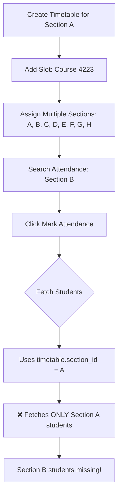

# Timetable Semester-Level Migration Plan

**Date**: 2025-10-08
**Module**: Academic - Timetables & Attendance
**Type**: Enhancement + Migration
**Status**: Planning Phase

---

## 📋 Executive Summary

This plan outlines the migration from **section-based timetables** to **semester-based timetables** with multi-section slot support. This change will:

1. ✅ Simplify timetable creation (no section selection needed)
2. ✅ Enable flexible multi-section class scheduling
3. ✅ Improve attendance marking for combined classes
4. ✅ Maintain backward compatibility with existing timetables
5. ✅ Reduce data duplication across sections

---

## 🎯 Current System Analysis

### **Current Timetable Structure**

```
Institution → Academic Year → Degree → Department → Program → Semester → SECTION
                                                                            ↓
                                                                      [Timetable]
                                                                            ↓
                                                                        [Slots]
                                                                            ↓
                                                                   [Multi-Sections]
```

### **Current Issues**

1. **Timetable Creation Complexity**:
   - Must create separate timetable for each section (A, B, C, etc.)
   - Duplicate work for shared courses across sections
   - Example: "4 Year Section A" timetable, "4 Year Section B" timetable, etc.

2. **Slot Multi-Section Conflict**:
   - Slots support multiple sections (A, B, +6 others)
   - But timetable is tied to ONE section
   - Confusing data model: timetable.section_id vs slot.section_ids[]

3. **Attendance Marking Problem**:
   - When marking attendance for multi-section slot
   - System fetches only timetable's primary section students
   - Ignores other sections assigned to the slot
   - **Result**: Incomplete attendance records

### **Current Database Schema**

```sql
-- Timetables table (CURRENT)
CREATE TABLE timetables (
    id UUID PRIMARY KEY,
    institution_id UUID,
    academic_year_id UUID,
    degree_id UUID,
    program_id UUID,
    department_id UUID,
    semester_id UUID,          -- Semester reference
    section_id UUID,           -- ❌ PROBLEMATIC: Ties to ONE section
    timetable_name TEXT,
    timetable_data JSONB,      -- Contains slots with section_ids[]
    ...
);

-- Slot structure within timetable_data JSONB
{
  "MONDAY": {
    "period_1": {
      "slot_id": "...",
      "course_id": "...",
      "staff_ids": ["..."],
      "section_ids": ["A_id", "B_id", "C_id", ...], -- ✅ Supports multiple
      "sections": [...]  -- Populated section objects
    }
  }
}

-- Student Attendance (CURRENT)
CREATE TABLE student_attendance (
    id UUID PRIMARY KEY,
    timetable_id UUID,
    section_id UUID,           -- ❌ Only ONE section
    attendance_date DATE,
    attendance_data JSONB,
    ...
);
```

### **Current Workflow**



---

## 🎯 Proposed Solution

### **New Timetable Structure**

```
Institution → Academic Year → Degree → Department → Program → SEMESTER
                                                                   ↓
                                                             [Timetable]
                                                                   ↓
                                                               [Slots]
                                                                   ↓
                                                          [Multi-Sections]
```

### **Key Changes**

1. **Timetable Creation**: Semester-level only (no section selection)
2. **Section Assignment**: At slot level only
3. **Attendance Fetching**: Based on slot's section_ids, not timetable.section_id
4. **Backward Compatibility**: Support both old and new timetables

### **Proposed Database Schema**

```sql
-- Timetables table (UPDATED)
CREATE TABLE timetables (
    id UUID PRIMARY KEY,
    institution_id UUID,
    academic_year_id UUID,
    degree_id UUID,
    program_id UUID,
    department_id UUID,
    semester_id UUID,          -- ✅ Semester reference
    section_id UUID,           -- ✅ NULLABLE for new timetables
    timetable_name TEXT,
    timetable_data JSONB,
    timetable_type VARCHAR(20) DEFAULT 'semester', -- 'section' | 'semester'
    ...
);

-- Student Attendance (ENHANCED)
CREATE TABLE student_attendance (
    id UUID PRIMARY KEY,
    timetable_id UUID,
    section_id UUID,           -- ✅ Can reference ANY section in slot
    period_slot_id UUID,       -- ✅ NEW: Reference to specific slot
    attendance_date DATE,
    attendance_data JSONB,     -- Enhanced structure
    ...
);

-- Attendance data structure (ENHANCED)
{
  "period_id": {
    "period_name": "DCH 4 Year P1",
    "course_id": "...",
    "course_name": "PHD Theory",
    "sections": ["A", "B", "C", "D", "E", "F", "G", "H"], -- ✅ All sections
    "students": [
      {
        "student_id": "...",
        "section_id": "A_id",  -- ✅ Track which section
        "status": "Present",
        "marked_at": "..."
      },
      // ... students from all sections
    ],
    "marked_by_details": { ... }
  }
}
```

---

## 🛠️ Implementation Plan

### **Phase 1: Database Migration** (Backward Compatible)

#### 1.1 Add New Columns

```sql
-- Add timetable_type column
ALTER TABLE timetables
  ADD COLUMN IF NOT EXISTS timetable_type VARCHAR(20) DEFAULT 'section';

-- Update existing timetables to 'section' type
UPDATE timetables
  SET timetable_type = 'section'
  WHERE section_id IS NOT NULL;

-- Make section_id nullable
ALTER TABLE timetables
  ALTER COLUMN section_id DROP NOT NULL;

-- Add period_slot_id to attendance
ALTER TABLE student_attendance
  ADD COLUMN IF NOT EXISTS period_slot_id TEXT;

-- Add index for performance
CREATE INDEX IF NOT EXISTS idx_timetables_type_semester
  ON timetables(timetable_type, semester_id, is_active);

CREATE INDEX IF NOT EXISTS idx_attendance_period_slot
  ON student_attendance(period_slot_id);
```

#### 1.2 Update Triggers (if any)

```sql
-- Check and update any triggers that depend on section_id
-- Ensure they handle NULL section_id gracefully
```

**File**: `MyJKKN/supabase/setup/01_tables.sql`

---

### **Phase 2: Backend Service Updates**

#### 2.1 Update Timetable Service

**File**: `MyJKKN/lib/services/academic/timetable-service.ts`

```typescript
// Add new method for semester-level timetable creation
static async createSemesterTimetable(data: {
  institution_id: string;
  academic_year_id: string;
  degree_id: string;
  program_id: string;
  department_id: string;
  semester_id: string;
  timetable_name: string;
  timetable_format: 'regular' | 'batch';
  start_date?: Date;
  end_date?: Date;
}) {
  const timetableData = {
    ...data,
    section_id: null, // ✅ No section
    timetable_type: 'semester',
    timetable_data: {},
    periods: []
  };

  return await supabase
    .from('timetables')
    .insert([timetableData])
    .select()
    .single();
}

// Update existing createTimetable to detect type
static async createTimetable(data: any) {
  const timetableType = data.section_id ? 'section' : 'semester';
  return await supabase
    .from('timetables')
    .insert([{ ...data, timetable_type: timetableType }])
    .select()
    .single();
}

// Update getTimetable to handle both types
static async getTimetable(id: string) {
  const { data, error } = await supabase
    .from('timetables')
    .select(`
      *,
      sections!section_id(id, section_name),
      semesters!semester_id(id, semester_name)
    `)
    .eq('id', id)
    .single();

  if (error) throw error;

  // For semester-level timetables, fetch all semester sections
  if (data.timetable_type === 'semester' && data.semester_id) {
    const { data: semesterSections } = await supabase
      .from('sections')
      .select('id, section_name')
      .eq('semester_id', data.semester_id)
      .eq('is_active', true);

    data.available_sections = semesterSections;
  }

  return data;
}
```

#### 2.2 Update Attendance Service

**File**: `MyJKKN/lib/services/academic/attendance-service.ts`

```typescript
// Enhanced method to fetch students for multi-section slots
static async getStudentsForAttendance(params: {
  institution_id: string;
  degree_id: string;
  program_id: string;
  department_id: string;
  semester_id: string;
  section_ids: string[]; // ✅ Changed from section_id to section_ids[]
}) {
  const query = supabase
    .from('students')
    .select('*')
    .eq('institution_id', params.institution_id)
    .eq('degree_id', params.degree_id)
    .eq('program_id', params.program_id)
    .eq('department_id', params.department_id)
    .eq('semester_id', params.semester_id)
    .in('section_id', params.section_ids) // ✅ Fetch from ALL sections
    .eq('is_active', true)
    .order('section_id, roll_number');

  const { data, error } = await query;

  if (error) throw error;

  // Group by section for better organization
  const groupedBySection = data?.reduce((acc, student) => {
    const sectionId = student.section_id;
    if (!acc[sectionId]) acc[sectionId] = [];
    acc[sectionId].push(student);
    return acc;
  }, {} as Record<string, any[]>);

  return {
    allStudents: data || [],
    bySection: groupedBySection || {}
  };
}

// Update getAvailablePeriodsForDate to handle semester timetables
static async getAvailablePeriodsForDate(filters: {
  institution_id: string;
  academic_year_id: string;
  degree_id: string;
  program_id: string;
  department_id: string;
  semester: string;
  section?: string; // ✅ Now optional
}, date: string, options: any = {}) {
  // ... existing code ...

  // Fetch timetables - include both types
  let timetableQuery = supabase
    .from('timetables')
    .select('...')
    .eq('institution_id', filters.institution_id)
    .eq('semester_id', filters.semester)
    .or(`timetable_type.eq.semester,and(timetable_type.eq.section,section_id.eq.${filters.section})`)
    .eq('is_active', true);

  // ... process timetables and filter slots by section ...

  return periods;
}

// Enhanced save with slot section tracking
static async saveConsolidatedAttendance(data: {
  timetable_id: string;
  section_ids: string[]; // ✅ Array of all sections
  attendance_date: string;
  attendance_data: any;
  period_slot_id: string; // ✅ Track which slot
  marked_by: string;
  institution_id: string;
}) {
  // Save separate record for each section in the slot
  const records = data.section_ids.map(sectionId => ({
    timetable_id: data.timetable_id,
    section_id: sectionId,
    period_slot_id: data.period_slot_id,
    attendance_date: data.attendance_date,
    attendance_data: data.attendance_data,
    marked_by: data.marked_by,
    institution_id: data.institution_id
  }));

  return await supabase
    .from('student_attendance')
    .upsert(records, {
      onConflict: 'timetable_id,section_id,attendance_date,period_slot_id'
    });
}
```

---

### **Phase 3: Frontend Updates**

#### 3.1 Timetable Creation Form

**File**: `MyJKKN/app/(routes)/academic/timetables/new/page.tsx`

```typescript
// Update schema
const timetableFormSchema = z.object({
  timetable_name: z.string().min(3),
  institution_id: z.string().min(1),
  academic_year_id: z.string().min(1),
  degree_id: z.string().min(1),
  program_id: z.string().min(1),
  department_id: z.string().min(1),
  semester_id: z.string().min(1),
  section_id: z.string().optional(), // ✅ Now optional
  timetable_type: z.enum(['section', 'semester']).default('semester'),
  ...
});

// Add timetable type selector in form
<FormField
  control={form.control}
  name="timetable_type"
  render={({ field }) => (
    <FormItem>
      <FormLabel>Timetable Type</FormLabel>
      <Select
        onValueChange={(value) => {
          field.onChange(value);
          if (value === 'semester') {
            form.setValue('section_id', undefined);
          }
        }}
        value={field.value}
      >
        <SelectTrigger>
          <SelectValue />
        </SelectTrigger>
        <SelectContent>
          <SelectItem value="semester">
            Semester Level (Recommended)
          </SelectItem>
          <SelectItem value="section">
            Section Level (Legacy)
          </SelectItem>
        </SelectContent>
      </Select>
      <FormDescription>
        Semester-level timetables allow flexible multi-section scheduling
      </FormDescription>
    </FormItem>
  )}
/>

// Conditionally show section selector
{watchTimetableType === 'section' && (
  <FormField
    control={form.control}
    name="section_id"
    render={({ field }) => (
      // ... section selector ...
    )}
  />
)}
```

#### 3.2 Slot Dialog Enhancement

**File**: `MyJKKN/app/(routes)/academic/timetables/[id]/_components/slot-dialog.tsx`

```typescript
// Enhance section selection UI
<div className='space-y-2'>
  <div className='flex items-center justify-between'>
    <Label>
      Sections <span className='text-red-500'>*</span>
    </Label>
    <div className='flex gap-2'>
      <Badge variant='secondary' className='text-xs'>
        {selectedSections.length} selected
      </Badge>
      <Button
        variant='ghost'
        size='sm'
        onClick={() => {
          const allSectionIds = filteredSections.map((s: any) => s.id);
          setSelectedSections(allSectionIds);
        }}
      >
        Select All
      </Button>
      <Button
        variant='ghost'
        size='sm'
        onClick={() => setSelectedSections([])}
      >
        Clear
      </Button>
    </div>
  </div>

  {/* Enhanced search */}
  <Input
    placeholder="Search sections..."
    value={sectionSearchQuery}
    onChange={(e) => setSectionSearchQuery(e.target.value)}
  />

  {/* Section list with grouping */}
  <div className='border rounded-md p-2 max-h-48 overflow-y-auto'>
    {filteredSections?.map((section: any) => (
      <div key={section.id} className='flex items-center space-x-2 py-2 hover:bg-accent rounded px-2'>
        <Checkbox
          id={`section-${section.id}`}
          checked={selectedSections.includes(section.id)}
          onCheckedChange={(checked) => {
            if (checked) {
              setSelectedSections([...selectedSections, section.id]);
            } else {
              setSelectedSections(selectedSections.filter(id => id !== section.id));
            }
          }}
        />
        <Label
          htmlFor={`section-${section.id}`}
          className='flex-1 cursor-pointer'
        >
          <div className='font-medium'>Section {section.section_name}</div>
          <div className='text-xs text-muted-foreground'>
            {section.student_count || 0} students
          </div>
        </Label>
      </div>
    ))}
  </div>

  {selectedSections.length > 0 && (
    <Alert>
      <AlertDescription>
        This class will be scheduled for {selectedSections.length} section(s).
        Attendance can be marked for all sections together.
      </AlertDescription>
    </Alert>
  )}
</div>
```

#### 3.3 Attendance Mark Page

**File**: `MyJKKN/app/(routes)/academic/attendance/mark/page.tsx`

**Critical Fix**: Change section resolution priority

```typescript
// BEFORE (INCORRECT)
if (timetableData.section_id) {
  resolvedSectionId = timetableData.section_id; // ❌ Wrong priority
}

// AFTER (CORRECT)
// Priority 1: Use sectionIds from URL (selected from period)
const urlSectionIds = searchParams.get('sectionIds')?.split(',') || [];

if (urlSectionIds.length > 0) {
  resolvedSectionIds = urlSectionIds; // ✅ Use slot's sections
} else if (sectionId) {
  // Single section from URL
  resolvedSectionIds = [sectionId];
} else if (periodId) {
  // Extract from slot data
  const slot = findSlotById(periodId, timetableData);
  resolvedSectionIds = slot?.section_ids || [];
} else if (timetableData.section_id) {
  // Fallback to timetable section (legacy)
  resolvedSectionIds = [timetableData.section_id];
}

// Fetch students from ALL sections
const { allStudents, bySection } = await AttendanceService.getStudentsForAttendance({
  institution_id: contextData.institution_id,
  degree_id: contextData.degree_id,
  program_id: contextData.program_id,
  department_id: contextData.department_id,
  semester_id: contextData.semester_id,
  section_ids: resolvedSectionIds // ✅ Array of sections
});

setStudents(allStudents);
setStudentsBySection(bySection);
```

**Enhanced Student Roster Display**:

```typescript
// Group students by section for clarity
<div className='space-y-6'>
  {Object.entries(studentsBySection).map(([sectionId, students]) => (
    <Card key={sectionId}>
      <CardHeader>
        <CardTitle className='text-lg'>
          Section {sectionNames[sectionId]}
          <Badge className='ml-2'>{students.length} students</Badge>
        </CardTitle>
      </CardHeader>
      <CardContent>
        <div className='grid grid-cols-1 sm:grid-cols-2 lg:grid-cols-3 xl:grid-cols-4 gap-4'>
          {students.map((student) => (
            // ... student card ...
          ))}
        </div>
      </CardContent>
    </Card>
  ))}
</div>

{/* Quick stats by section */}
<Card>
  <CardHeader>
    <CardTitle>Attendance Summary by Section</CardTitle>
  </CardHeader>
  <CardContent>
    <div className='grid grid-cols-2 md:grid-cols-4 gap-4'>
      {Object.entries(studentsBySection).map(([sectionId, students]) => {
        const presentCount = students.filter(
          s => attendanceData[s.id] === 'Present'
        ).length;
        const percentage = Math.round((presentCount / students.length) * 100);

        return (
          <div key={sectionId} className='text-center p-4 border rounded-lg'>
            <div className='text-sm text-muted-foreground'>
              Section {sectionNames[sectionId]}
            </div>
            <div className='text-2xl font-bold'>{percentage}%</div>
            <div className='text-xs'>
              {presentCount}/{students.length} present
            </div>
          </div>
        );
      })}
    </div>
  </CardContent>
</Card>
```

#### 3.4 Attendance Search Page

**File**: `MyJKKN/app/(routes)/academic/attendance/page.tsx`

```typescript
// Update period selection to pass section_ids
const handlePeriodSelection = async (period: AttendancePeriodOption) => {
  const sectionIds = period.section_ids || period.sections?.map(s => s.id) || [];

  const params = new URLSearchParams({
    periodId: period.timetable_slot_id,
    timetableId: period.timetable_id || '',
    sectionIds: sectionIds.join(','), // ✅ Pass all sections
    date: searchContext.attendance_date || '',
    periodName: period.period_name || '',
    courseName: period.course?.course_name || '',
    startTime: period.start_time || '',
    endTime: period.end_time || ''
  });

  router.push(`/academic/attendance/mark?${params.toString()}`);
};

// Enhanced period display
{periods.map((period) => (
  <Card key={period.timetable_slot_id}>
    <CardContent className='p-4'>
      <div className='flex items-center justify-between'>
        <div className='flex-1'>
          <div className='font-semibold'>{period.course?.course_name}</div>
          <div className='text-sm text-muted-foreground'>
            {period.period_name} • {period.start_time} - {period.end_time}
          </div>
          {/* ✅ Show all sections */}
          <div className='flex flex-wrap gap-1 mt-2'>
            {period.sections?.map((section, idx) => (
              <Badge key={idx} variant='secondary'>
                {section.section_name || section}
              </Badge>
            ))}
            {period.sections && period.sections.length > 3 && (
              <Badge variant='outline'>
                +{period.sections.length - 3} more
              </Badge>
            )}
          </div>
        </div>
        <Button onClick={() => handlePeriodSelection(period)}>
          Mark Attendance
        </Button>
      </div>
    </CardContent>
  </Card>
))}
```

---

### **Phase 4: Migration Script for Existing Data**

**File**: `MyJKKN/scripts/migrate-timetables-to-semester-level.ts`

```typescript
import { createClientSupabaseClient } from '@/lib/supabase/client';

async function migrateTimetablesToSemesterLevel() {
  const supabase = createClientSupabaseClient();

  console.log('🔄 Starting timetable migration...');

  // Get all existing section-based timetables
  const { data: timetables, error } = await supabase
    .from('timetables')
    .select('*')
    .not('section_id', 'is', null)
    .eq('is_active', true);

  if (error) {
    console.error('❌ Error fetching timetables:', error);
    return;
  }

  console.log(`Found ${timetables.length} section-based timetables`);

  // Group timetables by semester
  const bySemester = timetables.reduce((acc, tt) => {
    const key = `${tt.institution_id}_${tt.semester_id}`;
    if (!acc[key]) acc[key] = [];
    acc[key].push(tt);
    return acc;
  }, {} as Record<string, any[]>);

  for (const [key, semesterTimetables] of Object.entries(bySemester)) {
    console.log(`\n📚 Processing semester group: ${key}`);
    console.log(`   Found ${semesterTimetables.length} timetables`);

    // Check if slots are identical across sections
    const firstTT = semesterTimetables[0];
    const allIdentical = semesterTimetables.every(tt =>
      JSON.stringify(tt.timetable_data) === JSON.stringify(firstTT.timetable_data)
    );

    if (allIdentical && semesterTimetables.length > 1) {
      console.log('   ✅ Slots are identical - can merge!');

      // Create new semester-level timetable
      const newTimetable = {
        ...firstTT,
        id: undefined, // New ID
        section_id: null,
        timetable_type: 'semester',
        timetable_name: `${firstTT.timetable_name} (Merged)`,
        migrated_from_old_structure: true,
        migration_timestamp: new Date().toISOString()
      };

      // Update all slots to include all sections
      const allSections = semesterTimetables.map(tt => tt.section_id);
      const updatedTimetableData = updateSlotsWithAllSections(
        newTimetable.timetable_data,
        allSections
      );

      newTimetable.timetable_data = updatedTimetableData;

      // Insert new timetable
      const { data: created, error: createError } = await supabase
        .from('timetables')
        .insert([newTimetable])
        .select()
        .single();

      if (!createError) {
        console.log(`   ✅ Created merged timetable: ${created.id}`);

        // Deactivate old timetables
        const oldIds = semesterTimetables.map(tt => tt.id);
        await supabase
          .from('timetables')
          .update({
            is_active: false,
            migration_notes: `Merged into ${created.id}`
          })
          .in('id', oldIds);

        console.log(`   ✅ Deactivated ${oldIds.length} old timetables`);
      } else {
        console.error('   ❌ Error creating merged timetable:', createError);
      }
    } else {
      console.log('   ℹ️  Timetables have different slots - keeping separate');

      // Just update type to 'section' for clarity
      const ids = semesterTimetables.map(tt => tt.id);
      await supabase
        .from('timetables')
        .update({ timetable_type: 'section' })
        .in('id', ids);
    }
  }

  console.log('\n✅ Migration complete!');
}

function updateSlotsWithAllSections(timetableData: any, sectionIds: string[]) {
  // Deep clone
  const updated = JSON.parse(JSON.stringify(timetableData));

  // Iterate through all days and periods
  Object.keys(updated).forEach(day => {
    Object.keys(updated[day]).forEach(periodKey => {
      const slot = updated[day][periodKey];

      // Update section_ids to include all sections
      if (slot && !slot.is_break_slot) {
        slot.section_ids = sectionIds;
      }
    });
  });

  return updated;
}

// Run migration
migrateTimetablesToSemesterLevel().catch(console.error);
```

---

### **Phase 5: Testing Plan**

#### 5.1 Unit Tests

```typescript
// Test timetable creation
describe('TimetableService', () => {
  it('should create semester-level timetable without section', async () => {
    const result = await TimetableService.createSemesterTimetable({
      semester_id: 'test-semester-id',
      // no section_id
    });

    expect(result.section_id).toBeNull();
    expect(result.timetable_type).toBe('semester');
  });

  it('should fetch all sections for semester timetable', async () => {
    const timetable = await TimetableService.getTimetable('test-id');
    expect(timetable.available_sections).toBeDefined();
    expect(timetable.available_sections.length).toBeGreaterThan(0);
  });
});

// Test attendance fetching
describe('AttendanceService', () => {
  it('should fetch students from multiple sections', async () => {
    const result = await AttendanceService.getStudentsForAttendance({
      section_ids: ['section-a-id', 'section-b-id', 'section-c-id']
    });

    expect(result.allStudents.length).toBeGreaterThan(0);
    expect(Object.keys(result.bySection)).toHaveLength(3);
  });

  it('should save attendance for all sections in slot', async () => {
    const result = await AttendanceService.saveConsolidatedAttendance({
      section_ids: ['section-a-id', 'section-b-id'],
      period_slot_id: 'test-slot-id'
    });

    expect(result).toBeDefined();
  });
});
```

#### 5.2 Integration Tests

| Test Case | Steps | Expected Result |
|-----------|-------|-----------------|
| Create Semester Timetable | 1. Navigate to new timetable<br>2. Select "Semester Level"<br>3. Fill form without section<br>4. Submit | ✅ Timetable created with section_id = null |
| Add Multi-Section Slot | 1. Open semester timetable<br>2. Add slot<br>3. Select 8 sections (A-H)<br>4. Save | ✅ Slot has section_ids array with 8 items |
| Search Attendance | 1. Search for Section B<br>2. View available periods | ✅ Shows periods where Section B is assigned |
| Mark Multi-Section Attendance | 1. Click "Mark Attendance" on multi-section slot<br>2. Verify student list | ✅ Shows students from ALL assigned sections |
| Save Attendance | 1. Mark attendance<br>2. Save | ✅ Creates records for each section |
| Legacy Timetable Support | 1. Open old section-based timetable<br>2. View slots | ✅ Works normally with backward compatibility |

#### 5.3 User Acceptance Testing

**Scenario 1**: Combined Class (8 Sections)
- Create timetable for "4 Year Semester"
- Add slot: PHD Theory course, Sections A-H
- Mark attendance for Section B
- **Expected**: See all students from A-H

**Scenario 2**: Mixed Slots
- Slot 1: Sections A, B, C (combined)
- Slot 2: Section A only (separate)
- **Expected**: Both work independently

**Scenario 3**: Existing Timetables
- Open old "4 Year Section A" timetable
- **Expected**: No breaking changes, works as before

---

## 📊 Impact Assessment

### **Positive Impacts**

1. **Reduced Duplication**: No need for separate timetables per section
2. **Flexibility**: Easy to create combined classes
3. **Accurate Attendance**: Captures all students in multi-section slots
4. **Better UX**: Less confusion about section vs slot sections
5. **Scalability**: Easier to manage large semesters with many sections

### **Migration Effort**

| Component | Effort | Risk | Priority |
|-----------|--------|------|----------|
| Database Schema | Low | Low | High |
| Backend Services | Medium | Medium | High |
| Timetable Creation UI | Medium | Low | High |
| Slot Dialog | Low | Low | Medium |
| Attendance Mark Page | High | High | Critical |
| Attendance Search | Medium | Medium | High |
| Migration Script | Medium | Medium | Medium |
| Testing | High | Low | High |

### **Backward Compatibility**

✅ **Fully Backward Compatible**:
- Old timetables continue to work
- `timetable_type = 'section'` flag identifies legacy
- Attendance service handles both types
- No data loss or breaking changes

---

## 🚀 Rollout Plan

### **Week 1: Database & Backend**
- [ ] Update database schema
- [ ] Update timetable service
- [ ] Update attendance service
- [ ] Run migration script (dry run)

### **Week 2: Frontend Updates**
- [ ] Update timetable creation form
- [ ] Enhance slot dialog
- [ ] Fix attendance mark page (critical)
- [ ] Update attendance search

### **Week 3: Testing**
- [ ] Unit tests
- [ ] Integration tests
- [ ] UAT with real data
- [ ] Performance testing

### **Week 4: Production Rollout**
- [ ] Deploy to staging
- [ ] Final testing
- [ ] Production deployment
- [ ] Monitor for issues
- [ ] User training/documentation

---

## 📝 Documentation Updates

### Files to Update:
1. `MyJKKN/CLAUDE.md` - Add new architecture notes
2. `MyJKKN/README.md` - Update timetable section
3. `MyJKKN/docs/modules/academic/TIMETABLE_GUIDE.md` - Create comprehensive guide
4. `MyJKKN/docs/modules/academic/ATTENDANCE_GUIDE.md` - Update attendance docs

---

## 🔍 Monitoring & Validation

### Post-Deployment Checks:

1. **Database Integrity**:
   ```sql
   -- Check for orphaned records
   SELECT COUNT(*) FROM student_attendance
   WHERE section_id NOT IN (SELECT id FROM sections);

   -- Verify semester timetables
   SELECT COUNT(*) FROM timetables
   WHERE timetable_type = 'semester' AND section_id IS NULL;
   ```

2. **Performance Monitoring**:
   - Monitor query times for multi-section attendance
   - Check for N+1 queries
   - Validate index usage

3. **User Feedback**:
   - Track support tickets
   - Monitor error logs
   - Collect user feedback

---

## ⚠️ Risks & Mitigation

| Risk | Impact | Probability | Mitigation |
|------|--------|-------------|------------|
| Data loss during migration | High | Low | Backup before migration, dry run first |
| Attendance marking breaks | High | Medium | Thorough testing, gradual rollout |
| Performance degradation | Medium | Low | Add indexes, optimize queries |
| User confusion | Medium | Medium | Clear documentation, training |
| Legacy timetable issues | Medium | Low | Maintain backward compatibility |

---

## ✅ Success Criteria

1. ✅ Can create timetables at semester level
2. ✅ Can assign multiple sections to single slot
3. ✅ Attendance fetches ALL students from slot sections
4. ✅ Existing timetables continue to work
5. ✅ No performance degradation
6. ✅ Zero data loss
7. ✅ Positive user feedback

---

## 📞 Support & Contact

**Technical Lead**: [Your Name]
**Project Manager**: [PM Name]
**Documentation**: This file + `/docs/modules/academic/`

---

## 🔄 Version History

| Version | Date | Author | Changes |
|---------|------|--------|---------|
| 1.0 | 2025-10-08 | Claude Code | Initial planning document |

---

**Status**: ✅ Ready for Implementation
**Next Steps**: Review with team → Start Phase 1 (Database Migration)
