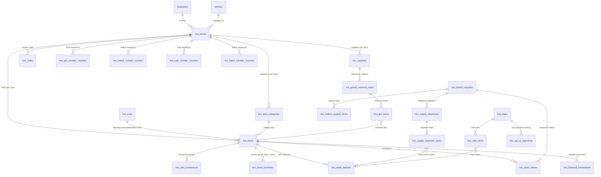

# IMS Module — Supabase Database Schema

**Module:** Inventory Management System (IMS)
**Database:** Supabase PostgreSQL (project `zwiasdpodeirxnybwvuw`)
**Document version:** 1.0
**Last updated:** 2026-04-27
**Maintained by:** Roja Sundharam (`Roja-IMS` branch)
**Schema verified live via Supabase MCP** — this document reflects the production database, not the setup SQL files.

---

## 1. Module Overview

The IMS module is an **end-to-end inventory and point-of-sale system** for JKKN institutions. It supports the full lifecycle of physical goods inside an educational institution:

| Domain | Purpose |
|---|---|
| **Master Data** | Stores, suppliers, item catalog, units of measure |
| **Stock Receiving (GRN)** | Recording goods received from suppliers, with batch & expiry tracking |
| **Indent Workflow** | Internal departments raising requests for stock items |
| **Inter-store Transfers** | Moving stock between stores or across institutions (supply shipments) |
| **Stock Issuing** | Releasing stock to consuming departments |
| **Sales (POS)** | Point-of-sale to students/staff with UPI QR + cash payments |
| **Stock Tracking** | Real-time current quantity (`stock_summary`) and FIFO batches |
| **Financial Audit** | Append-only ledger of every stock movement with cost impact |

The module is **multi-tenant**: every operational table carries an `institution_id` (or inherits one through a `store_id` → `ims_stores.institution_id` chain). Row-Level Security (RLS) enforces that users see only their institution's data, with `super_admin` and `store_admin` having broader access.

---

## 2. Schema at a Glance

**25 tables** in production, all prefixed `ims_`, organised by domain:

| # | Domain | Tables (production-verified) |
|---|---|---|
| **A** | Master Data | `ims_stores`, `ims_units`, `ims_unit_conversions`, `ims_item_categories`, `ims_items`, `ims_suppliers` |
| **B** | Stock Tracking | `ims_stock_summary`, `ims_stock_batches`, `ims_stock_issues`, `ims_department_consumption` |
| **C** | GRN (Purchase Receiving) | `ims_goods_received_notes`, `ims_grn_items`, `ims_grn_number_counters` |
| **D** | Indents (Internal Requests) | `ims_indent_requests`, `ims_indent_request_items`, `ims_indent_number_counters` |
| **E** | Supply Shipments (Inter-store/institution) | `ims_supply_shipments`, `ims_supply_shipment_items` |
| **F** | Point-of-Sale | `ims_sales`, `ims_sale_items`, `ims_sale_number_counters`, `ims_shifts`, `ims_upi_qr_payments` |
| **G** | Audit / Counters | `ims_financial_transactions`, `ims_batch_number_counters` |

---

## 3. Entity-Relationship Diagram



---

## 4. Tables by Domain

### A. Master Data

#### `ims_stores` (20 columns)
The primary tenant-of-tenant entity. A store belongs to one institution; all other operational tables ultimately scope back to a store.

| Key columns | Notes |
|---|---|
| `id` (PK), `institution_id` (FK), `code` (UNIQUE) | Code is globally unique across the org |
| `manager_id` (FK profiles), `created_by` | |
| `is_active` | |

#### `ims_units` (6 columns)
Reference table for units of measure (kg, litre, piece, etc.). Globally shared — no `institution_id` or `store_id`.

#### `ims_unit_conversions` (8 columns)
Per-item conversion factors between purchase/sale/indent units. Scoped to `(item_id, store_id)`.

#### `ims_item_categories` (12 columns)
Hierarchical category tree (`parent_id` self-FK). The `code` is currently globally unique. Recently extended (2026-04-17) with `icon`, `sort_order`, and `is_system` fields.

#### `ims_items` (27 columns)
Master item catalog. The largest master table in the module.

| Key columns | Notes |
|---|---|
| `id` (PK), `institution_id`, `store_id` | Multi-tenant scoped |
| `code` | Item SKU, **unique per institution** (see §6 — recently changed) |
| `name`, `description`, `company_name` | |
| `category_id` (FK), `item_type` (CHECK enum) | Types: `consumable / equipment / medicine / stationery / other` |
| `base_unit_id`, `purchase_unit_id`, `sale_unit_id`, `indent_unit_id` (all FK ims_units) | Multi-unit support |
| `cost_price`, `mrp`, `selling_price`, `gst_rate`, `hsn_code` | Pricing & tax |
| `reorder_level`, `max_stock_level` | Inventory control |
| `track_batch`, `track_expiry`, `is_sellable_to_students` | Behavioural flags |
| `is_active` | |

#### `ims_suppliers` (13 columns)
Supplier master. Scoped to `(institution_id, store_id)`. Used as FK from GRNs.

---

### B. Stock Tracking

#### `ims_stock_summary` (9 columns)
**One row per `(item_id, store_id)`** — denormalised current quantity for fast UI queries.

| Key columns |
|---|
| `id` (PK), `item_id` (FK), `store_id` (FK), `institution_id` |
| `current_quantity`, `reserved_quantity`, `available_quantity`, `total_value` |
| **UNIQUE** on `(item_id, store_id)` |

#### `ims_stock_batches` (19 columns)
FIFO batch tracking — every receipt creates a batch row, every issue/sale decrements it.

| Key columns |
|---|
| `id` (PK), `item_id`, `store_id`, `institution_id` |
| `batch_number` (auto: `BTH-YYMMDD-NNNNN`), `expiry_date` |
| `received_quantity`, `available_quantity` |
| `cost_price`, `supplier_id` (FK, ON DELETE SET NULL), `grn_id` (FK) |
| `location_type`, `department_id` (for stock held in departments) |

#### `ims_stock_issues` (13 columns)
Outflow ledger — when stock leaves the central store for a department.

| Key columns |
|---|
| `id` (PK), `store_id`, `institution_id`, `item_id`, `unit_id` |
| `department_id` (FK), `indent_id` (FK ims_indent_requests) |
| `issued_by` (FK profiles), `received_by` (FK profiles) |
| `quantity`, `unit_cost`, `total_cost` |

#### `ims_department_consumption` (10 columns)
Period-level analytics rollup of `(store, department, item, period_start, period_end)`. Used for consumption reports.

---

### C. GRN — Goods Received Notes

#### `ims_goods_received_notes` (15 columns)
Header for incoming stock from suppliers.

| Key columns |
|---|
| `id` (PK), `grn_number` (UNIQUE), `store_id`, `institution_id` |
| `supplier_id` (FK), `received_by`, `verified_by`, `approved_by` (all FK profiles) |
| `status`, `total_amount`, `received_at` |

#### `ims_grn_items` (17 columns)
Line items for each GRN. **`ON DELETE CASCADE`** when GRN is deleted.

| Key columns |
|---|
| `grn_id` (FK CASCADE), `item_id` (FK), `unit_id` (FK ims_units) |
| `received_quantity`, `unit_cost`, `total_cost`, `gst_amount` |
| `batch_number`, `expiry_date` |

#### `ims_grn_number_counters` (4 columns)
Atomic per-store, per-day counter for generating GRN numbers (e.g. `GRN-260427-001`). UNIQUE on `(store_id, counter_date)`. Updated via RPC to prevent race conditions.

---

### D. Indents — Internal Stock Requests

#### `ims_indent_requests` (25 columns)
The most fields of any IMS table — supports complex workflow including inter-institution requests.

| Key columns |
|---|
| `id` (PK), `indent_number` (UNIQUE), `store_id`, `institution_id` |
| `department_id` (FK), `requested_by`, `approved_by`, `local_approved_by` (all FK profiles) |
| `source_store_id`, `destination_store_id`, `destination_institution_id` | Inter-org routing |
| `request_scope`, `status`, `expires_at` |
| Partial indexes on `destination_institution_id`, `expires_at`, `source_store_id` (only WHERE not null — keeps indexes small) |

#### `ims_indent_request_items` (7 columns)
Lines. **`ON DELETE CASCADE`** with parent indent. RLS inherits scope by joining back to parent indent.

#### `ims_indent_number_counters` (4 columns)
Same atomic-counter pattern as GRN. UNIQUE `(store_id, counter_date)`.

---

### E. Supply Shipments — Inter-store / Inter-institution Transfers

Added 2026-04-17 (`ims_supply_shipments_and_items_tables` migration). Decouples "what was requested" (indents) from "what was actually shipped" — supports partial fulfilment.

#### `ims_supply_shipments` (19 columns)
Header.

| Key columns |
|---|
| `id` (PK), `shipment_no` (UNIQUE), `request_id` (FK ims_indent_requests) |
| `source_store_id`, `destination_store_id`, `destination_institution_id` |
| `dispatched_by`, `received_by` (FK profiles), `dispatched_at`, `received_at` |
| `status` |
| Partial index on in-transit shipments (`dispatched_at IS NOT NULL AND received_at IS NULL`) |

#### `ims_supply_shipment_items` (12 columns)
Lines. **`ON DELETE CASCADE`** with shipment.

| Key columns |
|---|
| `shipment_id` (FK CASCADE), `request_item_id` (FK indent line) |
| `item_id`, `bundle_parent_item_id` (for bundle/kit items) |
| `source_batch_id` (FK ims_stock_batches) |
| Partial index for bundle children |

> ⚠️ **RLS gap to track:** these two tables currently have permissive `USING (true)` policies (named "Authenticated users can …"). Consider tightening them to scope by source store's institution. Filed as follow-up.

---

### F. Point-of-Sale

#### `ims_sales` (26 columns)
Sale header. Supports student / staff / walk-in customer types.

| Key columns |
|---|
| `id` (PK), `sale_number` (UNIQUE), `store_id`, `institution_id` |
| `cashier_id` (FK profiles) |
| `customer_id`, `customer_type` (enum: student/staff/walk-in) |
| `subtotal`, `tax_amount`, `discount_amount`, `total_amount`, `payment_method`, `status` |

#### `ims_sale_items` (13 columns)
Lines. **`ON DELETE CASCADE`** with sale. References `batch_id` for FIFO traceability.

#### `ims_sale_number_counters` (4 columns)
Same atomic counter pattern. UNIQUE `(store_id, counter_date)`.

#### `ims_shifts` (12 columns)
Cashier session. Tracks opening/closing cash float per store.

| Key columns |
|---|
| `cashier_id`, `store_id` (FK CASCADE) |
| `opening_balance`, `closing_balance`, `expected_balance` |
| `status`, `opened_at`, `closed_at` |

#### `ims_upi_qr_payments` (15 columns)
UPI QR-code payment lifecycle tracking — generated, scanned, confirmed.

| Key columns |
|---|
| `sale_id` (FK), `store_id` (FK CASCADE) |
| `transaction_ref` (UNIQUE), `status`, `confirmed_by` (FK profiles) |

---

### G. Audit / Number Counters

#### `ims_financial_transactions` (15 columns)
Append-only ledger. Every stock movement (GRN, issue, sale, adjustment) writes a row here. Enables financial reporting independent of operational tables.

| Key columns |
|---|
| `transaction_type`, `reference_type`, `reference_id` (polymorphic FK) |
| `item_id`, `store_id`, `institution_id`, `department_id` |
| `quantity`, `unit_cost`, `total_value`, `created_by`, `created_at` |
| Composite index on `(reference_type, reference_id)` for "show me transactions for this GRN" queries |

#### `ims_batch_number_counters` (3 columns, **composite PK**)
**PK is `(store_id, date)`** — atomic counter for batch number generation (`BTH-YYMMDD-NNNNN`).

---

## 5. Multi-Tenant & Security Model

### Scoping pattern

Most operational tables follow this triplet:

```
institution_id  ─→ direct tenant scope
store_id        ─→ which store within the institution
created_at      ─→ audit
```

Tables that are **logically children** (line items, batches, shifts, UPI payments) often omit `institution_id` and instead scope through their parent via JOIN — e.g. `ims_grn_items` policies do `EXISTS (SELECT 1 FROM ims_goods_received_notes WHERE …)`.

### RLS Policy Pattern

The standard pattern in production is:

```sql
USING (
  institution_id = (
    SELECT profiles.institution_id
    FROM profiles
    WHERE profiles.id = auth.uid()
  )
  OR get_current_user_role() = 'super_admin'
)
```

**Roles with elevated access:**
- `super_admin` — global read/write across all institutions
- `store_admin` — write access on `ims_items` (added 2026-04-21 fix)
- `admin` — write access on `ims_units`, `ims_item_categories`

**Read-permissive tables** (`USING (true)` on SELECT for any authenticated user):
- `ims_stores` — any authenticated user can list stores (needed for store picker UI)
- `ims_units` — global reference data
- `ims_item_categories` — read by all, write by admins

**Recently fixed RLS gap:** `ims_items` policies were missing `store_admin` from the role allowlist; fixed in migration `20260421101109_fix_ims_store_admin_rls`.

**Known RLS gap (not yet addressed):** `ims_supply_shipments` and `ims_supply_shipment_items` still have `USING (true)` permissive policies — should be tightened to scope by source-store institution.

---

## 6. Key Design Patterns

### Atomic Number Counters
All sequence-based document numbers (GRN, indent, sale, batch) use a per-store, per-day counter table with UNIQUE constraint on `(store_id, counter_date)` and atomic RPC functions for increment. This pattern eliminates the race condition that plain sequences would have under concurrent writes from multiple cashiers.

### FIFO Batch Tracking
Items with `track_batch = true` create a `ims_stock_batches` row on receipt. Issues and sales reference `batch_id` for traceability; the application layer picks the oldest available batch (FIFO). Items with `track_expiry = true` additionally store `expiry_date` for shelf-life management.

### Polymorphic Audit Ledger
`ims_financial_transactions` uses `(reference_type, reference_id)` as a polymorphic foreign key — one ledger table audits stock movements regardless of source (GRN / sale / issue / adjustment). The composite index `idx_ims_financial_txn_reference` makes "show all transactions for this GRN" fast.

### Separation of Request and Fulfilment
The indent → supply-shipment separation (added April 2026) lets a single indent be fulfilled by multiple shipments (partial deliveries) and supports inter-institution routing where the destination institution differs from the requesting one.

---

## 7. Recent Schema Changes (last 30 days)

| Date | Migration | Change |
|---|---|---|
| 2026-04-17 | `ims_item_categories_add_icon_sortorder_issystem` | UI-fields on item categories |
| 2026-04-17 | `ims_supply_shipments_and_items_tables` | New tables for inter-store transfers |
| 2026-04-21 | `fix_ims_store_admin_rls` | Allow `store_admin` to write `ims_items` |
| 2026-04-27 | `add_inter_institution_scope_to_ims_indent_requests` | Cross-institution indent fields |
| **2026-04-27** | **`ims_items_unique_scope_per_institution`** | **Drop global `UNIQUE(code)`, add `UNIQUE(institution_id, code)`** — fixes bulk-import collision when two institutions use the same SKU. See §8. |

---

## 8. Active Issues & Watch List

### ✅ Resolved on 2026-04-27

**Bulk import failing with `ims_items_code_key` violation.** Code uniqueness was scoped globally instead of per-institution, so importing a SKU into Store A would fail if it already existed in Store B (different institutions). Fixed by replacing `UNIQUE (code)` with composite `UNIQUE (institution_id, code)`. Pre-flight duplicate check in `inventory-service.server.ts` updated to filter by institution. PG `23505` errors now extract the offending code instead of returning "Row 0".

### 🟡 Open

1. **`ims_supply_shipments` RLS too permissive** — `USING (true)` on all four operations. Tighten to source-store institution scope.
2. **`ims_grn_items` lacks `institution_id`** — only inherits scope via parent JOIN. RLS enforces correctly but writes need to revalidate parent each time. Performance impact is minor (parent is indexed) but worth monitoring.
3. **`ims_item_categories.code` is still globally unique** — same pattern that bit `ims_items`. Low priority because categories are smaller, but consider scoping per-institution proactively.

---

## 9. Application Layer Map

For team members navigating the codebase:

| Concern | Location |
|---|---|
| Service layer (server) | [lib/services/ims/inventory-service.server.ts](../../../lib/services/ims/inventory-service.server.ts) |
| Service layer (client) | [lib/services/ims/](../../../lib/services/ims/) — 13 files, one per domain |
| React Query hooks | [hooks/ims/](../../../hooks/ims/) — staleTime tuned per resource (1min–30min) |
| API routes | [app/api/ims/](../../../app/api/ims/) |
| UI pages | [app/(routes)/ims/](../../../app/(routes)/ims/) |
| Excel import logic | [app/api/ims/inventory/import/route.ts](../../../app/api/ims/inventory/import/route.ts) + [lib/utils/ims-item-excel-mappings.ts](../../../lib/utils/ims-item-excel-mappings.ts) |
| Database setup (canonical) | [supabase/setup/01_tables.sql](../../../supabase/setup/01_tables.sql) — search for `ims_` |

---

## 10. Quick Reference

### Index Coverage Summary

| Table | Indexes (excl. PK) | Notable |
|---|---|---|
| `ims_items` | 6 | Composite UNIQUE on `(institution_id, code)`; standalone `code` index for cross-org lookups |
| `ims_indent_requests` | 9 | Multiple partial indexes — only-when-not-null saves space on optional FK columns |
| `ims_stock_batches` | 6 | Includes `expiry_date` (for soon-to-expire reports) and `(location_type, department_id)` (for in-department stock) |
| `ims_supply_shipments` | 6 | Partial in-transit index for live-tracking queries |
| `ims_financial_transactions` | 6 | Polymorphic `(reference_type, reference_id)` index for cross-document audit |

### Common Queries

```sql
-- Current stock for an institution
SELECT i.code, i.name, ss.current_quantity, ss.available_quantity
FROM ims_stock_summary ss
JOIN ims_items i ON i.id = ss.item_id
WHERE ss.institution_id = '<your-institution-uuid>'
ORDER BY i.name;

-- Items below reorder level
SELECT i.code, i.name, ss.available_quantity, i.reorder_level
FROM ims_items i
JOIN ims_stock_summary ss ON ss.item_id = i.id
WHERE ss.available_quantity < i.reorder_level
  AND i.is_active = true
  AND i.institution_id = '<your-institution-uuid>';

-- Soon-expiring batches (next 30 days)
SELECT b.batch_number, i.name, b.expiry_date, b.available_quantity
FROM ims_stock_batches b
JOIN ims_items i ON i.id = b.item_id
WHERE b.expiry_date BETWEEN CURRENT_DATE AND CURRENT_DATE + INTERVAL '30 days'
  AND b.available_quantity > 0
ORDER BY b.expiry_date;

-- Sales for today by store
SELECT s.store_id, COUNT(*) AS sale_count, SUM(s.total_amount) AS revenue
FROM ims_sales s
WHERE s.created_at::date = CURRENT_DATE
  AND s.status = 'completed'
GROUP BY s.store_id;
```

---

## 11. References

- **Live verification:** Always query Supabase MCP (`mcp__supabase__list_tables`, `mcp__supabase__execute_sql`) before trusting any setup file. Per project guidance in [CLAUDE.md](../../../CLAUDE.md), files may lag the database.
- **Service layer entry points:** Each domain has both a client service (`*-service.ts`) and where needed a server service (`*-service.server.ts`). The latter uses `next/headers` and must never be imported from client components.
- **RLS performance:** Functions inside policies are wrapped in `(SELECT auth.uid())` and `(SELECT profiles.institution_id …)` per the supabase-expert skill's performance rules. All policy columns are indexed.

---

**Document maintenance:** When schema changes, update this file alongside the `supabase/setup/01_tables.sql` change in the same PR. Run `mcp__supabase__list_tables` and `mcp__supabase__execute_sql` to verify against the live database before publishing updates.
