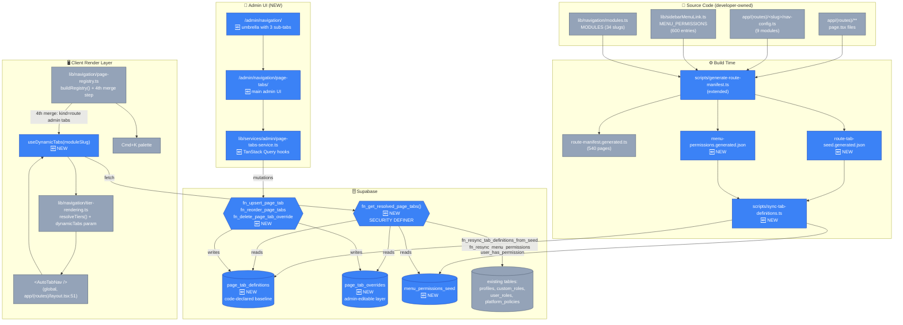
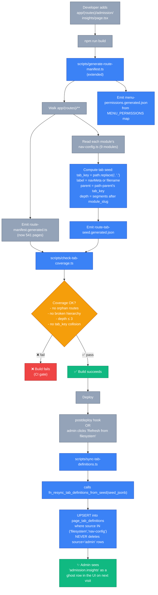
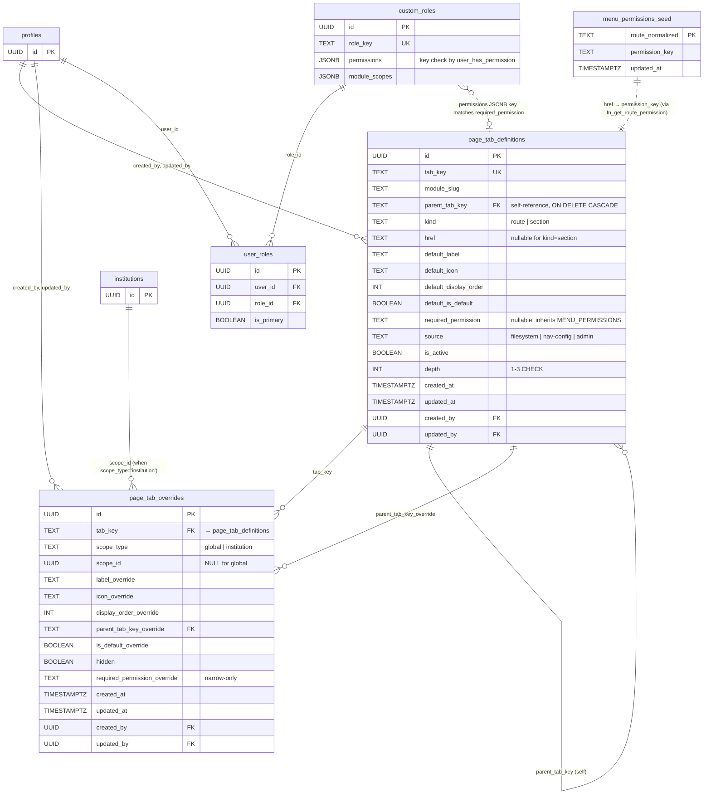
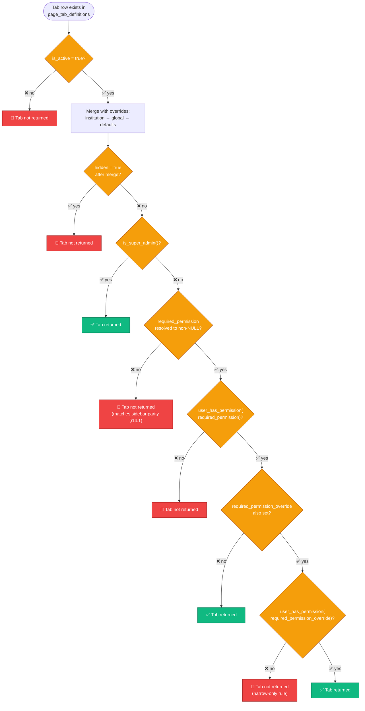
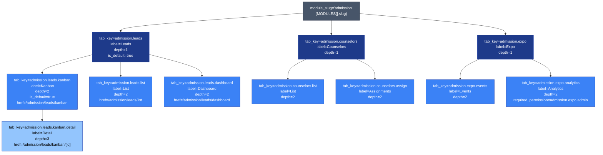

# Dynamic Page-Tabs System — Flow Diagrams

**Date:** 2026-04-29
**Companion to:** `2026-04-29-dynamic-page-tabs-design.md`

> **How to view:** Open this file in VS Code → preview pane (Ctrl+K V), or push to GitHub. Both render Mermaid blocks natively. Diagrams are also live-editable; tweak the source and the preview updates instantly.

---

## 1. System Architecture (high level)

Shows every new + existing component and how they connect.



---

## 2. Read Path — How a tab gets rendered for an end user

What happens when a logged-in user navigates to `/admission/leads/kanban`.

```mermaid
sequenceDiagram
    autonumber
    actor User
    participant Page as "Next.js Page<br/>(any /admission/* route)"
    participant Layout as "app/(routes)/layout.tsx"
    participant ATN as "&lt;AutoTabNav /&gt;"
    participant Hook as "useDynamicTabs(<br/>'admission', instId)"
    participant TQ as "TanStack Query"
    participant SVC as "page-tabs-service.ts"
    participant RPC as "fn_get_resolved_page_tabs"
    participant DB as "page_tab_definitions<br/>+ page_tab_overrides"
    participant Tiers as "resolveTiers()<br/>tier-rendering.ts"

    User->>Page: GET /admission/leads/kanban
    Page->>Layout: render
    Layout->>ATN: mount
    ATN->>Hook: invoke
    Hook->>TQ: queryKey: ['page-tabs','resolved','admission',instId]
    TQ-->>Hook: cache miss
    Hook->>SVC: getResolved('admission', instId)
    SVC->>RPC: rpc('fn_get_resolved_page_tabs', {module_slug, institution_id})

    RPC->>DB: SELECT defs LEFT JOIN overrides
    Note over RPC,DB: COALESCE: institution > global > defaults
    DB-->>RPC: rows (resolved labels, orders, parents)

    Note over RPC: Filter: hidden=false<br/>AND (is_super_admin OR<br/>user_has_permission(req_perm))
    RPC-->>SVC: ResolvedTab[]
    SVC-->>Hook: data
    Hook-->>ATN: { data: dynamicTabs }

    ATN->>Tiers: resolveTiers(pathname, { dynamicTabs })
    Note over Tiers: Merge per tab_key<br/>DB wins where present<br/>Falls back to nav-config.ts<br/>then to manifest
    Tiers-->>ATN: tier1[], tier2[], tier3[] chips
    ATN-->>User: rendered chip strip

    Note over User: User clicks "Kanban" chip
    User->>Page: navigate to /admission/leads/kanban
```

---

## 3. Write Path — Admin renames a tab

What happens when a super-admin renames "Kanban" to "Board" for one institution.

```mermaid
sequenceDiagram
    autonumber
    actor Admin as "super_admin"
    participant UI as "/admin/navigation/<br/>page-tabs"
    participant Dialog as "&lt;TabEditDialog /&gt;"
    participant Hook as "useUpsertPageTab"
    participant TQ as "TanStack Query"
    participant SVC as "page-tabs-service.ts"
    participant RPC as "fn_upsert_page_tab"
    participant DB as "page_tab_overrides"
    participant ATN as "&lt;AutoTabNav /&gt;<br/>(in user sessions)"

    Admin->>UI: click Edit on "admission.leads.kanban"
    UI->>Dialog: open with current values
    Admin->>Dialog: change label to "Board"<br/>scope = institution X
    Dialog->>Hook: mutate({ tab_key, scope_type:'institution', scope_id:X, label_override:'Board' })
    Hook->>SVC: upsertOverride(...)
    SVC->>RPC: rpc('fn_upsert_page_tab', {mode:'override', ...})

    Note over RPC: Validate:<br/>- is_super_admin OR is_admin<br/>- tab_key exists in definitions<br/>- depth ≤ 3<br/>- href in route manifest (if changed)<br/>- narrow-only permission rule
    RPC->>DB: INSERT ... ON CONFLICT (tab_key, scope_type, scope_id)<br/>DO UPDATE SET label_override='Board'
    DB-->>RPC: row
    RPC-->>SVC: ok
    SVC-->>Hook: ok

    Hook->>TQ: invalidateQueries(['page-tabs'])
    TQ->>TQ: mark stale<br/>['page-tabs','resolved','admission','*']

    Note over ATN: any user in inst X<br/>whose page refetches
    ATN->>Hook: useDynamicTabs re-runs
    Hook-->>ATN: refreshed data with "Board"
    ATN-->>Admin: chip now reads "Board"
    Note over Admin: ✅ Visible immediately to admin;<br/>visible to other users on next refetch (≤60s default staleTime)
```

---

## 4. Build-Time Auto-Discovery Flow

What happens when a developer adds a new page and runs the build.



---

## 5. Entity-Relationship Diagram

How the new tables relate to each other and to existing tables.



---

## 6. Permission Resolution Decision Tree

How `fn_get_resolved_page_tabs` decides whether to show a single tab to a user.



**Where `required_permission` comes from** (resolution priority, top wins):
1. `page_tab_overrides.required_permission_override` for matching `(tab_key, scope='institution', scope_id)`
2. `page_tab_overrides.required_permission_override` for matching `(tab_key, scope='global')`
3. `page_tab_definitions.required_permission`
4. Lookup `MENU_PERMISSIONS[normalize(href)]` via `fn_get_route_permission(href)` (only if `kind='route'`)
5. NULL → tab is hidden for non-super-admins (§14.1 lock)

---

## 7. Concrete 3-Tier Hierarchy Example

What `module_slug='admission'` looks like in the DB and what the user sees.



**What the user sees on `/admission/leads/kanban`**:

```
┌───────────────────────────────────────────────────────────┐
│ 🏠 Sidebar: Admission CRM (top-level only)               │
├───────────────────────────────────────────────────────────┤
│ TIER 1 chips:  [Leads*]  [Counselors]  [Expo]            │   ← from depth=1 rows
│ TIER 2 chips:  [Kanban*]  [List]  [Dashboard]            │   ← from depth=2 rows under "Leads"
│ TIER 3 chips:  [Detail]                                   │   ← from depth=3 rows under "Kanban"
├───────────────────────────────────────────────────────────┤
│ Page content for /admission/leads/kanban                  │
└───────────────────────────────────────────────────────────┘
   * = is_default=true, also active because URL matches
```

If admin overrides for institution X:
- Hide `admission.expo.analytics` → "Analytics" chip gone for institution X.
- Rename `admission.leads.kanban` to "Board" → tier-2 chip reads "Board" for institution X.

---

## 8. Quick Glossary

| Term | Meaning |
|---|---|
| **`tab_key`** | Stable canonical id, e.g. `admission.leads.kanban`. Derived deterministically by `lib/navigation/tab-key.ts`. |
| **`module_slug`** | First URL segment, from `lib/navigation/modules.ts`. 34 stable values. |
| **`source='filesystem'`** | Tab discovered by build script from a `page.tsx` file with no nav-config entry. |
| **`source='nav-config'`** | Tab declared in `app/(routes)/<slug>/nav-config.ts`. |
| **`source='admin'`** | Tab created by an admin in the UI, no source-code presence. |
| **`scope_type='global'`** | Override applies to everyone unless overridden by institution. |
| **`scope_type='institution'`** | Override applies only to that institution; wins over `'global'`. |
| **`narrow-only override`** | `required_permission_override` may only ADD constraints (AND logic), never widen access. |
| **Ghost row** | A `page_tab_definitions` row from the build seed that admin hasn't yet promoted, hidden, or overridden. Visible in admin UI with "Code" badge. |
| **3-tier limit** | DB CHECK + RPC validation. `depth IN (1,2,3)`. Re-parenting beyond depth 3 is rejected. |

---

## 9. How to View These Diagrams

1. **VS Code (recommended for inline editing)**:
   - Open this file
   - Press `Ctrl+K V` (Cmd+K V on Mac) to open Markdown preview side-by-side
   - Mermaid blocks render automatically (built-in support since VS Code 1.72)
   - Edit the source on the left → preview updates instantly on the right

2. **GitHub**:
   - Push this file → open it in GitHub web UI
   - All Mermaid blocks render as SVGs
   - Excellent for PR review

3. **Mermaid Live Editor** (for one-off tweaks):
   - Copy any code block (between ` ```mermaid ` and ` ``` `) into <https://mermaid.live>
   - Real-time preview, can export PNG/SVG

4. **Claude Code's Visual Companion** (if you want me to generate richer mockups beyond Mermaid — UI mockups, color exploration, multi-frame walkthroughs):
   - Tell me "use the visual companion for diagram X"
   - I'll spin it up; needs a local URL open in your browser

---

## 10. What These Diagrams Cover (Spec Section Mapping)

| Diagram | Maps to spec section(s) |
|---|---|
| 1. System Architecture | §5 Architecture Overview, §12 File Tree |
| 2. Read Path | §7.1 fn_get_resolved_page_tabs, §9 Render Bridge |
| 3. Write Path | §7.2 fn_upsert_page_tab, §10 Admin UI, §10.3 Service & hooks |
| 4. Build-Time Auto-Discovery | §8 Build-Time Discovery |
| 5. ER Diagram | §6 Data Model |
| 6. Permission Resolution Tree | §11 Permission Gating, §14.1 Sidebar parity (LOCKED) |
| 7. 3-Tier Hierarchy Example | §5.3 tab_key canonicalization, §6.1 schema |
| 8. Glossary | cross-cutting |

If anything in these diagrams contradicts the spec, the **spec wins** — flag the mismatch and I'll fix the diagram inline.
