# Dynamic Page-Tabs System — User Flow Diagrams

**Date:** 2026-04-29
**Companion to:** `2026-04-29-dynamic-page-tabs-design.md` and `2026-04-29-dynamic-page-tabs-flow-diagrams.md`

> **Focus:** This file describes **user journeys** — what each user role *does*, *clicks*, *sees* — not the technical request/response sequence.
>
> **How to view:** Open in VS Code → press **Ctrl+K V** for live preview, or push to GitHub for SVG rendering.

---

## User Roles in This System

| Role | Permission level | What they do |
|---|---|---|
| **End user** (student, faculty, staff) | Has some `<module>.<resource>.<action>` permissions | Navigates pages, clicks tabs, never sees the admin UI |
| **Admin** | `is_admin()` returns true | Manages tab labels, order, visibility for their institution |
| **Super-admin** | `is_super_admin()` returns true | Manages tabs globally and per-institution; sees every module |
| **Developer** | Writes code, opens PRs | Adds new pages and modules; never edits tabs in DB |

---

## Flow 1 — End User: Navigating a Module

The most common user flow. An end-user logs in and navigates to a feature.

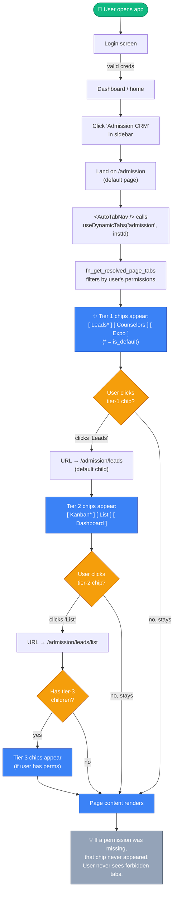

**Key UX guarantees:**
- A tab the user doesn't have permission for **never appears** — no greyed-out chips, no "access denied" page.
- Default chip is auto-active on landing — user doesn't need to pick.
- URL is bookmarkable: refreshing `/admission/leads/kanban` lands back on the same chip.

---

## Flow 2 — Admin: Renaming a Tab for One Institution

The most common admin task. Admin wants institution X to see "Board" instead of "Kanban".

```mermaid
flowchart TD
    START([👤 Admin logs in]) --> NAV["Navigate to<br/>/admin/navigation"]
    NAV --> UMBRELLA["See umbrella with 3 sub-tabs:<br/>[Admin Nav] [Page Metadata] [Page Tabs]"]
    UMBRELLA --> CLICK_PT["Click 'Page Tabs'"]
    CLICK_PT --> LAND["Land on<br/>/admin/navigation/page-tabs"]

    LAND --> SELECT_MOD["Select module from dropdown<br/>e.g. 'admission'"]
    SELECT_MOD --> SELECT_SCOPE["Select scope:<br/>○ Global<br/>● Institution X"]
    SELECT_SCOPE --> LOAD_TREE["UI fetches via<br/>page-tabs-service.listDefinitions<br/>+ listOverrides"]

    LOAD_TREE --> SEE_TREE["See 3-tier tab tree<br/>with current values<br/>(institution overrides applied)"]

    SEE_TREE --> FIND["Find 'admission.leads.kanban' row<br/>(label currently 'Kanban')"]
    FIND --> CLICK_EDIT["Click [Edit] button"]
    CLICK_EDIT --> DIALOG["&lt;TabEditDialog /&gt; opens"]

    DIALOG --> SHOW_FIELDS["Dialog shows:<br/>• Code default: 'Kanban' (read-only)<br/>• Override label: [____]<br/>• Override icon: [____]<br/>• Override perm: [____]<br/>• Hidden: [ ]"]

    SHOW_FIELDS --> TYPE["Admin types 'Board' in label override"]
    TYPE --> CLICK_SAVE["Click [Save]"]
    CLICK_SAVE --> CALL_RPC["useUpsertPageTab mutation<br/>→ fn_upsert_page_tab(<br/>tab_key='admission.leads.kanban',<br/>scope='institution', scope_id=X,<br/>label_override='Board')"]

    CALL_RPC --> VALIDATE{"RPC validates:<br/>- is_super_admin OR is_admin?<br/>- tab_key exists?<br/>- depth ≤ 3?<br/>- narrow-only perm rule?"}
    VALIDATE -->|"❌ fail"| ERROR["Toast: error message"]
    VALIDATE -->|"✅ pass"| UPSERT["UPSERT into page_tab_overrides"]

    UPSERT --> INVALIDATE["TanStack Query<br/>invalidates ['page-tabs']"]
    INVALIDATE --> UI_UPDATE["Admin UI: row badge<br/>changes from 'Code' to<br/>'Code · overridden'"]

    UI_UPDATE --> VERIFY["Admin opens new tab to<br/>/admission/leads (as inst-X user)"]
    VERIFY --> SEE_NEW["✨ Chip now reads 'Board'<br/>for institution X users only"]

    classDef start fill:#10b981,stroke:#047857,color:#fff
    classDef gate fill:#f59e0b,stroke:#b45309,color:#fff
    classDef action fill:#3b82f6,stroke:#1e40af,color:#fff
    classDef bad fill:#ef4444,stroke:#991b1b,color:#fff
    classDef good fill:#10b981,stroke:#047857,color:#fff
    class START start
    class VALIDATE gate
    class CLICK_PT,SELECT_MOD,CLICK_EDIT,TYPE,CLICK_SAVE,VERIFY action
    class ERROR bad
    class SEE_NEW good
```

---

## Flow 3 — Admin: Hiding a Tab Globally

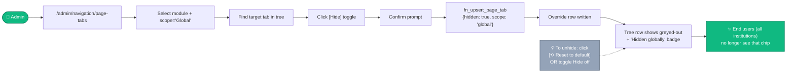

---

## Flow 4 — Admin: Adding a New Admin-Authored Tab

This is for tabs that don't exist in code yet — admin wants to surface a route as a tab.

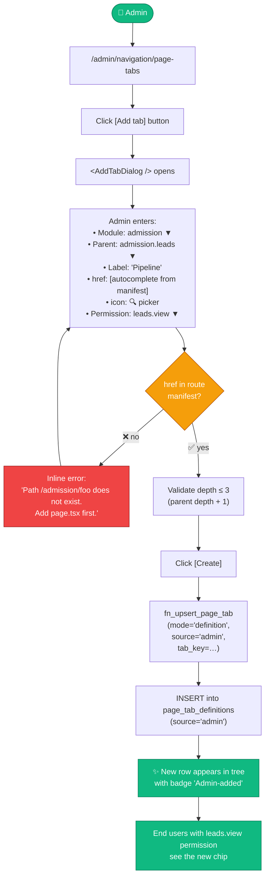

---

## Flow 5 — Developer: Adding a New Page

The developer's lifecycle for a new module page, end to end.

```mermaid
flowchart TD
    START([👨‍💻 Developer]) --> CREATE["Create<br/>app/(routes)/admission/<br/>insights/page.tsx"]

    CREATE --> NAVMETA{"Add navMeta?<br/>(optional)"}
    NAVMETA -->|"yes"| EXPORT["export const navMeta = {<br/>  label: 'Insights',<br/>  icon: 'BarChart'<br/>}"]
    NAVMETA -->|"no"| SKIP1["Filename auto-titlecased"]
    EXPORT --> PERMS
    SKIP1 --> PERMS

    PERMS["Add permission to<br/>lib/constants/permissions.ts<br/>'admission.insights.view'"] --> SIDEBAR

    SIDEBAR["Add MENU_PERMISSIONS entry<br/>'/admission/insights' → 'admission.insights.view'<br/>in lib/sidebarMenuLink.ts"] --> ROLES

    ROLES["Seed permission for relevant roles<br/>(via UI or migration)"] --> NAVCFG{"Module already has<br/>nav-config.ts?"}

    NAVCFG -->|"yes (admission does)"| ADD_CFG["Add to admission/nav-config.ts<br/>under appropriate group"]
    NAVCFG -->|"no"| SKIP2["Filesystem auto-discovery<br/>will pick it up"]

    ADD_CFG --> RUN
    SKIP2 --> RUN

    RUN["npm run gen:routes"] --> EMIT["scripts emit:<br/>• route-manifest.generated.ts<br/>• route-tab-seed.generated.json<br/>• menu-permissions.generated.json"]

    EMIT --> CI["git commit + push<br/>→ CI runs check:tab-coverage"]
    CI --> CI_OK{"CI passes?"}
    CI_OK -->|"❌ no"| FIX["Fix orphan/depth/collision<br/>issues, push again"]
    CI_OK -->|"✅ yes"| MERGE["Merge PR"]

    FIX --> RUN

    MERGE --> DEPLOY["Deploy"]
    DEPLOY --> POSTDEPLOY["postdeploy hook<br/>runs sync:tabs"]
    POSTDEPLOY --> RPC["fn_resync_tab_definitions_from_seed<br/>UPSERTs source='filesystem'<br/>or source='nav-config' rows"]

    RPC --> ADMIN_SEES["👤 Admin opens<br/>/admin/navigation/page-tabs"]
    ADMIN_SEES --> GHOST["Sees 'admission.insights'<br/>as ghost row<br/>(badge: 'Code')"]

    GHOST --> USER_SEES["✨ End user with permission<br/>sees the new tab automatically<br/>— no admin action required"]

    classDef start fill:#10b981,stroke:#047857,color:#fff
    classDef gate fill:#f59e0b,stroke:#b45309,color:#fff
    classDef action fill:#3b82f6,stroke:#1e40af,color:#fff
    classDef good fill:#10b981,stroke:#047857,color:#fff
    classDef bad fill:#ef4444,stroke:#991b1b,color:#fff
    class START start
    class NAVMETA,NAVCFG,CI_OK gate
    class CREATE,EXPORT,PERMS,SIDEBAR,ROLES,ADD_CFG,RUN action
    class FIX bad
    class GHOST,USER_SEES good
```

**Developer-experience win**: steps 1, 6, 7, 8 are mandatory. Steps 2 (navMeta), 4 (sidebar entry — only if it should appear in sidebar), 5 (permissions seed — usually a separate role-mgmt task), and the nav-config edit are optional. The minimum viable contribution is **create page.tsx + permission key + run gen:routes + commit**.

---

## Flow 6 — Combined Swimlane: All Three User Roles

Shows how the three user types interact with the same system simultaneously.

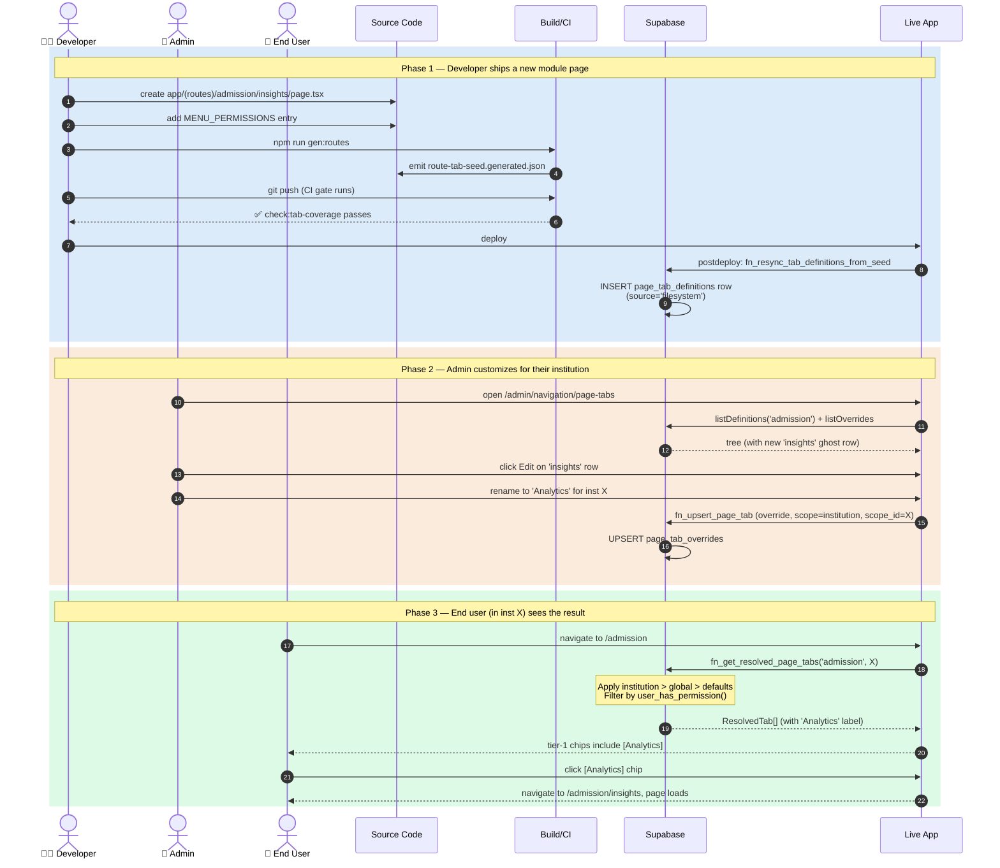

---

## Flow 7 — End User Permission Decision Tree

What the user actually experiences as the resolver decides each tab's visibility.

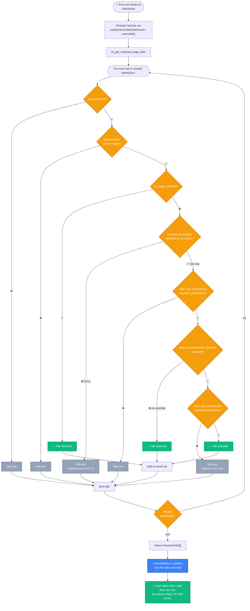

---

## Flow 8 — Admin's "Reset to Default" Recovery Flow

When admins need to undo their override (intentionally or accidentally).

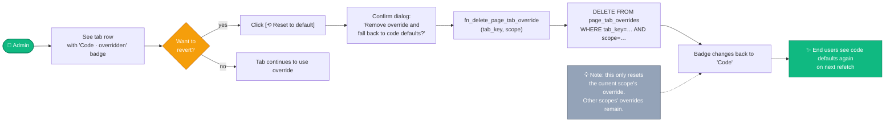

---

## Flow 9 — Day-in-the-Life Personas

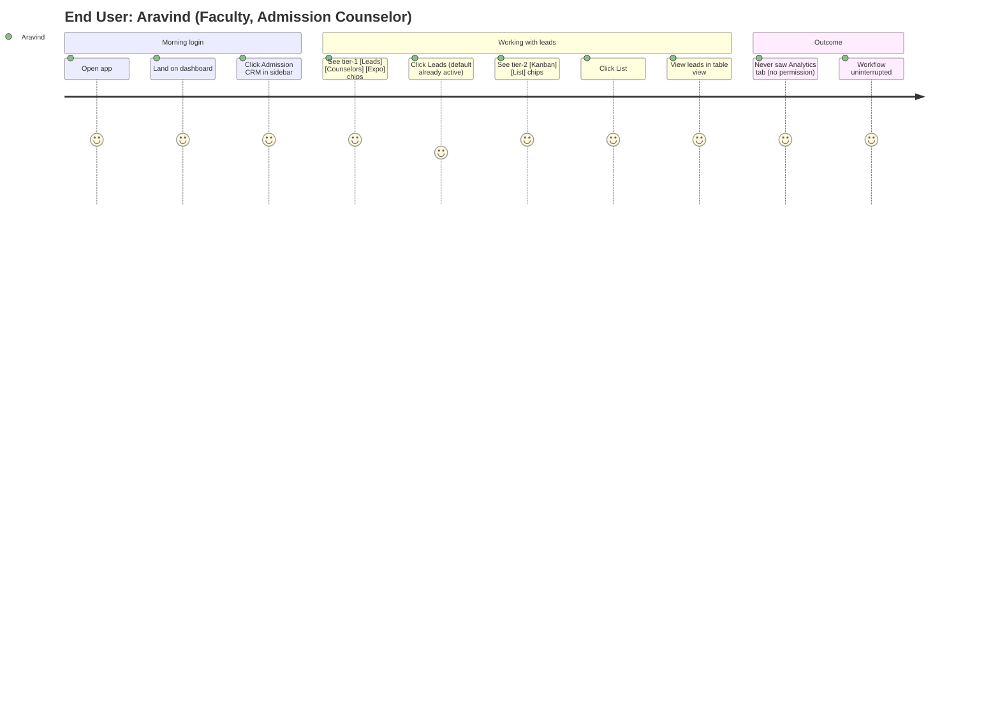

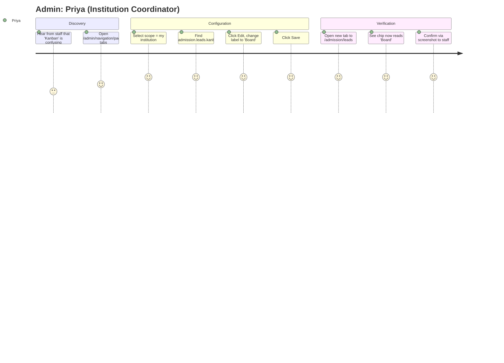

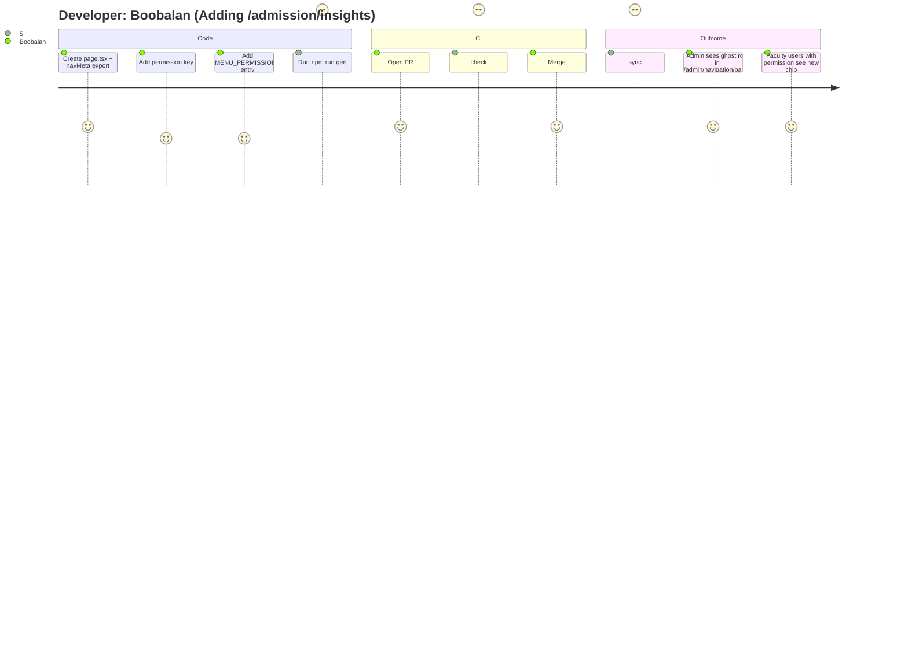

---

## Flow 10 — When Things Go Wrong (Failure Modes)

Common errors and how each user type encounters them.

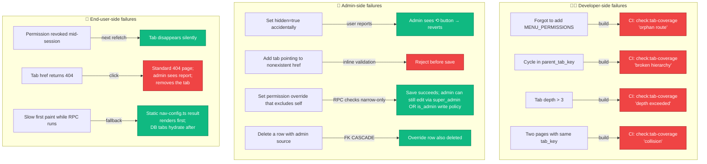

---

## How to View

1. **VS Code**: open this file → `Ctrl+K V` for live preview.
2. **GitHub**: push the file → all Mermaid renders as SVG in the web UI.
3. **Mermaid Live Editor**: <https://mermaid.live> — paste any single block.
4. **Visual Companion**: tell me "use visual companion for the admin UI mockup" if you want browser-based mockups beyond Mermaid.

---

## Mapping to Spec Sections

| Flow | Maps to spec section(s) |
|---|---|
| 1. End User Navigation | §5.1 substrate, §9 render bridge, §11 permissions |
| 2. Admin Renames Tab | §10 admin UI, §7.2 fn_upsert_page_tab |
| 3. Admin Hides Globally | §10 admin UI, §6.2 hidden column |
| 4. Admin Adds New Tab | §10 admin UI, §14.3 href validation |
| 5. Developer Adds Page | §8 build-time discovery, §15 acceptance criteria #3 |
| 6. Combined Swimlane | §5 architecture, all phases |
| 7. End User Permission Tree | §11 permissions, §14.1 LOCKED parity rule |
| 8. Admin Reset to Default | §7.4 fn_delete_page_tab_override |
| 9. Personas | UX coverage |
| 10. Failure Modes | §13 testing, §14 risks |
