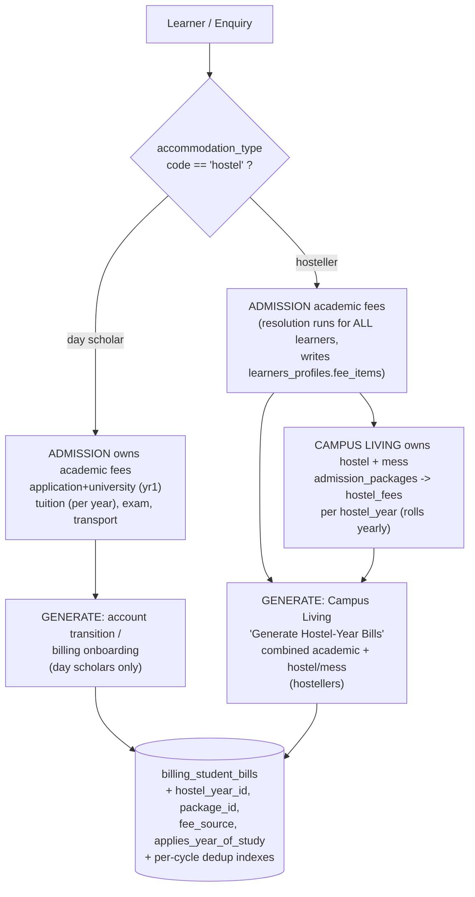
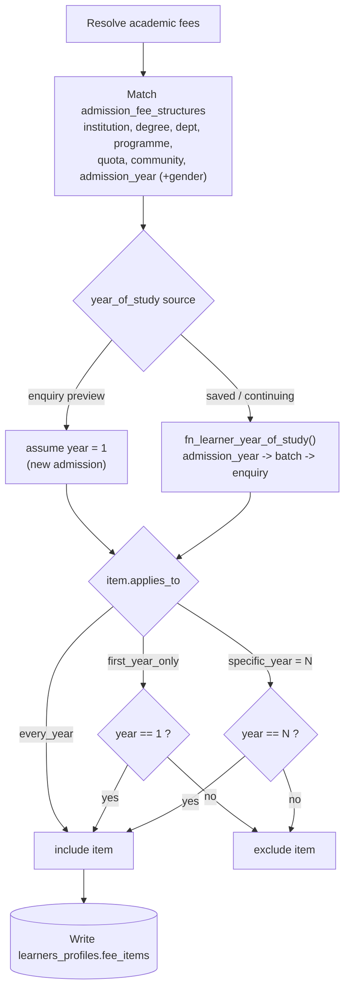
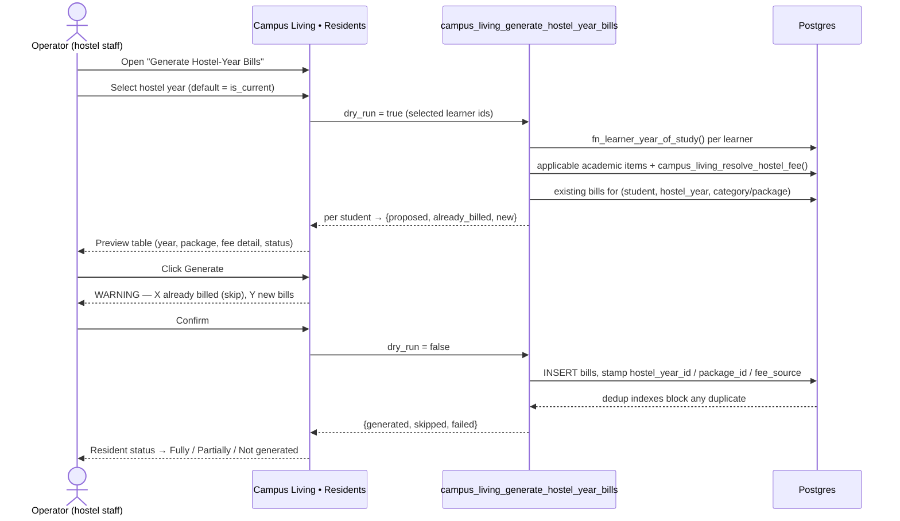
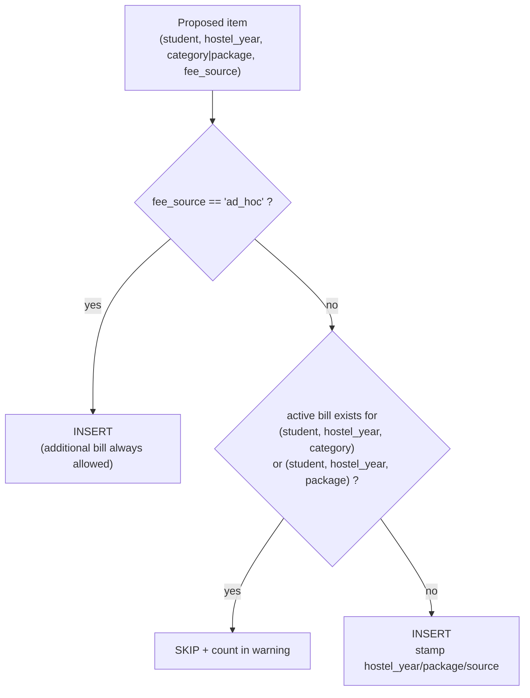
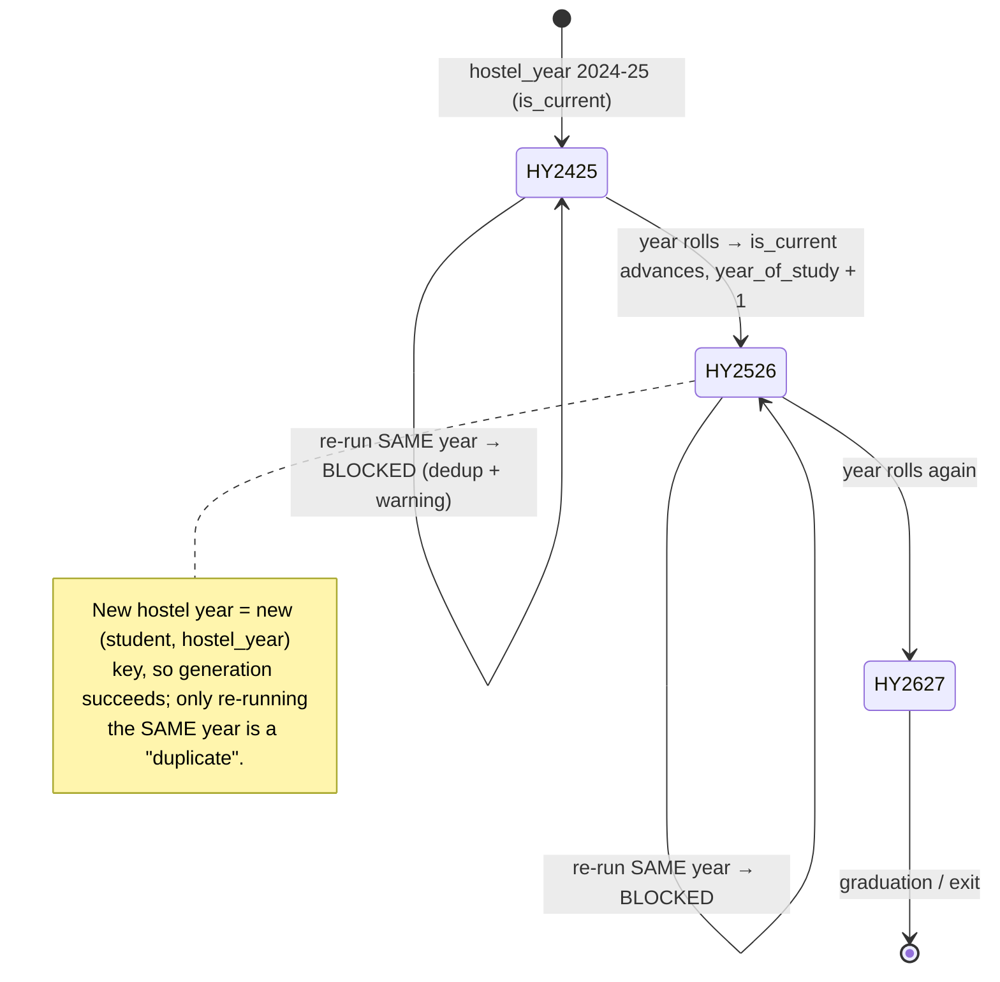
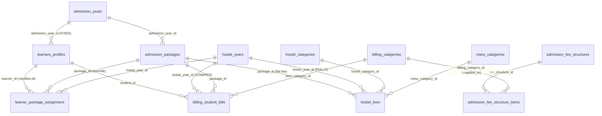

# Hostel Fees / Year-Aware Billing — Flow Diagrams

Companion to `2026-06-05-hostel-fees-campus-living-billing-design.md` and the implementation plan. Renders as diagrams on GitHub / Mermaid-aware viewers.

---

## 1. Fee ownership & routing (the big picture)

Who owns which fee, and where it becomes a bill.

> **Routing rule:** a hosteller's academic bills come from the Campus Living combined run (stamped with `hostel_year_id`), NOT from account transition — so the academic portion is never billed twice.

---

## 2. Academic fee resolution (year-of-study aware)

Runs for every learner; the only difference between a new and a continuing student is the year-of-study that filters the items.

---

## 3. Hostel-year bill generation (Campus Living) — operator flow

---

## 4. "Should this bill be created?" — per-item dedup decision

---

## 5. Year-over-year lifecycle (why dedup is per hostel year)

---

## 6. Data model (entity relationships)

**Two independent year axes:** `admission_year_id` (fixed, on the profile, finds the package) vs `hostel_year_id` (rolls yearly, on `hostel_fees` + stamped on each bill, finds the per-cycle fee).
